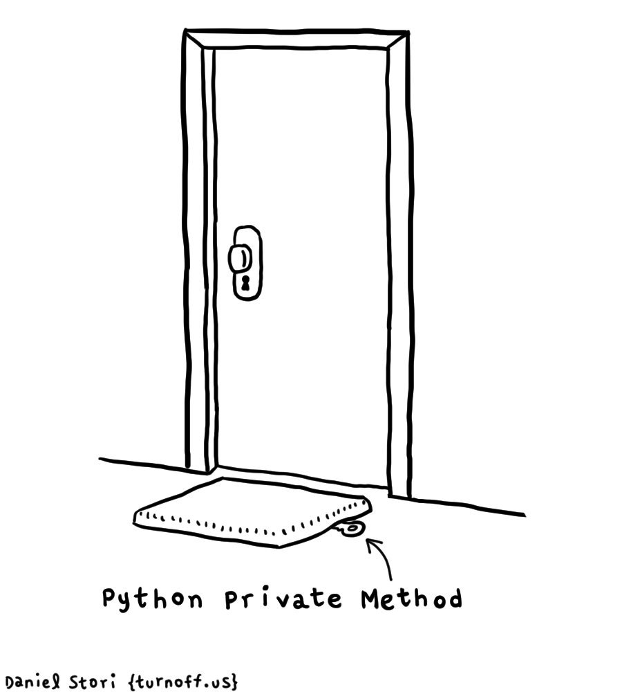

# Lecture 5 - Introduksjon til Objektorientert programmering
Henrik Finsberg - 07.09.22

---

## Mål for dagens forelesning

- Hva er objekt orientert programmering (OOP)
- Hvordan bruker man OOP i python
    - Klasser
    - Instanser
    - Atributter
    - Properties
- Hvordan gjøre klasser kallbare

---

## Hva er objekt orientert programmering?

* Et eksempel på programmerings paradigme
    - Det finnes mange måter å løse det samme problemet på. Orientert programmering er en måte.
* Koden vår består av å opprette objekter via klasser
* Objekter har
    - egenskaper (properties)
        + navn, alder, adresse
    - oppførsel (metoder)
        + snakkeing, gåing, sykling

---

## Ulike programmeringsspråk kan brukes til ulike programmerings paradigmer

* Python er et eksempel på et språk som støtter flere paradigmer
* Java er eksempel på et språk som kun støtter objekt orientert programmering
* C++ støtter også flere paradigmer
* C støtter ikke objekt orientert programmering men er et prosedyrisk programmeringsspråk

---

## Ulike programmerings paradigmer har fordeler og ulemper

* Objekt orientert programmering er veldig bra hvis du kan beskrive programmet som objekter med egenskaper og oppførsel og hvor det er relasjoner mellom disse objektene.
    - Studenter i en klasse - studenter har egenskaper og oppførsel, klassen er en gruppe av studenter som tar ulike kurs
    - En bil har en motor med egenskaper
    - Hunder og katter er dyr med noen fells og noen ulike egenskaper
* Objekt orientert programmering er ofte ikke det beste hvis du ønsker veldig effektiv kode

---

## Simula, det første objekt-orienterte programmeringspråket ble utviklet av  Ole-Johan Dahl og Kristen Nygård


---

## Objekt orientert programmering i python

* Lag et `person` objekt som inneholder `name` og `age` ved hjelp av dictionaries
*
    ```python
    p1 = {"name": "Henrik", "age": 33}
    p2 = {"name": "Marius", "age": 30}
    ```

---

## Klasser i Python

* Klasser i python deklareres ved hjelp av nøkkelordet `class`

    ```python
    class Person:
        pass


    p = Person()
    ```

* Vi kaller `Person` en klasse

* `p` kalles for en instans av klassen `Person`

* `pass` betyr bare at vi ikke vil gjøre noe mer med denne klasssen

* Det er konvensjon at klasser starer med STOR bokstav (https://peps.python.org/pep-0008/#class-names)

---

## Vi kan lage flere personer og sette atributter

```python
class Person:
    pass


p1 = Person()
p1.name = "Henrik"
p1.age = 33
p2 = Person()
p2.name = "Marius"
p2.age = 30
```
---

## Atributter

* `name` et eksempel på et atributt på objektet `p1`

* Det er to typer atributter: data atributter og metoder

* I python kan vi også bruke funksjonene `getattr` og `setattr`. Disse er veldige nyttige dersom vi skal sette eller aksessere flere atributter i en løkke

*
    ```python
    for att in ["name", "age"]:
        print(getattr(p1, att))
    ```
---

## Vi kan også la klassen vår ta argumenter

```python
class Person:
    def __init__(self, name, age):
        self.name = name
        self.age = age


p1 = Person("Henrik", 33)
p2 = Person("Marius", 30)
```

* `__init__` kalles en konstruktør og kalles når vi lager en ny instans av klassen
* Første argument (`self`) referer til objektet som instansieres
* Inad i klassen kan vi bruke `self` til å aksessere attributter på instansen
* Merk at det er ikke noe magisk med `self`. Det er bare konvensjon at dette argumentet kalles for `self`.

---

## Alternativ implementasjon av `__init__`

```python
class Person1:
    pass


def make_person(p, name, age):
    p.name = name
    p.age = age


p1 = Person1()
make_person(p1, "Henrik", 33)
```
```python
class Person2:
    def __init__(self, name, age):
        self.name = name
        self.age = age


p2 = Person2("Henrik", 33)
```

---

## Vi kan definere andre metoder

Funksjoner på en klasse som tar inn `self` som første argument kalles "instans metoder" (instance methods).
Dersom du ønsker å tilgang til instansens egne attributter må man lage en instans metode

```python
class Person:
    def __init__(self, name, age):
        self.name = name
        self.age = age

    def year_born(self):
        return 2022 - self.age


p1 = Person("Henrik", 33)
print(p1.year_born())
```

---

## Eksempel - Sphere

- Lag en klasse `Sphere` some tar inn en `radius` i konstruktøren.
- Regn ut arealet of volumuet av sphæren og sett disse some atributter på instansen

$$
A = 4 \pi r ^2
$$
$$
V = \frac{4}{3} \pi r^3
$$

---

```python
from math import pi


class Sphere:
    def __init__(self, radius):
        self.radius = radius
        self.area = 4 * pi * radius**2
        self.volume = (4 / 3) * pi * radius**3


football = Sphere(11)
print(f"Area is {football.area:.2f} cm^2")
print(f"Volume is {football.volume:.3f} cm^3")
print(f"print(football): {football}")
```

---

## Implementer metoden `__str__`

Hvis vi printer objektet direkte får vi ikke det mest nyttige teksten
```python
print(football)
```
```text
<__main__.Sphere object at 0x105137eb0>
```
* Implementer `__str__` slik at vi lettere kan se hva slags objekt vi jobber med.
* Merk: her kan vi også bruke `__repr__` (representation). Hva er forskjellen? Prøv
    ```python
    print(football, [football])
    ```

---

```python
from math import pi


class Sphere:
    def __init__(self, radius):
        self.radius = radius
        self.area = 4 * pi * radius**2
        self.volume = 4 * pi * radius**3 / 3

    def __str__(self):
        # return f"Sphere({self.radius})"
        return f"{type(self).__name__}({self.radius})"


football = Sphere(11)
print(f"print(football): {football}")
```

---

## Kontrollspørsmål

* Hva kalles `p`?
    ```python
    p = Person(name="Henrik")
    ```
* Hva er `self`?
    ```python
    class Person:
        def __init__(self, name):
            self.name = name
    ```
* Hva kaller vi `name` ?
    ```python
    print(p.name)
    ```

---

# Sphere - ikke tillate negativ radius

* En sfære med negativ radius gir ikke mening så dette bør sjekkes.

* `assert` statements er bra å bruke for a sjekke at programmet ditt oppfører seg som forventet, men i et større program bør du bruke ordentlig Exceptions.

* Tips: Skriv kode som oppdager feil tidlig.

---

```python
from math import pi


class Sphere:
    def __init__(self, radius):
        if radius < 0:
            raise ValueError(f"Radius must be non-negative, got radius = {radius:.2f}")
        self.radius = radius
        self.area = 4 * pi * radius**2
        self.volume = 4 * pi * radius**3 / 3

    def __repr__(self):
        return f"{type(self).__name__}({self.radius})"
```

---

## Kan vi endre radius etter at klassen er laget?

```python
s = Sphere(2.0)
s.radius = 1.0
```

Hva vil skje med `area`?

---

## Vi kan fikse dette ved å gjøre `area` og `volume` om til metoder

```python
from math import pi


class Sphere:
    def __init__(self, radius):
        if radius < 0:
            raise ValueError(f"Radius must be non-negative, got radius = {radius:.2f}")
        self.radius = radius

    def area(self):
        return 4 * pi * self.radius**2


football = Sphere(11)
print(football.area())
```
Da vil `football.area()` vil alltid bruke det oppdaterte verdien av `football.radius`

---

## Metoder vs data atributter

* `area` er nå en metode, men vi ønsker at det skal være et data atributt.

* Med andre ord, vi må nå bruke `football.area()`, mens vi ønsker å kunne skrive `football.area`

* Hvordan kan vi gjøre en metode om til et datafelt?

---

## Properties er metoder som oppfører seg som data atributter

Vi kan gjøre en metode om til et datafeld ved at skrive `@property` rett over metoden

```python
from math import pi


class Sphere:
    def __init__(self, radius):
        if radius < 0:
            raise ValueError(f"Radius must be non-negative, got radius = {radius:.2f}")
        self.radius = radius

    @property
    def area(self):
        return 4 * pi * self.radius**2


football = Sphere(11)
print(football.area)
```

---

## `@property` kalles en dekorator

* Vi skal se nærmere på hva en dekorator er når vi snakker om funksjonell programmering (om 2 uker).
* En dekorator er en funksjon som tar inn en funksjon og returnerer en modifisert (dekorert) versjon av den funksjonen
* Merk at `area` må ta nøyatig ett argument, nemlig `self`

---

## Hva er fordelen med å implementere `area` som er property?

* Vi kan sørge for at `area` alltid bruker oppdatert versjon av `radius`
* Vi kan sørge for at ingen kan overskrive `area`, dvs gjøre følgende
    ```python
    s = Sphere(1)
    s.area = 42  # AttributeError: can't set attribute 'area'
    ```
* Merk at `s.area` kaller nå en funksjon som potensielt kan gjennomføre en tung beregning

---

```python
def my_decorator(f):
    def wrapper():
        print("Hello before function call")
        f()
        print("Hello after function call")

    return wrapper


def say_hello():
    print("Hello")


@my_decorator
def say_hello_decorated():
    print("Hello")


print("\nCalling say_hello()")
say_hello()

print("\nCalling say_hello_decorated()")
say_hello_decorated()

say_hello2 = my_decorator(say_hello)
print("\nCalling my_decorator(say_hello)()")
say_hello2()
```

---

## Kan vi sette radius til en negativ verdi?

```python
s = Sphere(2.0)
s.radius = -1.0
```
Hvordan kan vi hindre brukeren å gjøre dette?
* Vi kan implemetere radius som en property ved å sette den radiusen vi tar inn i konstruktøren i en "privat" intern variable `_radius`

---


```python
from math import pi


class Sphere:
    def __init__(self, radius):
        if radius < 0:
            raise ValueError(f"Radius must be non-negative, got radius = {radius:.2f}")
        self._radius = radius

    @property
    def radius(self):
        return self._radius

    @property
    def area(self):
        return 4 * pi * self.radius**2


s = Sphere(2)
s.radius = -1  # AttributeError: can't set attribute 'radius'
```

---

## Hvordan gjøre det mulig å sette radiusen

Vi må implementere en *setter* metode og vi kan bruke denne setter metoden til å sjekke at radiusen ikke er negative

* Vi bruker `@property` for en *getter* metode, f.eks
    ```python
    @property
    def radius(self):
        return self._radius
    ```
* Vi bruker `@func.setter` for *setter* metode det `func` er navnet på metoden med `@property`, f.eks
    ```python
    @radius.setter
    def radius(self, value):
        self._radius = value
    ```
* Merk at setter metoden må defineres etter getter metoden

---

```python
from math import pi


class Sphere:
    def __init__(self, radius):
        if radius < 0:
            raise ValueError(f"Radius must be non-negative, got radius = {radius:.2f}")
        self._radius = radius

    @property
    def radius(self):
        return self._radius

    @radius.setter
    def radius(self, value):
        if value < 0:
            raise ValueError(f"Radius must be non-negative, got radius = {value:.2f}")
        self._radius = value

    @property
    def area(self):
        return 4 * pi * self.radius**2


s = Sphere(2)
s.radius = 1  # Oppdaterer radius til 1
s.radius = -1  # Kaster ValueError
```

---

## Da kan vi også bruke setter metoden i `__init__` metoden

```python
from math import pi


class Sphere:
    def __init__(self, radius):
        self.radius = radius

    @property
    def radius(self):
        return self._radius

    @radius.setter
    def radius(self, value):
        if value < 0:
            raise ValueError(f"Radius must be non-negative, got radius = {value:.2f}")
        self._radius = value

    @property
    def area(self):
        return 4 * pi * self.radius**2
```

---

## La oss skrive noen enkle tester for å sjekke at alt fungerer

```python
from sphere import Sphere
import math
import pytest


@pytest.mark.parametrize(
    "radius, area",
    [
        (0, 0),
        (1, 4 * math.pi),
        (2, 4 * math.pi * 4),
    ],
)
def test_attributes(radius, area):
    s = Sphere(radius)
    assert math.isclose(s.radius, radius)
    assert math.isclose(s.area, area)


@pytest.mark.parametrize("radius", [-1, -2, -3])
def test_initialize_with_negative_radius_raises_ValueError(radius):
    with pytest.raises(ValueError):
        Sphere(radius)


def test_update_radius_updates_attribute():
    s = Sphere(2.0)
    s.radius = 1.0
    assert math.isclose(s.radius, 1)
    assert math.isclose(s.area, 4 * math.pi)


def test_update_radius_with_negative_value_raises_ValueError():
    s = Sphere(2.0)
    with pytest.raises(ValueError):
        s.radius = -1.0
```

---

## Hva er fordelen med å bruke setter og getter metoder?

* Dersom du ønsker å oppdatere et data atributt så kan du sjekke at verdien som settes er gylding (for eksempel at radius ikke er negativ)

---

## Private variabler i Python

* Atributter som man ikke ønsker at brukeren skal endre, starter gjerne med `_` (for eksempel `self._radius`)

* Slike variabler er ment for å bli brukt internt i klassen.

* Det er allikevel ingenting som hindrer brukeren i å endre dette
    ```python
    s = Sphere(radius=2)
    s._radius = 1
    ```

* I C++ kan man gjøre variable "ordentlig" private (dvs at brukeren ikke kan aksessere dem fra utsiden)

---

## Ingen variabler er virkelig private i python



---

## Eksempel: Quadratic function

Vi ønsker å implementere en klasse for kvadratiske funksjoner

$$
f(x) = ax^2 + bx + c
$$

Vi ønsker å lage en funksjon på følgende måte
```python
f = Quadratic(a=1, b=2, c=0)
```
og kunne skrive
```python
print(f.evaluate(1))  # 1*1^2 + 2*1^2 + 0 = 3
```
samt skrive
```python
print(f)
```
og få en fin output

---

## Hva er det første vi bør gjøre?

* Skriv en test
    ```python
    # test_quadratic.py
    import math
    from quadratic import Quadratic


    def test_evaluate_Quadratic():
        f = Quadratic(a=1, b=2, c=0)
        assert math.isclose(f.evaluate(1), 3)


    def test_print_Quadratic():
        f = Quadratic(a=1, b=2, c=0)
        assert str(f) == "x^2 + 2x"
    ```

---

## Hva er det neste vi bør gjøre?

* Kjøre testen, og sjekk at den feiler
* Implementer klassen `Quadratic`

---

```python
def make_factor_str(coefficient, x_str):
    if coefficient == 0:
        return ""
    if coefficient == 1:
        return x_str

    return f"{coefficient}{x_str}"


class Quadratic:
    def __init__(self, a, b, c):
        self._a = a
        self._b = b
        self._c = c

    def __str__(self):
        s0 = make_factor_str(self._c, "")
        s1 = make_factor_str(self._b, "x")
        s2 = make_factor_str(self._a, "x^2")

        factors = [si for si in [s2, s1, s0] if si != ""]

        return " + ".join(factors)

    def evaluate(self, x):
        return self._a * x**2 + self._b * x + self._c
```

---

## Vi ønsker å gjøre instanser av klassen Quadratic kallbare

Istedenfor å skrive
```python
value = f.evaluate(2.0)
```
ønsker vi å kunne skrive
```python
value = f(2.0)
```

* Vi kan oppnå dette ved å implementere en spesiell metode som heter `__call__`.
* Husk å skriv en test for dette også

---


```python
def make_factor_str(coefficient, x_str):
    if coefficient == 0:
        return ""
    if coefficient == 1:
        return x_str

    return f"{coefficient}{x_str}"


class Quadratic:
    def __init__(self, a, b, c):
        self._a = a
        self._b = b
        self._c = c

    def __str__(self):
        s0 = make_factor_str(self._c, "")
        s1 = make_factor_str(self._b, "x")
        s2 = make_factor_str(self._a, "x^2")

        factors = [si for si in [s2, s1, s0] if si != ""]

        return " + ".join(factors)

    def __call__(self, x):
        return self.evaluate(x)

    def evaluate(self, x):
        return self._a * x**2 + self._b * x + self._c
```

---

## Vi kan sjekke om et objekt er kallbart ved å bruke `callable`

```python
f = Quadratic(a=1, b=2, c=0)
assert callable(f) is True
# Eventuelt `assert callable(f)`
```

* Alle funksjoner er kallbare
* Alle instanser av klasser som implementerer `__call__` er kallbare

---

## Eksempel: Derivative

Vi ønsker å implementere en klasse som regner ut deriverte


* Vi kan tilnærme den deriverte ved å bruke en symmetrisk differanse

    $$
    f'(x) = \lim_{h \mapsto 0} \frac{f(x + h) - f(x-h)}{2h}
    $$

* Implementer en klasse `Derivative` som tar inn en kallbar funksjon `f` og en toleranse `h` is konstruktøren og lar deg evaluere den deriverte i et punkt

---

## Hva er det første vi bør gjøre?

* Skriv en test
*
    ```python
    def test_derivative():
        f = math.sin
        h = 1e-6
        df = Derivative(f)

        assert math.isclose(df(0.5), math.cos(0.5), rel_tol=h)
        assert math.isclose(df(0.2), math.cos(0.2), rel_tol=h)
        assert math.isclose(df(0.1), math.cos(0.1), rel_tol=h)
    ```
---

Deretter implementer klassen

```python
class Derivative:
    def __init__(self, f, h=1e-6):
        self._f = f
        self._h = h

    def __call__(self, x):
        h = self._h
        return (self._f(x + h) - self._f(x - h)) / (2 * h)
```

---

## Nå kan vi for eksempel bruke Newtons metode til å finne nullpunkter

Finn nullpunktene til

$$
f(x) = x^2 + 4*x + 4 = (x + 2)^2
$$

Vi kan bruke metoden `newton` fra `scipy.optimize`

---

```python
from scipy.optimize import newton
from quadratic import Quadratic
from derivative import Derivative

f = Quadratic(a=1, b=4, c=4)
dfdx = Derivative(f)
x0 = 0.0

zero = newton(f, x0, dfdx)
print(zero)
```

---

## Mål for dagens forelesning

- Hva er objekt orientert programmering (OOP)
- Hvordan bruker man OOP i python
    - Klasser
    - Instanser
    - Atributter
    - Properties
- Hvordan gjøre klasser kallbare
