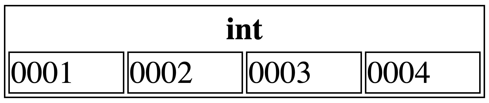
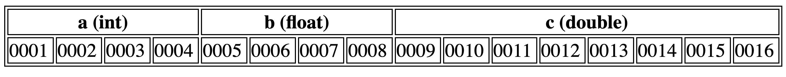

# Lecture 12 - Array, minne og pekere
Henrik Finsberg - 30.09.22


---

## Kontrollspørsmål fra forrige time

* Hva er en kompilator?
* Hvordan lager man kommentarer i C++?
* Hvordan brukes en funksjon med signaturen `void print(int)`?
* Hvordan kan man legge til et nytt element bakerst i en vector?

---

## Kontrollspørsmål fra forrige time (svar)
* En kompilator oversetter kildekode til maskinkode (`.cpp` til en kjørbar fil)
* `//` eller `/* */` for multiline
* Tar inn en `int` returnerer ingenting, f.eks
    ```c++
    inx x = 10;
    print(x)
    ```
    men dette vil ikke funke
    ```c++
    double x = 3.14 print(x)
    ```
* Ved å bruke `push_back`
    ```c++
    std::vector<int> values{1, 2, 3} // Husk: #include <vector>
    values.push_back(4);
    ```


---

## Mål for dagens forelesning
- Hva er et array og hvordan konstruerer og bruker vi det?
- Hvordan er variabler lagret i minnet (adresser)?
- Hva er en referanse?
- Hva er en peker?
- Ulike måter vi kan kalle funksjoner


---

##  Hva er et array?

* En liste med elementer som er lagret i minnet

* Alle elementer er av samme type

* Elementene er lagret sammenghengene i minnet - noe som gjør det mye mer effektivt å operere på
    - Mer om dette senere

* Et array kan ikke endre størrelse - i motsetning til `vector`


---

## Mitt første array

Et array a typen `double` med lengde `20` deklareres på følgende måte

```C++
double x[20];
```

* Skriv et program som deklarer dette (tomme) arrayet of printer inholdet

`empty_array.cpp`

---

## For å ungå tilfeldige verdier kan vi fylle arrayet vårt med `0`

```c++
double x[20];
for (int i = 0; i < 20; i++)
{
    x[i] = 0;
}
```

---

### Vi kan initialisere et array med verdier når vi konstruerer det også

Et array med 5 verdier
```C++
int primes[] = {2, 3, 5, 7, 11};
```
eller (ekvivalent)
```C++
int primes[5] = {2, 3, 5, 7, 11};
```

---

## Vi kan også droppe `=`


Et array med 5 verdier
```C++
int primes[]{2, 3, 5, 7, 11};
```
eller (ekvivalent)
```C++
int primes[5]{2, 3, 5, 7, 11};
```

---

## Vi kan også initalisere ett array med kun noen verdier


Et array av lengde 100 med de 5 første verdiene satt
```C++
int primes[100] = {2, 3, 5, 7, 11};
```
Dette betyr at vi har allokert plass i minnet til 100 tall, men at vi kun fyller inn de første 5 tallene.

---

### Hvordan kan vi lage en 2 x 2 matrise?

```C++
int A[2][2]
```

`matrix_2x2.cpp`


---

```c++
// matrix_2x2.cpp
#include <iostream>

int main()
{
    // Fyll i en løkke
    int A[2][2];
    for (int i = 0; i < 2; i++)
    {
        for (int j = 0; j < 2; j++)
        {
            A[i][j] = i + j;
        }
    }

    // Eller via en konstruktør
    int A[2][2]{{1, 2}, {3, 4}};

    for (int i = 0; i < 2; i++)
    {
        for (int j = 0; j < 2; j++)
        {
            std::cout << "(i, j, A[i][j]) = (" << i << ", " << j << ", " << A[i][j] << ")\n";
        }
    }
    return 0;
}
```

---

## Lag et program som løser et system av ODEer

Følgende ligning beskriver hastiget og posisjon til et legeme i fritt fall (uten luftmotstand)
$$\frac{{\rm d}v}{{\rm d}t} = -g, \qquad \frac{{\rm d}y}{{\rm d}t}=v.$$

Lagre resultatet i en tekstfil som dere kan laste inn i python og plotte.

Bruk følgende verdier
```c++
double g = 9.81;

// Initial betingelser
double y0 = 100.0; // 100 meter over bakken
double v0 = 0.0;   // Starter med null hastighet
```

---

Oppdater løsning ved å bruke følgende skjema

```c++
while (t < T)
{
    t = t_prev + dt;
    v = v_prev - g * dt;
    y = y_prev + v * dt;
}
```
Løs det ved bruke `dt = 0.01` og `T = 4.0`.

`falling_body.cpp`

---

```c++
// falling_body.cpp
#include <fstream>
#include <iostream>

int main()
{
    double g = 9.81;

    // Initial betingelser
    double y0 = 100.0;
    double v0 = 0.0;

    double T = 4.0;
    double dt = 0.01;

    double t, t_prev, v, v_prev, y, y_prev;

    t_prev = 0;
    v_prev = v0;
    y_prev = y0;

    std::ofstream ofs{"output.txt"};
    while (t < T)
    {
        t = t_prev + dt;
        v = v_prev - g * dt;
        y = y_prev + v * dt;

        std::cout << t << " " << v << " " << y << "\n";
        ofs << t << " " << v << " " << y << "\n";

        t_prev = t;
        v_prev = v;
        y_prev = y;
    }

    return 0;
}
```

---

## Plot løsningen med python

Lag et script i python some laster inn dataene fra tekstfilen og plotter de

---

```python
import numpy as np
import matplotlib.pyplot as plt

d = np.loadtxt("output.txt")
t, v, y = d.T

fig, ax = plt.subplots()
(l1,) = ax.plot(t, v)
ax2 = ax.twinx()
(l2,) = ax2.plot(t, y, color="r")
ax.legend([l1, l2], ["Velocity", "Position"])
plt.show()
```

---

## Hvordan er variabler lagret i minnet?

Forrige gang snakket vi litt om hvor mye plass ulike variabler tar i minnet

```c++
int x
```
tar for eksempel 4 bytes. Hver byte har en *adresse* i minnet.




---

## Ulike typer tar ulike plass i minnet

```C++
int a = 1;
float b = 1.0;
double c = 1.0;
```
Tre variabler av ulik type og adresser




---

## Hvor stor plass tar denne variabelen i minnet?

```C++
double x[20];
```

* Hver `double` tar 8 bytes
* Svar: 20 * 8 = 160 bytes

---

## Vi kan få adressen til en variable ved å bruke "&"

```C++
#include <iostream>

int main()
{
    int a = 1;
    float b = 1.0;
    double c = 1.0;
    std::cout << "Variable a with value " << a << " is located at " << &a << "\n";
    std::cout << "Variable b with value " << b << " is located at " << &b << "\n";
    std::cout << "Variable c with value " << c << " is located at " << &c << "\n";

    return 0;
}
```

`where_in_memory.cpp`

---

## Kalling av funksjoner - C++

Lag en funksjon `halve` med følgende signatur
```c++
/*
Takes in a double and halves the value of it
*/
void halve(double);
```
* Hva skjer med verdien utenfor funksjonen?


* Dette kalles **call by value**
* Prøv å skriv ut adressen til variablen i og utenfor funksjonen

* Verdien som sendes inn er kun en kopi

`call_by_value.cpp`

---

## Dersom vi ikke ønsker å sende inn en kopi, må vi sende inn en referanse til variablene

Dette spesifiseres kun i argumentet i funksjonsdeklarasjonen

```C++
void halve(double &x)
{
    x /= 2;
}
```

* Dette kalles **call by reference**

* Vi kan bruke "call by reference" i stedet for å returnere resultatet

---

## Vi kan bruke *call by reference* istedet for å returnere

Lag en funksjon finner største og minste elementet i et array


```python
def min_max(array):
    minimum = maximum = array[0]
    for v in array[1:]:
        if v < minimum:
            minimum = v
        if v > maximum:
            maximum = v
    return minimum, maximum


print(min_max([1, 4, 8, 6, 4, 0, 10, 2, 34, -1, 2]))
```

Istedenfor å returnere to "int"s, kan vi bruke "call by reference"

`min_max.cpp`

---

```c++
#include <iostream>
#include <vector>

void minmax(int &min, int &max, std::vector<int> values)
{
    min = max = values[0];
    for (int v : values)
    {
        if (v < min)
        {
            min = v;
        }
        if (v > max)
        {
            max = v;
        }
    }
}

int main()
{
    std::vector<int> values{1, 4, 8, 6, 4, 0, 10, 2, 34, -1, 2};
    int min, max;
    minmax(min, max, values);
    std::cout << "min = " << min << ", max = " << max << "\n";
    return 0;
}
```

---

## I dette tilfelle ville jeg kanskje sjekket standardbibliotektet først

```c++
#include <algorithm>
#include <iostream>
#include <vector>

int main()
{
    std::vector<int> values{1, 4, 8, 6, 4, 0, 10, 2, 34, -1, 2};

    auto minmax = std::minmax_element(begin(values), end(values));
    std::cout << "min = " << *minmax.first << ", max = " << *minmax.second << "\n";
    return 0;
}
```

---

## Vi kan gjøre variabler "immutable" (umulige å endre) ved å bruke `const`

```C++
const int MYCONSTANT = 10;
```

Da vil det ikke funke å for eksempel skrive

```C++
MYCONSTANT++;
```

`constant.cpp`

----

Dette er lurt å bruke `const` dersom du for eksempel vil sende inn en stor vektor som du ikke ønsker å endre.

```C++
double standard_deviation(const std::vector<double> &data)
{
    ...
}
```
Husk at dersom vi bruker "call by value" så lager vi en ekstra kopi av `data`, mens dette slipper vi om vi bruker *call by reference*

---

Merk at det ikke er nødvendig å bruke `const`, men det gjør

1. at brukeren av koden ser at det som sendes inn ikke endres inne i funksjonen, og
2. kompilatoren vil si ifra deresom du prøver å endre på den.


---


## Referanse variabler

Det er også mulig å lage referanse variabler utenfor funksjonsargumentene.

Hva tror dere er forskjellen på `b` og `c` ?

```C++
int a = 5;
int &b = a;
int c = a;
```

* Hva tror dere skjer med `a` om vi endrer på `b` eller `c`?

`reference_variables.cpp`


---

```c++
// reference_variables.cpp
#include <iostream>

int main()
{
    int a = 5;
    int &b = a;
    int c = a;

    std::cout << "a = " << a << ", b = " << b << ", c = " << c << "\n";
    std::cout << "Increment a\n";
    a++;
    std::cout << "a = " << a << ", b = " << b << ", c = " << c << "\n";
    std::cout << "Increment b\n";
    b++;
    std::cout << "a = " << a << ", b = " << b << ", c = " << c << "\n";
    std::cout << "Increment c\n";
    c++;
    std::cout << "a = " << a << ", b = " << b << ", c = " << c << "\n";
    return 0;
}
```

---

## Pekere (pointers)

* Objekter lever i minnet, og vi kan akkssessere dette minnet via variabler eller pekere
* En peker er en variabel hvor verdien er minneadressen

* Vi bruker `*` til å deklarere en peker

    ```C++
    int *x;
    ```
    Her er `x` en peker variabel som peker på en `int`


---

## Verdien til en peker er en adresse i minnet

```C++
int *x;
int a = 42;
double *y;
double b = 3.14;

x = &a;
y = &b;
```
* For å hente ut verdien på en minneadresse må vi dereferere pekeren ved å bruke `*`

    ```c++
    std::cout << "a = " << a << ", &a =  " << &a << ", x = " << x << ", *x =" << *x << "\n";
    std::cout << "b = " << b << ", &b =  " << &b << ", y = " << y << ", *y =" << *y << "\n";
    ```
* Med andre ord
    ```c++
    std::cout << *(&a) << " = " << a << "\n";
    ```

---

## Pekere vs referanse variabler

```C++
int a = 10;

// Referanse til a
// - verdien er det samme som a
// - adressen er det samme som a
int &b = a;

// Peker på a
// - verdien er adressen til a
// - pekeren har en egen adresse
int *c = &a;
```

Hva skjer dersom vi prøver å legge 5 til a, b, c ?

`pointer_vs_reference.cpp`

---

## Pekere vs referanse variabler


* Det å endre en peker direkete vil ikke ikke endre variablen


* Når vi legger til 5 på pekeren flytter vi bare pekeren 5 (`int`) plasser i minnet slik at den nå peker på en annen minne-adresse.

---

## For å endre verdien som en peker peker på, kan vi bruke dereferering (dereferencing)


```C++
int a = 10;
int *c = &a;

// Dereferering
*c += 5
```

`dereference.cpp`


---

| Syntax    | Meaning               |
|--------	|---------------------	|
| `int i`  	| integer variable    	|
| `int &r` 	| reference variable  	|
| `int *p` 	| pointer variable    	|
| `&i`     	| get address of something |
| `*p`     	| content of address/pointer |

---

## Allokering av minne

Minne allokeres for variabler, men ingen verdi settes

```C++
int x;
double y;
```

---

Vi allokerer en peker som ikke pekere på noe
```C++
int *z;
```
`z` kalles for en NULL peker (null pointer). Merk at vi allokerer minne for pekeren på samme måte som for en variabel

---

Dersom en peker, peker på noe kan vi også få den til å slutte å peke på dette ved å sette den lik `nullptr`

```C++
int *z = &x;
z = nullptr;
```

---

## Kalling av funksjoner i C++


Call by value
```C++
// Denne funksjonen gjør ingenting fordi vi kun endrer kopien av x
void halve(double x)
{
    x /= 2;
}
```


Call by referece
```C++
void halve(double &x)
{
    x /= 2;
}
```

---

Call by pointer
```C++
void halve(double *x)
{
    *x /= 2;
}
```
Merk at vi må bruke dereferering for å endre verdien.

`call_by_pointer.cpp`

---

## Mål for dagens forelesning
- Hva er et array og hvordan konstruerer og bruker vi det?
- Hvordan er variabler lagret i minnet (adresser)?
- Hva er en referanse?
- Hva er en peker?
- Ulike måter vi kan kalle funksjoner
