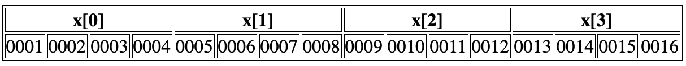
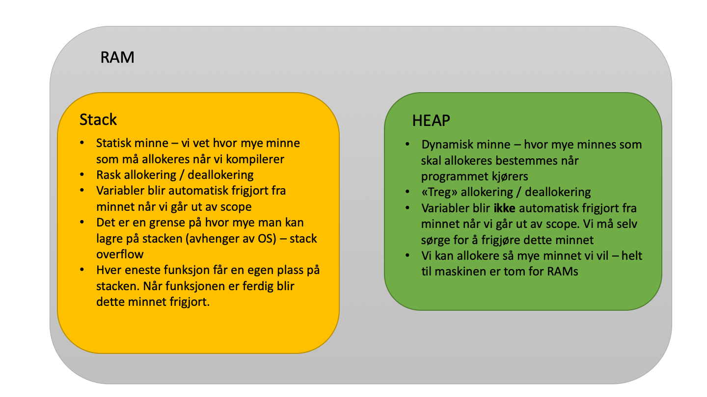

# Lecture 14 - Mer om pekere,  arrays, dynamisk allokering og dynamiske arrays
Henrik Finsberg - 07.10.22

---

## Kontrollspørsmål fra forrige time

1. Hva er forskjellen på en `class` og en `struct`
2. Hva vil det si at en variabel er `private`
3. Hva er funksjons overlasting (*function overloading*)?

---

## Kontrollspørsmål fra forrige time (svar)

1. I en `struct` er (*default*) medlemsvariabler `public`, mens i en `class` er de `private`. `struct` brukes til å gruppere data, mens `class` brukes til å lage objeker med egenskaper og oppførsel
2. Medlemsvariabler som er `private` kan kun brukes internt i klassen
3. Funksjons overlasting er når vi har flere funksjoner med samme navn som har ulik signatur (dvs kan ta ulik input or returnere ulik output). Eksempel
   ```c++
   std::vector<int> range(int end) std::vector<double> range(double start, double end, double step = 1.0)
   ```

---

## Mål for dagens forelesning

- Hvordan er peker og arrays relatert
- Hva mener vi med dynamisk minne allokering
- Hva er en destruktør og hvorfor trenger vi det
- Hva er en array list / dynamisk array
- Hva er smarte pekere

---

## Repetisjon av pekere

```C++
// Heltalls variabel
int a = 10;

// Heltalls peker
int *b;
```

* Vi kan la `b` peke på `a` ved å sette verdien til `b` lik adressen til `a`
    ```C++
    b = &a;
    ```

* Dersom vi printer verdien til `b` vil vi kun få adressen til `a`

    ```C++
    // Printer adressen til a
    std::cout << b << "\n";
    ```

---

* Det samme gjelder dersom vi prøver å gjøre aritmetikk med `b` (for eksempel legge til 5). Da vil vi kun endre adressen som `b` peker på.
    ```C++
    // Vil kun flytte pekeren 5 plasser i minnet
    b += 5
    ```
* Vi kommer tilbake til hva vi mener med 5 plasser i minnet

* For å printe verdien til `a` via pekeren `b`, må vi først dereferere `b`
    ```C++
    std::cout << *b << "\n";
    ```

* For å endre verdien til `a` via pekeren `b`, må vi også dereferere `b`
    ```C++
    // Nå endres *b og dermed også verdien til a
    *b += 5;
    ```

---

| uttrykk | can leses som     |
| ------- | ----------------- |
| int i   | heltalls variabel |
| int *p  | peker variabel    |
| *x      | pekt på av x      |
| &x      | adressen til x    |

Vi kan også be pekeren om å ikke peke på noe
```C++
b = nullptr;
```
Da kaller vi `b` en null-peker (NULL pointer)

---

## Pekere på objekter

Det er også mulig å lage pekere som peker objekter - instanser av structs eller klasser

```C++
struct GridPoint
{
    int x;
    int y;
    int z;
};
```

Lag en instans av `GridPoint` (`start`) og lag deretter en `GridPoint`-peker som peker på dette objektet.

`pointer_to_object.cpp`

---

* Hvordan få tilgang til atributtene til ett objekt gjennom dereferering?

    ```C++
    GridPoint *start_ptr = &start std::cout << "x = " << (*start_ptr).x << "\n";
    ```

* Dette blir fort tungvindt. Derfor finnes det en enklere syntax

    ```C++
    std::cout << "x = " << start_ptr->x << "\n";
    ```

---

| uttrykk  | betyr                                                 |
| -------- | ----------------------------------------------------- |
| `x.y`    | medlem `y` på objekt `x`                              |
| `x->y`   | medlem `y` på objekt pekt på av `x` (`x` er en peker) |
| `(*x).y` | medlem `y` på objekt pekt på av `x` (`x` er en peker) |

---

## Array og pekere

*Hvordan er et array lagret i minnet?*

Husk at vi kan deklarere ett array med heltall av lengde 10

```C++
int x[10];
```
Lag et program som printer adressen til de 4 første elementene i et array.
Legger du merke til noe spesielt?

`array_adress.cpp`

---

Adressen til x[i+1] er 4 mer enn x[i]




---

## Hva skjer om vi kun printer ut bare `x`?

```C++
std::cout << "x = " << x << "\n";
```


---

## `x` er en peker som peker på `x[0]`

Vi får det samme som `&x[0]`!

Hvordan er `x` og `y` relatert her?
```C++
int x[] = {2, 4, 6, 8, 10, 12};
int *y = &x[0];
```
* y og x peker på det samme objektet

---

Hvordan kan vi printe ut verdiene i arrayet nå som du vet hvordan pekere fungerer?

* Svar:
    ```C++
    std::cout << "y[0] = " << y[0] << "\n";
    std::cout << "y[1] = " << y[1] << "\n";
    ...
    ```

---

Kan vi printe på noen annen måte? Hva med å bruke dereferering?

* Svar:
    ```C++
    std::cout << "*y = " << *y << "\n";
    std::cout << "*(y + 1) = " << *(y + 1) << "\n";
    ...
    ```

---

## Dette kalles **peker aritmetikk** (pointer arithmetic)

| utrykk | ekvivalent uttrykk | kan leses som               |
| ------ | ------------------ | --------------------------- |
| x[0]   | *x                 | første objekt pekt på av x  |
| x[1]   | *(x + 1)           | andre objekt pekt på av x   |
| x[n]   | *(x + n)           | (n+1)te objekt pekt på av x |

---

## Dersom data ligger etter hverandre i minnet så trenger vi kun å vite adressen til første elementet


* En `int *` peker kan peke på ett tall eller ett helt array

* En peker vet ikke hvor langt ett array er

* Prøv å regne ut lengden til `x` og `y` ved å bruke `sizeof(x) / sizeof(x[0])`

* Kompilatoren vet størrelsen på `x` men ikke på `y` (defor vil `sizeof(y)` returnere størrelsen til pekeren og ikke arrayet)

---

## Hva kan vi si om lengden til ett array?

* Ikke bruk `sizeof(x) / sizeof(x[0])` til å regne ut lengen med mindre du er HELT sikker!

* Det er bedre å lagre lengen av arrayet i en egen variabel.


---

## Hva med å lage en klasse hvor vi lagrer legenden og en peker til første element?

```C++
class Array
{
  public:
    int *_data;
    int _size;
};
```

Lag en konstruktør som tar inn `n` og setter alle elementene i data til 0.
Verifiser at når du lager en instans så er elementene i arrayet lik 0.

`array_class.cpp`

---

```C++
#include <iostream>

class Array
{
  public:
    int *_data;
    int _size;

    Array(int n)
    {
        int data[n];
        for (int i = 0; i < n; i++)
        {
            data[i] = 0;
        }
        _data = data;
        _size = n;
    }
};

int main()
{

    Array arr{10};
    for (int i = 0; i < 10; i++)
    {
        std::cout << arr._data[i] << "\n";
    }

    return 0;
}
```

---

## Alle variabler som er laget i et skop (for eksempel inn i en funksjon) vil bli frigjort fra minnet nå vi går ut av skopet (scope)

* Hva er et skop? Det som er inne i nøyaktig samme krølleparantes er i samme skop.
* elementene i arrayet blir satt til 0 inne i et skop
* når vi går ut av skopet blir elementene kastet (minnet blir frigjort) og verdiene blir søppel-verdier


---

Her er ett eksempel som minner om tilfelle med `Array` konstruktøren.
Her lager vi en skop å bruke `{}`. `x` blir frigjort fra minnet når
skopet tar slutt.

```c++
int *y;
{
    int x[] = {0, 0, 0, 0, 0, 0};
    y = x;
}
for (int i = 0; i < 5; i++)
{
    std::cout << y[i] << "\n;
}
```
Det er mulig at vi printer kun `0` her, men vi har ingen garanti fordi dette minnet kan brukes fritt av andre resurser.

---

## En variabel kan allokeres i en annen del av minnet slik at den ikke blir forkastet når vi går ut av skop

Vi allokerer peker ved å be dem peke på en adresse i dette andre minnet ved å bruke ordet `new`
```C++
int *x = new int;
```
Og setter verdien på denne minneadressen ved å bruke dereferering
```C++
*x = 5;
```
Eventuelt så kan vi gjøre dette direkte
```C++
int *x = new int{5};
```
---

## Vi kan fikse kontruktøren vår ved å bruke dynamisk minne allokering
```C++
Array(int size)
{
    _data = new int[size];
    _size = n;
    for (int i = 0; i < size; i++)
    {
        _data[i] = 0;
    }
}
```
Dette nye minnet kalles heap mens det minnet vi er vandt til kalles stack

---

Kan også bruke medlemsinitaliseringslister her

```c++
Array(int size) : _size(size), _data(new int[size])
{

    for (int i = 0; i < size; i++)
    {
        _data[i] = 0;
    }
}
```

---




---

## Vi må selv sørge for å frigjøre minnet vi allokerer på heapen

Frigjøre minnet til en `int`
```C++
int *x;
x = new int;

delete x;
```

Frigjøre minnet til et array
```C++
int *x;
x = new int[200];

delete[] x;
```


---

## Hva skjer om vi glemmer å frigjøre minnet?

```C++
void doomsday()
{
    while (true)
    {
        Array a{1};
    }
}
```

`doomsday.cpp`

Tommelfingerregel: For hver `new` bør det være en `delete`

---

## Hvordan frigjøre minnet til en array instans når instans forsvinner fra scopet

Vi må implementere en destruktør (destructor)

```C++
~Array()
{
    delete[] _data;
}
```

---


Lag et program som printer når konstruktør og destruktør kalles. Prøv å gjøre dette inne i et skop

`array_class_destructor.cpp`

---

```c++
#include <iostream>

class Array
{
  public:
    int *_data;
    int _size;

    Array(int size) : _size(size), _data(new int[size])
    {
        std::cout << "Create array of size " << _size << "\n";
        for (int i = 0; i < size; i++)
        {
            _data[i] = 0;
        }
    }
    ~Array()
    {
        std::cout << "Delete array of size " << _size << "\n";
        delete[] _data;
    }
};

int main()
{

    std::cout << "Before scope\n";
    Array arr{2};
    {
        std::cout << "Beginning of scope\n";
        Array arr{1};
        std::cout << "End of scope\n";
    }
    std::cout << "After scope\n";
    return 0;
}
```

---


## Når skal man bruke dynamisk minne?


* Hvis man trenger at data skal leve lengre enn utenfor sitt skop

* Du har så store data at de ikke får plass i statisk minne

* Du vet ikke hvor mye minne du trenger før programmet kjører
    - for eksempel hvis størrelsen av et array avhenger av bruker-input

* Du bør alltid bruke statiske variabler dersom du har mulighet til det

---

## Er du nødt til å allokere dynamisk minne, gjør det via en klasse

* Alloker minne i konstruktøren
* Dealloker minne i destruktøren
* Resource Acquisition Is Initialization (RAII)
* Bruke smarte pekere hvis du kan!
* https://isocpp.github.io/CppCoreGuidelines/CppCoreGuidelines#S-resource

---

## Smarte pekere


```C++
// Rå peker
#include <iostream>

int main()
{
    int *p = new int{42};
    std::cout << *p << "\n";
    delete p;
}
```

```c++
// Smart peker
#include <iostream>
#include <memory>

int main()
{
    std::unique_ptr<int> p(new int{42});
    std::cout << *p << "\n";
}
```

---

Det går også an å bruke `std::make_unique` i C++14


Smart peker
```c++
#include <iostream>
#include <memory>

int main()
{
    std::unique_ptr<int> p = std::make_unique<int>(42);
    std::cout << *p << "\n";
}
```

---

# Smarte peker for Array klassen

Vi kan endre dette
```c++
class Array
{
  public:
    int *_data;
    int _size;

    Array(int n) : _data(new int[n]), _size(n)
    {
        for (int i = 0; i < n; i++)
        {
            _data[i] = 0;
        }
    }
    ~Array()
    {
        delete[] _data;
    }
};
```

---

til dette
```c++
class Array
{
  public:
    unique_ptr<int[]> _data;
    int _size;

    Array(int n) : m_data(new int[n]), _size(n)
    {
        for (int i = 0; i < n; i++)
        {
            _data[i] = 0;
        }
        _size = n;
    }
};
```

---

I dette spesifikke tilfelle burde man heller bruke `std::vector`, men...

---

# Dynamiske array - Array list

Tenk at `vector` ikke fantes.
Kan vi lage en array klasse med variabel størrelse?


`array_list.cpp`

---

## Implementer konstruktør, destruktør og lengde

* Lag en array klasse med tre private variables; en størrelse (`size`) en kapasitet (`capacity`) og en `int` peker (`data`). Lag en konstruktør og en destruktør. Sett `capacity = 100` som default verdi.

* Lag en metode `length` som returner lengden av arrayet. Lag deretter en test som sjekker som sjekker at lengen av et tomt array er 0. Du kan inkludere `<cassert>` og bruke `assert(array.length() == 0)` for å sjekke at lengden er 0.

---

## Implementer `append` og `get`

* Lag en metode `append` som legger til elementer på slutten av arrayet. Hva slags signatur bør denne metoden ha?

* Lag en metode `get` som tar inn en index `i` returnerer elementet på plass nummer `i`. Hva slags signatur har denne funksjonen? Bør vi gjøre noen sjekker?

---

* Skrive en test som sjekker at dersom vi legger til elementer i lista, så vil `.get` returnere disse.
* Skriv en test som sjekker at dersom vi prøver å hente et element som er mindre enn 0 eller større en legnden som kastes en `std::out_of_range`
* Hint: Bruk følgende code
    ```C++
    bool throwed_range_error = false;
    try
    {
        // Prøv å gjøre noe som kaster std::out_of_rage
    }
    catch (const std::out_of_range &e)
    {
        throwed_range_error = true;
    }
    assert(throwed_range_error);
    ```


---

## Implementer `print`

* Implementer en metode `print` som printer ut arrayet

---

* Implementer `int& operator[]` slik at vi kan aksessere elementer nummer `i` på følgende måte: `array[i]`.

* Hva betyr det at denne metoden returnerer `int&` i motsetning til `int`?

* Skriv en test for dette

---


## Hva skal vi gjøre dersom `size >  capacity`?

* Implementer en metode `resize` som dobler kapasiteten ved å først allokere ett nytt array av dobbel størrelse og deretter kopiere det gamle arrayet til det nye. Gjør dette til en private metode.

* Fiks `append` slik at dersom du prøver å øke størrelsen utover kapasiteten så kalles `resize`.

* Sett default kapsitet til 1

* Implementer en metode som returnerer kapasiteten

* Skriv en test som sjekker at kapasiteten endrer seg etterhvert som man legger til elementer i lista


---

* Lag en ny konstruktør som kan ta inn en `int` som er kapasiteten.

* Lag en ny konstruktør som kan ta inn liste med tall (`ArrayList array{{1, 2, 3, 4}};`). *Hint: La konstruktøren din ta inn en vector*.

* Skriv tester for dette.


---

```c++
#include <iostream>
#include <stdexcept>
#include <vector>

class ArrayList
{
  private:
    int *_data;
    int _size = 0;
    int _capacity = 1;

    /**
     * @brief Check it index is out of range
     * and if it is, throw a range_error
     *
     * @param index The index to be checked
     */
    void check_index(int index)
    {
        if ((index >= _size) || (index < 0))
        {
            throw std::out_of_range("Index " + std::to_string(index) + " is out of range to array with size " +
                                    std::to_string(_size));
        }
    }

    /**
     * @brief Increase capacity of array with the
     * given growth factor.
     *
     */
    void resize()
    {
        int capacity = 2 * _capacity;
        int *data = new int[capacity];
        for (int i = 0; i < _capacity; i++)
        {
            data[i] = _data[i];
        }
        delete[] _data;
        _data = data;
        _capacity = capacity;
    }

  public:
    ArrayList()
    {
        _data = new int[_capacity];
        for (int i = 0; i < _capacity; i++)
        {
            _data[i] = 0;
        }
    }
    ArrayList(int capacity) : _capacity(capacity), _data(new int[capacity])
    {
        for (int i = 0; i < _capacity; i++)
        {
            _data[i] = 0;
        }
    }
    ArrayList(std::vector<int> data)
    {
        _data = new int[_capacity];
        for (int i = 0; i < _capacity; i++)
        {
            _data[i] = 0;
        }
        for (int x : data)
        {
            append(x);
        }
    }
    ~ArrayList()
    {
        delete[] _data;
    }
```
---

```c++
/**
 * @brief Returns the length of the array
 *
 * @return The length of the array
 */
int length()
{
    return _size;
}

/**
 * @brief Add element to the end of the list.
 *
 * @param value The value to be added.
 */
void append(int x)
{
    if (_size >= _capacity)
    {
        resize();
    }
    _data[_size] = x;
    _size++;
}

/**
 * @brief Print the ArrayList
 *
 */
void print()
{
    std::cout << "[";
    for (int i = 0; i < _size - 1; i++)
    {
        std::cout << _data[i] << ", ";
    }
    std::cout << _data[_size - 1] << "]\n";
}

/**
 * @brief Overload of getitem.
 *
 * @param index The index in the array
 * @return int A copy of value at that index
 */
int get(int index)
{
    check_index(index);
    return _data[index];
}

/**
 * @brief Overload of getitem.
 *
 * @param index The index in the array
 * @return int& A reference variable of the value at that index
 */
int &operator[](int index)
{
    check_index(index);
    return _data[index];
}

/**
 * @brief Returns the capacity of the ArrayLst
 *
 * @return The capacity
 */
int capacity()
{
    return _capacity;
}
}
;
```

---

```c++
#include <cassert>

#include "array_list.cpp"

void test_array_throw_range_error()
{
    ArrayList a{};
    a.append(0);
    a.append(1);

    bool throwed_range_error = false;
    try
    {
        int x = a.get(2);
    }
    catch (const std::out_of_range &e)
    {
        throwed_range_error = true;
    }
    assert(throwed_range_error);
}

void test_get()
{
    ArrayList a{};
    a.append(0);
    a.append(1);

    assert(a.get(0) == 0);
    assert(a.get(1) == 1);
}

void test_get_update()
{
    ArrayList a{};
    a.append(0);
    a.append(1);
    a[0] = 42;

    assert(a[0] == 42);
    assert(a[1] == 1);
}

void test_array_with_two_elements_has_length_two()
{
    ArrayList a{{1, 2}};
    assert(a.length() == 2);
}

void test_capacity()
{
    ArrayList a{};
    assert(a.capacity() == 1);
    a.append(0);
    a.append(1);
    assert(a.capacity() == 2);
    a.append(2);
    assert(a.capacity() == 4);
}
```

---

## Hva er ulempen med denne implementeringen?

* Dersom vi må øke kapasiteten så må vi bruke tid på
    1. Å allokere nytt minne
    2. Kopiere hele arrayet til dette nye minnet
    3. Slette det gamle arrayet

---

## Hvordan funker dette for `vector` i C++ og lister i python?

`capacity.cpp`

`capacity.py`


---

```python
# capcacity.py
import sys

for num_elements in range(0, 14):
    lst = []
    for el in range(num_elements):
        lst.append(el)
    print(num_elements, sys.getsizeof(lst))
```

---

```c++
// capacity.cpp
#include <iostream>
#include <vector>

int main()
{
    for (int num_elements = 0; num_elements < 14; num_elements++)
    {
        std::vector<int> arr;
        for (int i = 0; i < num_elements; i++)
        {
            arr.push_back(i);
        }
        std::cout << num_elements << " " << arr.capacity() << "\n";
    }
    return 0;
}
```

---

## ArrayList er et eksempel på en datastruktur

* I det neste ukene og i prosjekt 2 kommer vi til så se på denne samt andre datastrukturer

* Et annet eksempel er noe som kalles lenket list som vi skal se nærmere på - det er dette du får hvis du bruker `#include <list>`

---

## Mål for dagens forelesning

- Hvordan er peker og arrays relatert
- Hva mener vi med dynamisk minne allokering
- Hva er en destruktør og hvorfor trenger vi det
- Hva er en array list / dynamisk array
- Hva er smarte pekere
