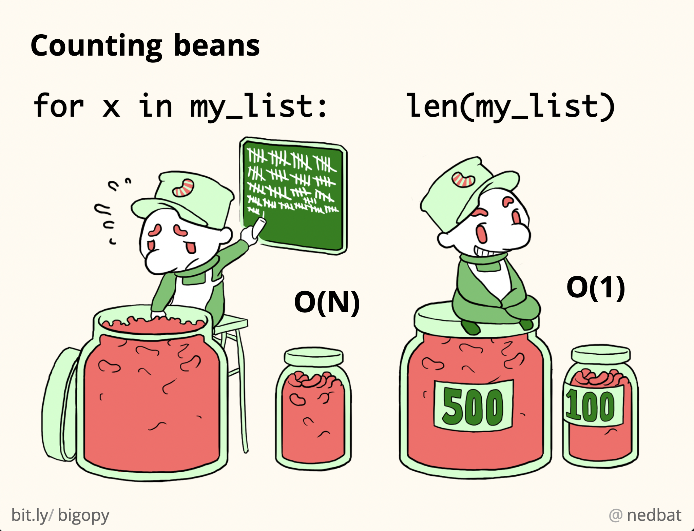
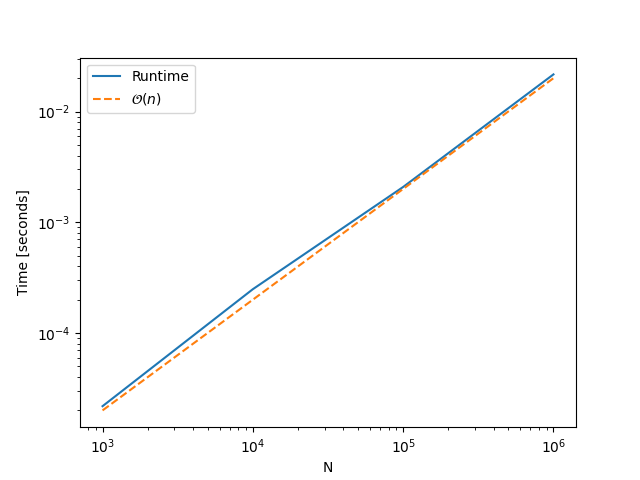
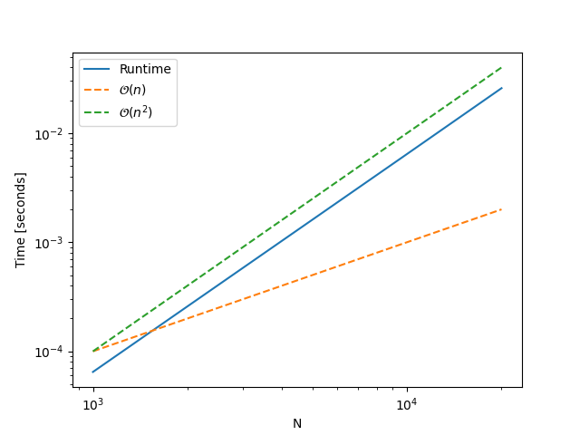
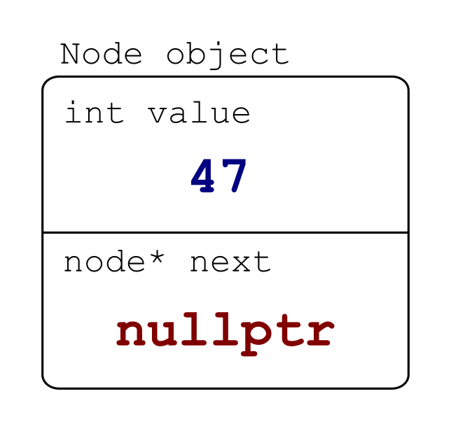

# Lecture 15 - Lenkede lister og algoritme analyse
Henrik Finsberg - 19.10.22

---

## Kontrollspørsmål fra forrige time


1. Hvordan aksesserer man medlemsvariabler til et objekt via en peker (f.eks `x` på `GridPoint`, via `GridPoint *start_ptr`)?
2. Hvis vi har `int x[10]`, og ønsker å sette `int y = x[2]`. Hvordan kan vi gjøre dette  via peker aritmetikk?
3. Hvorfor vil ikke dette fungere?
   ```c++
   class Array
   {
       ... Array()
       {
           int data[_capacity];
           for (int i = 0; i < _capacity; i++)
           {
               data[0] = 0;
           }
           _data = data;
       }
   };
   ```

---

## Kontrollspørsmål fra forrige time (svar)

1. Ved å bruke `->`, dvs `start_ptr->x`.
2. Vi kan bruke, `int y = *(x + 2)`.
3. Minnet som allokeres til `data` i kontstruktøren blir frigjort når variabelen går ut av skop (dvs når konstruktøren er ferdig). Det betyr at verdiene i arrayet blir søppelverdier. For å fikse dette må vi allokere arrayet på heapen. Det kan vi gjøre på følgenge måte
   ```c++
   Array()
   {
       _data = new int[_capacity] for (int i = 0; i < _capacity; i++)
       {
           _data[0] = 0;
       }
   }
   ```
    Men pass på! Nå må vi huske å frigjøre det minnet selv. Hvor bør vi gjøre dette?

---


## Mål for dagens forelesning

- Kunne analysere kjøretid til ulike algoritmer
- Forstå big O-notasjon og hvordan vi kan kvantifisere kjøretiden til en algoritme
- Vite hvordan lenkede lister fungerer
- Vite kjøretiden på de ulike operasjonene på ArrayList og lenkede lister

---

## Hvordan skal vi velge hvilken algoritme vi skal bruke?

* Si at vi har to forskjellige algoritmer for å sortere en liste. Begge algoritmene gir samme resultat. Hvilken skal vi velge?

* Det avhenger litt av situasjonen du er i
  * **Den som er raskest**
  * Den som bruker minst minne
  * Den som bruker minst energi

---

* Hvordan kan vi finne ut hvilken algoritme som er raskest?

* Vi kan implementere begge og teste - Dette gir oss ingen garanti!
    + Tiden det tar er avhengig av maskin og hvor mange andre programmer som kjører når vi tester algoritmen
    + Hvis vi kjører samme test to ganger på rad, så kan vi få forskjellige svar
    + Algoritmen kan oppføre seg forskjelig på forskjellig type input

---

## Hvor rask algoritmen er vil avhenge av input

* Størrelsen på lista vi ønsker å sortere
    - Større liste tar lenger tid
    - Hvis det tar $x$ tid å sortere en liste av størrelse $N$, hvor lang tid tar det å sortere en liste av størrelse $2N$?


* Hvordan ser lista ut som vi ønsker å sortere
    - er lista allerede sortert
    - er lista sortert men i feil rekkefølge
    - er lista helt tilfeldig

---


Telle en og en bønne vs telle bønner med merkelapp

* Telle en og en bønne vil ta lenger tid jo flere bønner det er
* Er det dobbelt så mange bønner, så tar det dobbelt så lang tid
* Er det merkelapp på bollene har det ingenting å si hvor mange bønner det er



---

Finn et spesifikt ord i en roman eller i en ordbok

* I en roman må man starte på side 1 og potensielt bla igjennom hele boken
* I en ordbok, kan du slå opp på midten av boken, deretter går du enten fram eller tilbake i boken og slå på nytt opp på midten


---

## Vi kan analysere algoritmen ved å telle operasjoner

* Vi kan analysere hvordan antall operasjoner algoritmen må utføre avhenger av $N$ ($N$ er typisk størrelse på input data)

* Eksempel på en operasjon kan være

    - Sette verdien til en variabel
    - Kalle en metode
    - Sammenligne to tall
    - Hente verdien på en indeks i et array

* Når vi er ferdig med å telle, beholder vi bare de mest signifikante leddene

* La oss analysere en algoritme som finner det minste elementet i en liste og la $N$ være størrelsen på input dataen - $N$ er lengden av lista

---

```python
def find_smallest(numbers: List[int]) -> int:
    smallest = numbers[0]
    for number in numbers:
        if number < smallest:
            smallest = number
    return smallest
```


---


```python
def find_smallest(numbers: List[int]) -> int:
    smallest = numbers[0]  # 1
    for number in numbers:
        if number < smallest:
            smallest = number
    return smallest
```


---

```python
def find_smallest(numbers: List[int]) -> int:
    smallest = numbers[0]  # 1
    for number in numbers:  # N
        if number < smallest:
            smallest = number
    return smallest
```


---

```python
def find_smallest(numbers: List[int]) -> int:
    smallest = numbers[0]  # 1
    for number in numbers:  # N
        if number < smallest:  # N * 1
            smallest = number
    return smallest
```


---

```python
def find_smallest(numbers: List[int]) -> int:
    smallest = numbers[0]  # 1
    for number in numbers:  # N
        if number < smallest:  # N * 1
            smallest = number  # N * k (k er mindre enn 1)
    return smallest
```

---

```python
def find_smallest(numbers: List[int]) -> int:
    smallest = numbers[0]  # 1
    for number in numbers:  # N
        if number < smallest:  # N * 1
            smallest = number  # N * k
    return smallest  # 1
```

---

```python
def find_smallest(numbers: List[int]) -> int:
    smallest = numbers[0]  # 1
    for number in numbers:  # N
        if number < smallest:  # N * 1
            smallest = number  # N * k
    return smallest  # 1
```

* Antall operasjoner = $1 + N + N + kN + 1 = (2 + k)N + 2$

---

## *stor O* notasjon beholder kun det største leddet og kaster bort alle koeffisienter

```python
def find_smallest(numbers: List[int]) -> int:
    smallest = numbers[0]  # 1
    for number in numbers:  # N
        if number < smallest:  # N * 1
            smallest = number  # N * k
    return smallest  # 1
```

* Antall operasjoner = $1 + N + N + kN + 1 = (2 + k)N + 2 = \mathcal{O}(N)$
* Vi sier at algoritmen er *O av N* (også kalt *lineær kjøretid*)

---

## Hva kan vi si om kjøretiden til en algoritme med lineær kjøretid?

* Hvis vi vet at algoritmen (i gjennomsnitt) bruker 1 sekund når lista er av størrelse $N$, hvor lang tid bruker algoritmen (i gjennomsnitt) på en liste av størrelse $2N$?
* Svar: 2 sekunder
* Hva med en liste av størrelse $10N$?
* Svar: 10 sekunder

---

## Kan vi verifisere at vi har analysert algoritmen riktig?

- Vi kan teste algoritmen på med ulik størrelse på input.

```python
import time
import numpy as np

num_runs = 100
all_runtimes = []
Ns = np.array([1000, 10_000, 100_000, 1_000_000])
for N in Ns:
    numbers = list(range(N))

    runtimes = []
    for _ in range(num_runs):
        t0 = time.perf_counter()
        find_smallest(numbers)
        elapsed_time_run = time.perf_counter() - t0
        runtimes.append(elapsed_time_run)

    elapsed_time = np.mean(runtimes)
    print(f"{N:10}\t{elapsed_time:10.4f}")
    all_runtimes.append(elapsed_time)
```

---

## Vi kan også plotte kjøretiden og sammenligne med en linær kjøretid

Vi plotter kjøretiden sammen med en fuksjon som er en lineær funksjon av $N$.
Her bruker vi $f(n) = kN =  2\times10^{-8} N$

```python
import matplotlib.pyplot as plt

fig, ax = plt.subplots()
ax.loglog(Ns, all_runtimes, label="Runtime")
ax.loglog(Ns, Ns * 2e-8, linestyle="--", label="$\mathcal{O}(n)$")
ax.set_xlabel("N")
ax.set_ylabel("Time [seconds]")
ax.legend()
plt.show()
```
---



---

## La oss prøve å bruke denne funksjonen til å sortere lista

Hva er kjøretiden til denne algoritmen?

```python
def sort_list(numbers: List[int]) -> List[int]:
    sorted_numbers = []
    N = len(numbers)
    for _ in range(N):
        smallest = find_smallest(numbers)
        sorted_numbers.append(smallest)
        numbers.remove(smallest)
    return sorted_numbers
```

---

```python
def sort_list(numbers: List[int]) -> List[int]:
    sorted_numbers = []  # 1
    N = len(numbers)  # 1
    for _ in range(N):
        smallest = find_smallest(numbers)
        sorted_numbers.append(smallest)
        numbers.remove(smallest)
    return sorted_numbers
```

---

```python
def sort_list(numbers: List[int]) -> List[int]:
    sorted_numbers = []  # 1
    N = len(numbers)  # 1
    for _ in range(N):  # N
        smallest = find_smallest(numbers)
        sorted_numbers.append(smallest)
        numbers.remove(smallest)
    return sorted_numbers
```

---

```python
def sort_list(numbers: List[int]) -> List[int]:
    sorted_numbers = []  # 1
    N = len(numbers)  # 1
    for _ in range(N):  # N
        smallest = find_smallest(numbers)  # N * N
        sorted_numbers.append(smallest)
        numbers.remove(smallest)
    return sorted_numbers
```

---

```python
def sort_list(numbers: List[int]) -> List[int]:
    sorted_numbers = []  # 1
    N = len(numbers)  # 1
    for _ in range(N):  # N
        smallest = find_smallest(numbers)  # N * N
        sorted_numbers.append(smallest)  # N * 1
        numbers.remove(smallest)
    return sorted_numbers
```

---

```python
def sort_list(numbers: List[int]) -> List[int]:
    sorted_numbers = []  # 1
    N = len(numbers)  # 1
    for _ in range(N):  # N
        smallest = find_smallest(numbers)  # N * N
        sorted_numbers.append(smallest)  # N * 1
        numbers.remove(smallest)  # N * N
    return sorted_numbers  # 1
```


---

```python
def sort_list(numbers: List[int]) -> List[int]:
    sorted_numbers = []  # 1
    N = len(numbers)  # 1
    for _ in range(N):  # N
        smallest = find_smallest(numbers)  # N * N
        sorted_numbers.append(smallest)  # N * 1
        numbers.remove(smallest)  # N * N
    return sorted_numbers  # 1
```

Vi kaster bort alle mindre ledd og koeffisienter -> $\mathcal{O}(N^2)$

---



---

```python
import time
import numpy as np
import matplotlib.pyplot as plt

num_runs = 100
all_runtimes = []
Ns = np.array([1000, 5_000, 10_000, 20_000])
for N in Ns:
    numbers = list(range(N))

    runtimes = []
    for _ in range(num_runs):
        t0 = time.perf_counter()
        sort_list(numbers)
        elapsed_time_run = time.perf_counter() - t0
        runtimes.append(elapsed_time_run)

    elapsed_time = np.mean(runtimes)
    all_runtimes.append(elapsed_time)
    print(f"{N:10}\t{elapsed_time:10.4f}")

fig, ax = plt.subplots()
ax.loglog(Ns, all_runtimes, label="Runtime")
ax.loglog(Ns, Ns * 1e-7, linestyle="--", label="$\mathcal{O}(n)$")
ax.loglog(Ns, Ns * Ns * 1e-10, linestyle="--", label="$\mathcal{O}(n^2)$")
ax.set_xlabel("N")
ax.set_ylabel("Time [seconds]")
ax.legend()
fig.savefig("fig/sort_list_runtime.png")
plt.show()
```

---


| Big Oh                | Navn         |
| --------------------- | ------------ |
| $\mathcal{O}(1)$      | Konstant     |
| $\mathcal{O}(\log n)$ | Logaritmisk  |
| $\mathcal{O}(n)$      | Lineær       |
| $\mathcal{O}(n^2)$    | Kvadratisk   |
| $\mathcal{O}(n^3)$    | Kubisk       |
| $\mathcal{O}(n^k)$    | Polynomsk    |
| $\mathcal{O}(e^n)$    | Exponentiell |
| $\mathcal{O}(n!)$     | Faktoriell   |


---

## Hva er kjøretiden på denne algortimen
```c++
void swap(int &a, int &b)
{
    int temp = a;
    a = b;
    b = temp;
}

void bubble_sort(std::vector<int> &input)
{
    bool swapped;
    int N = input.size();
    for (int end = N; end > 0; end--)
    {
        swapped = false;
        for (int i = 0; i < end - 1; i++)
        {
            if (input[i] > input[i + 1])
            {
                swap(input[i], input[i + 1]);
                swapped = true;
            }
        }
        if (swapped == false)
        {
            return;
        }
    }
}
```

---

```c++
void swap(int &a, int &b)
{
    int temp = a;
    a = b;
    b = temp;
}

void bubble_sort(std::vector<int> &input)
{
    bool swapped;         // 1
    int N = input.size(); // 1
    for (int end = N; end > 0; end--)
    {                    // N
        swapped = false; // N * 1
        for (int i = 0; i < end - 1; i++)
        { // N * N
            if (input[i] > input[i + 1])
            {                                 // N * N * 1
                swap(input[i], input[i + 1]); // N * N * 1
                swapped = true;               // N * N * 1
            }
        }
        if (swapped == false)
        { // N * 1
            return;
        }
    }
}
```

---

Det mest signifikante ledded inneholder $N^2$. Derfor er algoritmen $\mathcal{O}(N^2)$

---

## La oss teste den på litt input

```c++
#include <iostream>
#include <vector>

void print(std::vector<int> &input)
{
    for (auto l : input)
    {
        std::cout << l << " ";
    }
    std::cout << "\n";
}

void swap(int &a, int &b)
{
    int temp = a;
    a = b;
    b = temp;
}

void bubble_sort(std::vector<int> &input)
{
    bool swapped;
    for (int end = input.size(); end > 0; end--)
    {
        swapped = false;
        for (int i = 0; i < end - 1; i++)
        {
            if (input[i] > input[i + 1])
            {
                swap(input[i], input[i + 1]);
                swapped = true;
            }
        }
        if (!swapped)
        {
            // No swap was made meaning that the list is sorted
            return;
        }
        print(input);
    }
}

int main()
{

    std::vector<int> lst_sorted{1, 2, 3, 4, 5};
    std::vector<int> lst_sorted_reverse{5, 4, 3, 2, 1};

    std::cout << "\nSorted list:\n";
    bubble_sort(lst_sorted);
    std::cout << "\nReverse sorted list:\n";
    bubble_sort(lst_sorted_reverse);
    return 0;
}
```

---

```
./bubble_sort

Sorted list:

Reverse sorted list:
4 3 2 1 5
3 2 1 4 5
2 1 3 4 5
1 2 3 4 5
```

* Hvis lista allerede er sortert når vi sender den inn så returnerer vi med en gang. I dette tilfelle vil vi kun ta en iterasjon i den ytterste løkke.
* Kjøretiden er dermed $\mathcal{O}(N)$ dersom lista allerede er er sortert. Dette kaller vi *Best case* (beste tilfelle).

---

* Hvis lista er sortert men i motsatt rekkefølge vil vi måtte gå igjennon hele den ytre løkke. Dette kaller vi *Worst case* (værste tilfelle)
* En tilfeldig liste vil havne ett sted mid i mellom. Dette kaller vi *Average case* (gjennomsnitlig tilfelle)
* Det er ofte en gode ide å finne ut hva slags data du forventer som input og velge en algoritme som har god kjøretid på den typen input

---

## Tilbake til ArrayList

* Hva er kjøretiden på metoden for å hente ut et element fra lista?

    ```c++

    class Array
    {
      private:
        int *_data;
        int _size = 0;
        int _capacity = 2;

      public:
        int &operator[](int index)
        {
            if ((index >= _size) || (index < 0))
            {
                throw out_of_range("Index " + to_string(index) + " is out of range to array with size " + to_string(_size));
            }
            return _data[index];
        }
    };
    ```

---

* Kjøretiden avhenger ikke av $N$, derfor er dette en $\mathcal{O}(1)$ operasjon.
* Grunnen til dette er fordi elementene ligger etter hverandre i minnet og vi kan bruke peker aritmetikk for å finne adressen til elementet vi ønsker.

---


* Hva er kjøretiden til `resize`?
    ```c++
    void resize()
    {
        int capacity = 2 * _capacity;
        int *data = new int[capacity];
        for (int i = 0; i < _capacity; i++)
        {
            data[i] = _data[i];
        }
        delete[] _data;
        _data = data;
        _capacity = capacity;
    }
    ```
* Hva er $N$?
* Kjøretiden er $\mathcal{O}(N)$ - $N$ er kapasiteten

---

Hva er kjøretiden til `append`?
```c++
void append(int x)
{
    if (_size >= _capacity)
    {
        resize();
    }
    _data[_size] = x;
    _size++;
}
```

* `resize` er $\mathcal{O}(N)$, resten er $\mathcal{O}(1)$.
* Men hver gang vi gjør `resize`, dobler vi kapasiteten så det tar lenger og lenger tid mellom hver gang vi må kjøre `resize`

---

Anta at vi ønsker å legge til $n$ elementer

```c++
ArrayList arr;

for (int i = 0; i < n; i++)
{
    example.append(i);
}
```

* Anta at vi ikke gjør noe resizing.
* Da er hver append  $\mathcal{O}(1)$, og det er $n$ av dem, så total kostnad på $n$ kall til `append` er  $n \cdot \mathcal{O}(1) =  \mathcal{O}(n)$

---

Hvor mye koster all resizing for å nå $n$ elementer? Husk at vi dobler størrelsen hver gang

* Siste resize vil koste $n$ operasjoner
*  Nest siste resize vil koste $\frac{n}{2}$ operasjoner
* ...

    $$n + \frac{n}{2} + \frac{n}{4} + \frac{n}{8} + \ldots = 2n = \mathcal{O}(n)$$

---

* Så det å legge til $n$ elementer koster (append + resize)

    $$ \mathcal{O}(n) + \mathcal{O}(n) = \mathcal{O}(n) $$

* Og en append koster dermed

    $$\text{(amortized cost of 1 append)} = \frac{1}{n}\cdot \text{(cost of $n$ appends)} = \frac{1}{n}\cdot \mathcal{O}(n) = \mathcal{O}(1).$$

    Dette kalles "amortized cost" - gjennomsnitlig kostnad for en operasjon hvis man gjør mange av dem

---

## Lenkede lister

Data er ikke lagret i et array

Hvert element i listen er en node som inneholder en verdi og en peker.



---

Vi kan linke disse nodene sammen til en liste ved å la pekeren peke på neste element i lista


---

Merk at siste element ikke peker på noe


---

## Hvordan lage en Node?

Lag en struct `Node` som har to medlemmer: En `value` (`int`) og en peker kalt `next` til neste node. `next` skal ha en standardverid lik `nullptr`.

`linked_list.cpp`

* Sjekk at du kan lage to noder og koble dem sammen på følgende måte

    ```c++
    Node last_node{1};
    Node first_node{2, &last_node};
    std::cout << "Last node: " << last_node.value << "\n";
    std::cout << "First node: " << first_node.value << "\n";
    std::cout << "Last node from first node: " << first_node.next->value << "\n";
    ```
---

```c++
struct Node
{
    int value;
    Node *next = nullptr;
};
```

---

## Hvordan lage en liste basert på en lenket liste?

* Lag en klasse `LinkedList` som har en privat medlemsvariabel av typen `Node *` som heter `head` og er en peker til første noden i lista (og settes som standard til `nullptr`).

* Lag en private variabel `_size` som inneholder lengden på liste og metode `length` som returnerer denne lengden

* Test at en tom liste har lengde 0

---

```c++
// linked_list.cpp
class LinkedList
{
  private:
    Node *head = nullptr;
    int _size = 0;

  public:
    int length()
    {
        return _size;
    }
};
```

---

```c++
// test_linked_list.cpp
#include "linked_list.cpp"
#include <cassert>

void test_empty_list_has_length_zero()
{
    LinkedList ll;
    assert(ll.length() == 0);
}

int main()
{

    test_empty_list_has_length_zero();
    return 0;
}
```

---

## Legge til elementer i lista

* Lag en metode `append` med signaturen `void append(int)` some legger til noder i den lenkede lista ved å la `next` pekeren i en node peke på det neste elementet i lista.

* Lag en test som sjekker at lengden er riktig etter at du har kalt append

* Hint: Du kan iterere på følgende deg fram til siste element på følgende måte:

    ```C++
    Node *current = head;
    while (current->next != nullptr)
    {
        current = current->next;
    }
    ```


---

Hva er kjøretiden på denne algoritmen?
```c++
class LinkedList
{
    ... void append(int value)
    {
        Node *node = new Node{value};
        _size++;
        if (head == nullptr)
        {
            head = node;
            return;
        }
        Node *current = head;
        while (current->next != nullptr)
        {
            current = current->next;
        }
        current->next = node;
    }
};
```

---

```c++
void append(int value)
{
    Node *new_node = new Node{value}; // 1
    _size++;                          // 1
    if (head == nullptr)
    { // Dette tilfelle gjelder kun om lista er tom så det er ikke relevant
        head = new_node;
        return;
    }
    Node *current = head;            // 1
    while (current->next != nullptr) // N
    {
        current = current->next; // N * 1
    }
    current->next = new_node; // 1
}
```

* Kjøretiden for er $\mathcal{O}(n)$

---

## Print lista

* Lag en metode som printer alle elementene i lista
* Lag en visuell test for dette

*
    ```c++
    class LinkedList
    {
        ... void print()
        {
            std::cout << "[ ";
            Node *current = head;
            while (current != nullptr)
            {
                std::cout << current->value << " ";
                current = current->next;
            }
            std::cout << "]\n";
        }
    };
    ```

---

## Husk å rydde opp!

* Lag en destruktør som sletter alle nodene.

* Hva skjer hvis vi kun gjør følgende?

    ```C++
    ~LinkedList()
    {
        delete head;
    }
    ```

---

```c++
class LinkedList
{
    ... ~LinkedList()
    {
        Node *current = head;
        Node *next = head;
        while (current != nullptr)
        {
            next = current->next;
            delete current;
            current = next;
        }
    }
};
```

---

## Naturlig indexing

Vi ønsker å for eksempel kunne skrive

```C++
LinkedList ll;
ll.append(0);
std::cout << ll[0] << "\n";
ll[0] = 1;
```

Overskrive `int& operator[](int index)` slik at dette er mulig. Kast `out_of_range` dersom du prøve å sette eller aksessere en index som ikke er i lista.
Skriv en test for metoden.

---

```c++
// test_linked_list.cpp
void test_indexing()
{
    LinkedList ll;
    ll.append(1);
    assert(ll[0] == 1);
    ll.append(3);
    ll[1] = 2;
    assert(ll[1] == 2);
}
```

---

Hva er kjøretiden?

```c++
// linked_list.cpp
class LinkedList
{
    ... int &operator[](int index)
    {
        int current_index = 0;
        Node *current = head;
        while (current != nullptr)
        {
            if (current_index == index)
            {
                return current->value;
            }
            current = current->next;
            current_index++;
        }
        throw std::out_of_range("Index " + std::to_string(index) + " is out of range.");
    }
};
```
* $\mathcal{O}(N)$
---


## Forenkle denne implementeringen

Lag en private hjelpe funksjon `Node *get_node(int index)` som tar inn en indeks og returnerer en pekere til noden på denne indeksen, for forenkle implementasjonen av `int &operator[](int)`

Sjekk at testene fortsatt passerer.

---

```c++
Node *get_node(int index)
{
    int current_index = 0;
    Node *current = head;
    while (current != nullptr)
    {
        if (current_index == index)
        {
            return current;
        }
        current = current->next;
        current_index++;
    }
    throw std::out_of_range("Index " + std::to_string(index) + " is out of range.");
}
... int &operator[](int index)
{
    Node *current = get_node(index);
    return current->value;
}
```

---

## Sette inn elementer foran i lista

Lag en metode `push_front` som setter inn en verdi foran i lista, og skriv en test for dette

Hint: Hva skal `next` være for denne nye noden?

---

```c++
void test_push_front()
{
    LinkedList ll;
    ll.push_front(1);
    assert(ll[0] == 1);
    ll.push_front(2);
    assert(ll[0] == 2);
    assert(ll[1] == 1);
}
```

---

Hva er kjøretiden?
```c++
void push_front(int value)
{
    Node *node = new Node{value, head};
    head = node;
}
```
* $\mathcal{O}(1)$
---

## Hvordan ville dere gjort dette med ArrayList?

* Vi må gjøre plass til første element ved å flytte de andre

    ```c++
    class ArrayList
    {
        ... void push_front(int value)
        {
            if (_size >= _capacity)
            {
                resize();
            }
            for (int index = _size; index > 0; index--)
            {
                _data[index] = _data[index - 1];
            }
            _data[0] = value;
            _size++;
        }
    };
    ```
* Hva er kjøretiden?
* $\mathcal{O}(N)$

---

## Hvordan kan vi gjøre `append` $\mathcal{O}(1)$ for LinkedList?

* `push_front` er $\mathcal{O}(1)$. Kan vi gjøre noe lignende for slutten av lista?
* Vi kan lage en `Node *` som peker på siste node (`tail`)
* Da kan `append` metoden vår se slik ut

    ```c++
    void append(int value)
    {
        Node *new_node = new Node{value};
        if (head == nullptr)
        {
            head = new_node;
        }
        if (tail == nullptr)
        {
            tail = new_node;
        }
        else
        {
            tail->next = new_node;
            tail = new_node;
        }
    }
    ```

---

## ArrayList vs LinkedList

| Operation            | ArrayList          | Linked List      | Linked list (w/ tail ref) |
| -------------------- | ------------------ | ---------------- | ------------------------- |
| Insert at back       | $\mathcal{O}(1)^*$ | $\mathcal{O}(n)$ | $\mathcal{O}(1)$          |
| Insert at front      | $\mathcal{O}(n)$   | $\mathcal{O}(1)$ | $\mathcal{O}(1)$          |
| Insert in middle     | $\mathcal{O}(n)$   | $\mathcal{O}(n)$ | $\mathcal{O}(n)$          |
| Get element by index | $\mathcal{O}(1)$   | $\mathcal{O}(n)$ | $\mathcal{O}(n)$          |

\*) This is the amortized cost, i.e., the cost averaged over many operations

---

## Analogier - indeksering

**Lenket liste** - alfabetet.

Hvilken bokstav er nummer 17 i alfabetet?
$$ \text{A, B, C, D, ..}$$

**Dynamisk array** - Bok

Gå til side 57 i boka

---

## Analogier - legge til elementer

**Dynamisk array** - Stabel av bøker


**Lenkede lister** - sykkelkjede


---

## Mål for dagens forelesning

- Kunne analysere kjøretid til ulike algoritmer
- Forstå big O-notasjon og hvordan vi kan kvantifisere kjøretiden til en algoritme
- Vite hvordan lenkede lister fungerer
- Vite kjøretiden på de ulike operasjonene på ArrayList og lenkede lister
