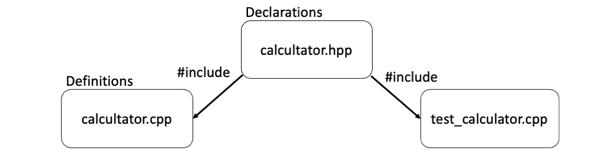
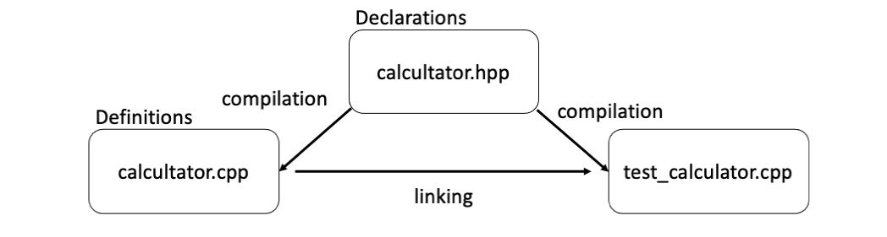

# Lecture 16 - Header filer og debugging
Henrik Finsberg - 21.10.22

---

## Kontrollspørsmål fra forrige time

1. Hva vil det si at en algoritme er $\mathcal{O}(N^2)$?
2. Hva er forskjellen på ArrayList og LinkedList når det kommer til å hente et elemet på plass $i$?
3. Hva med å sette inn et element foran i lista?

---


## Kontrollspørsmål fra forrige time (svar)

1. Dvs at kjørtiden vokser som kvadaratet av input størrelsen. Hvis algoritmen tar $x$ sekunder på en input av størrelse $N$ vil det ta $k^2x$ sekunder på input av størrelse $kN$.
2. I ArrayList kan vi aksessere elementene ved å bruke pekeraritmentikk ($\mathcal{O}(1)$). I en LinkedList må vi iterere oss fram til elementet ved å følge nodepekerene ($\mathcal{O}(N)$)
3. I ArrayList må gjøre plass til det første elementet ved å flytte alle de andre ($\mathcal{O}(N)$). I en LinkedList oppdaterer vi bare hva `head` peker på ($\mathcal{O}(1)$)

---

## Mål for dagens forelesning

Vite
- forskjell på en deklarasjon og en definisjon
- hva header filer er og hvordan man kan bruke dem
- hvordan man kan kompilere flere filer sammen
- om ulike verktøy for å forenkle komileringsprossessen (`make`, `cmake`)
- hvordan man kan bruke en debugger i C++

---


## I C++ må alle variabler og funksjoner være deklarert på før de brukes

Dvs at dette er OK
```c++
void print_hello()
{
    std::cout << "Hello\n";
}

int main()
{
    print_hello();
    return 0;
}
```

---

men ikke dette
```c++
int main()
{
    print_hello();
    return 0;
}

void print_hello()
{
    std::cout << "Hello\n";
}
```
Da får vi følgende melding
```
c++ decl.cpp -o decl -std=c++14
decl.cpp:6:5: error: use of undeclared identifier 'print_hello'
    print_hello()
```

---

## Dette kan fikses ved å deklarere `print_hello` øverst i filen

```c++
// Deklarasjon
void print_hello();

int main()
{
    print_hello();
    return 0;
}

// Definisjon
void print_hello()
{
    std::cout << "Hello\n";
}
```

---

## Deklarasjon og definisjon

* En deklarasjon spesifiserer signaturen til en funksjon, eller typen til en variabel.
  ```c++
  int x;
  void print(int);
  ```
* En definisjon instansierer en variabel eller implementerer en funksjon
  ```c++
  int x = 42;
  void print(int y)
  {
      std::cout << y << "\n";
  }
  ```
* Funksjoner og variabler som brukes må være deklarert på forhånd, men kan være definert senere.

---

## Det er vanlig å putte deklarasjonene i header filer

- Header filer er filer som ender med `.h` eller `.hpp`. Det er vanlig å bruke `.hpp` for C++ og `.h` for C.
- Definisjonene putter vi i `.cpp` filer
* Vi kan gjøre deklarasjonene tilgjengelige ved å inkludere dem på toppen av `.cpp` filene.


---

## Eksempel - en kalkulator

- Vi ønsker å lage en simpel kalkulator
- Vi kan legge deklarasjonene i `calculator.hpp`

```c++
// calculator.hpp
int add(int, int);
double divide(int, int);
```

---

Og legger definisjonene i `calculator.cpp`.
```c++
// calculator.cpp
#include "calculator.hpp"
#include <iostream>

int main()
{
    int a = 3;
    int b = 2;

    std::cout << "add(a, b) = " << add(a, b) << "\n";
    std::cout << "divide(a, b) = " << divide(a, b) << "\n";
    return 0;
}

int add(int a, int b)
{
    return a + b;
}

double divide(int a, int b)
{
    return a / ((double)b);
}
```

---

## I dette tilfelle virker det litt bortkastet

- Vi kunne jo bare hatt deklarasjonen og definisjonen på toppen slik vi er vandt til
* Men hva om vi nå ønsker å lage en ny fil `test_calculator.cpp` som hvor vi ønsker å teste calculatoren vår?
* Da kan vi enkelt kalle på disse funksjonene ved å legge til følgende linje på toppen av den filen
  ```c++
  #include "calculator.hpp"
  ```

---

```c++
// test_calculator.cpp
#include "calculator.hpp"
#include <cassert>
#include <cmath>
#include <iostream>

const double TOL = 1e-12;

void test_add()
{
    std::cout << "Test add\n";
    int a = 3;
    int b = 2;
    int c = add(a, b);
    assert(c == 5);
}

void test_divide()
{
    std::cout << "Test divide\n";
    int a = 3;
    int b = 2;
    double c = divide(a, b);
    double expected = 1.5;
    assert(abs(c - 1.5) < TOL);
}

int main()
{
    test_add();
    test_divide();
    return 0;
}
```

---

## Men hvordan skal vi kompilere dette?




Vi må på en eller annen måte sørge for at definisjonene blir med

---

## Kompilering og Linking


* Dette gjøres ved å først kompilere hver `.cpp` fil og deretter linke dem
* Merk at vi kan kun ha en funksjon som heter `main` så vi fjerner den som er i `calculator.cpp`.



---


---

Kompilering (legg på `-c` flagg)
```
c++ calculator.cpp --std=c++14 -c
c++ test_calculator.cpp --std=c++14 -c
```
Dette produserer to objektfiler `calculator.o` og `test_calculator.o`.

Linking
```
c++ calculator.o test_calculator.o -o calculator
```
Produserer `calculator` (eller `a.out` om du ikke presiserer noe output)

---

Prøv a legge til en melding på etter hver test som sier at testen passerte

---

## Da må vi kompilere og linke på nytt

* Alle filer som er endret må kompileres på nytt og til slutt må vi linke
    ```
    c++ test_calculator.cpp --std=c++14 -c
    c++ calculator.o test_calculator.o -o calculator
    ```
* Dette blir ganske slitsomt når man har mange filer!
* Derfor finnes the verktøy for å gjøre dette enklere

---

## Makefile

* `make` er et verktøy som lar deg automatisere komandoer. Vi lager en fil som heter `Makefile` som inneholder utrykk av typen
    ```
    target:   dependencies ...
            commands
            ...
    ```

---

* Lag en fil som heter `Makefile` med følgende innhold

    ```
    calculator: calculator.o test_calculator.o
        c++ -std=c++14 calculator.o test_calculator.o -o calculator

    calculator.o: calculator.cpp
        c++ -std=c++14 -c calculator.cpp

    test_calculator.o: test_calculator.cpp
        c++ -std=c++14 -c test_calculator.cpp
    ```

---

* Vi kjører en kommando ved å skrive `make <target>` for eksempel
  ```
  make calculator.o
  ```
  Dette vil kjøre kommandoen som vi spesifiserte under `calculator.o` målet.
* Hvis avhengighetene (dependencies) ikke har endret seg siden sist, vil ikke kommandoen kjøres, og du får følgende melding
    ```
    $ make calculator.o
    make: `calculator.o' is up to date.
    ```
* I målet `calculator` har vi to avhengigheter som igjen er mål
    ```
    calculator: calculator.o test_calculator.o
        c++ -std=c++14 calculator.o test_calculator.o -o calculator
    ```

---

* Når du skriver `make calculator` vil følgende skje
    1) Første avhengighet `calculator.o` sjekkes for endringer ved å kjøre `make calculator.o`, som kjører kun dersom det er en endring i `calculator.cpp`
    2) Det samme gjøres for `test_calculator.o`
    3) Til slutt kjøres kommandoen som hører til `calculator` målet.

---

## Annet alternativ (lignende prosjekt 2)

I stedenfor å bruke header filer så kan man også inkludere `.cpp` filen direkte. Dette er slik vi ber dere å gjøre det på prosjekt 2.

```
#include "calculator.cpp"
```

* Da er det nok å kompilere `test_calculator.cpp` på vanlig måte
* `#include "calculator.cpp"` vil bare kopiere alt innholdet i filen og lime det inn der hvor man skriver `#include`


---

## CMake en moderne utgave av `make`

- `make` er et supert verktøy, men du må skrive alle komandoer selv.
- CMake er smartere og brukes derfor ofterer på større prosjekter
- CMake can installeres med for eksempel `pip` (`pip install cmake`).
- https://cliutils.gitlab.io/modern-cmake/

---

## Configurasjoner skriver i `CMakeLists.txt`

* Lag en fil som heter `CMakeLists.txt` med følgende innhold
    ```
    project(calculator_project
        LANGUAGES CXX
    )

    set(CMAKE_CXX_STANDARD 14)

    add_executable(calculator
        calculator.cpp
        test_calculator.cpp
    )
    ```

---

## Kompilering med CMake

* Bygg prosjektet
    - med nåværende mappe (source) som kilde (`.`)
    - Bygg prosjeket i en mappe som heter `build`
    ```
    cmake -S . -B build
    ```
* Gå inn i `build`
    Der vil dere finne en `Makefile` som du kan kjøre ved å bruke
    ```
    make
    ```

---

## Debugging

* De fleste feil man gjør når man programmerer i C++ fanges opp av kompilatoren
* Men det finnes også feil som ikke kan fanges opp av kompilatoren, og disse er ofte vanskelig å finne ut av.
* Veldig ofte får du kun denne meldingen
    ```
    Segmentation fault (core dumped)
    ```
* Hva skal vi gjøre?
* Vi må bruke en debugger!


---

## Et program med en alvorlig feil - hva er feilen?

```c++
class Array
{
  private:
    int *data;

  public:
    Array()
    {
    }
    int &operator[](int index)
    {
        return data[index];
    }
};

void write_to_illegal_memory()
{
    Array arr;
    int value = 42;
    arr[0] = value;
}

int main()
{
    write_to_illegal_memory();
    return 0;
}
```

---

```
c++ write_to_illegal_memory.cpp -o write_to_illegal_memory -std=c++11
./write_to_illegal_memory
[1]    52156 bus error  ./write_to_illegal_memory
```

På IFI maskinen får jeg
```
c++ write_to_illegal_memory.cpp -o write_to_illegal_memory -std=c++11
./write_to_illegal_memory
Segmentation fault (core dumped)
```
---

## La oss prøve å kjøre programmet gjennom en debugger

- Du kan bruke `gdb` eller `lldb`. Jeg kommer til å bruke `lldb` men kommandoene er helt like bortsett fra at du må skrive `gdb` i stedenfor `lldb`
* Kompiler programmet med debug info (ta med `-g` flagget)
    ```
    c++ write_to_illegal_memory.cpp -o write_to_illegal_memory -std=c++11 -g
    ```
* Kjør debuggeren
    ```
    lldb ./write_to_illegal_memory
    ```

---

```
$ lldb ./write_to_illegal_memory
(lldb) target create "./write_to_illegal_memory"
Current executable set to '/Users/henriknf/local/src/IN1910/IN1910_dev/book/docs/slides/L16/build/write_to_illegal_memory' (x86_64).
(lldb)
```

* Skriv `run`
    ```
    (lldb) run
    Process 10496 launched: '/Users/henriknf/local/src/IN1910/IN1910_dev/book/docs/slides/L16/build/write_to_illegal_memory' (x86_64)
    Process 10496 stopped
    * thread #1, queue = 'com.apple.main-thread', stop reason = EXC_BAD_ACCESS (code=1, address=0x0)
        frame #0: 0x0000000100003f1c write_to_illegal_memory`write_to_illegal_memory() at write_to_illegal_memory.cpp:19:12
    16   void write_to_illegal_memory()
    17   {
    18       Array arr;
             int value = 42;
    -> 19       arr[0] = 42;
    20   }
    21
    22   int main()
    Target 0: (write_to_illegal_memory) stopped.
    ```
* Vi får ut linjenummer hvor feilen skjedde og info om at grunnen til feilen er `EXC_BAD_ACCESS`

---

* Du kan også bruke `bt` (backtrace) for å se hvilke funksjoner som er kalt
    ```
    (lldb) bt
    * thread #1, queue = 'com.apple.main-thread', stop reason = EXC_BAD_ACCESS (code=1, address=0x0)
        * frame #0: 0x0000000100003f1c write_to_illegal_memory`write_to_illegal_memory() at write_to_illegal_memory.cpp:19:12
        frame #1: 0x0000000100003f84 write_to_illegal_memory`main at write_to_illegal_memory.cpp:24:5
        frame #2: 0x00007fff2042df3d libdyld.dylib`start + 1
    ```
* Bruk `up` og `down` til å bevege deg rundt i programmet.
* `p` kan brukes til å printe (her ser vi at `arr` er en null peker)
    ```
    (lldb) p value
    (int) $0 = 42
    ```
* `q` brukes til å avslutte

---


## Mål for dagens forelesning

Vite
- forskjell på en deklarasjon og en definisjon
- hva header filer er og hvordan man kan bruke dem
- hvordan man kan kompilere flere filer sammen
- om ulike verktøy for å forenkle comileringsprossessen (`make`, `cmake`)
- hvordan man kan bruke en debugger i C++
