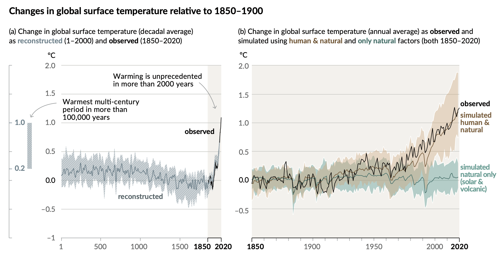

---
jupyter:
  jupytext:
    text_representation:
      extension: .md
      format_name: markdown
      format_version: '1.3'
      jupytext_version: 1.13.8
  kernelspec:
    display_name: Python 3
    language: python
    name: python3
---

<!-- #region hide_input=true slideshow={"slide_type": "skip"} -->
# Lecture 21 - Pandas and matplotlib
<!-- #endregion -->

<!-- #region slideshow={"slide_type": "slide"} -->
Dette er et Zoom opptak og alle spørsmål fra deltagere blir en del av opptaket. De som ikke ønsker dette bør slå av sin mikrofon og video. De kan bruke chat-funksjonene, den blir ikke lagret. Opptaket blir lagret inntil videre og skal brukes i undervisning. Opptaket legges ut på semestersiden og vil være tilgjengelig for alle. Hjemmelsgrunnlag for behandlingen er personvernforordningen art. 6 nr. 1 bokstav e, jf. universitets og høyskoleloven § 1-3
<!-- #endregion -->

<!-- #region slideshow={"slide_type": "slide"} -->
## Pandas og Matplotlib
<!-- #endregion -->

<!-- #region slideshow={"slide_type": "slide"} -->
### Mål

- Enkel bruk av `pandas`
- Vise ulike måter å visualisere data ved hjelp av `matplotlib`
- Forklare hvordan man bygger opp en plot
- Tips og triks
<!-- #endregion -->

<!-- #region slideshow={"slide_type": "slide"} -->
## Hvorfor er visualisering viktig i naturvitenskapen?
<!-- #endregion -->

<!-- #region slideshow={"slide_type": "fragment"} -->
* Formidlig
    - formidle resultater på en måte som er lett å forstå slik at forskning blir formidlet på en riktig måte
    - Spesielt viktig for beslutningstakere (statsledere)
* Utforskning
    - visualisering kan bidra til å se på data på en ny måte og gi ny innsikt
<!-- #endregion -->

<!-- #region slideshow={"slide_type": "slide"} -->
## Eksempel - FNs klimarapport (Summary for policymakers)



https://www.ipcc.ch/report/ar6/wg1/downloads/report/IPCC_AR6_WGI_SPM_final.pdf
<!-- #endregion -->

<!-- #region slideshow={"slide_type": "slide"} -->
## Eksempel data

Vi vil bruke offentlig data på Covid19 i Norge (https://github.com/thohan88/covid19-nor-data)
<!-- #endregion -->

```python
# Filenavn
path = "infected.csv"
url = "https://raw.githubusercontent.com/thohan88/covid19-nor-data/37b6b32d32db05b08dda15f002dcc2198836d4c1/data/01_infected/msis/municipality_wide.csv"

# Download data
import urllib.request
urllib.request.urlretrieve(url, path)
```

<!-- #region slideshow={"slide_type": "slide"} -->
### Hvordan skal vi lese dataene?

Formatet som brukes her heter `csv` (comma-separated-values).

Det finnes en pakke i python som heter `csv`.

Vi kommer til å bruke `pandas` som er et mye brukt bibliotekt for de som driver med "data science"

```
python -m pip install pandas
```
<!-- #endregion -->

<!-- #region slideshow={"slide_type": "slide"} -->
### Åpne dataene
<!-- #endregion -->

```python slideshow={"slide_type": "-"}
import pandas
df_infected = pandas.read_csv(path)
```

```python
df_infected[:10]
#df_infected.head(n=10)
```

<!-- #region slideshow={"slide_type": "slide"} -->
### Velge noen få kolonner
<!-- #endregion -->

```python
# Beolkningstall i hver kommune
kommune_pop = df_infected[["kommune_name", "population"]]
kommune_pop
```

```python slideshow={"slide_type": "slide"}
df_infected[:30].plot("kommune_name", "population", "bar", figsize=(10, 6))
```

<!-- #region slideshow={"slide_type": "slide"} -->
## Hva om vi ønsker å se på kun Viken fylke?
<!-- #endregion -->

<!-- #region slideshow={"slide_type": "fragment"} -->
La oss se på et enklere problem først. Hvordan kan jeg hente ut elementene som er større enn 10
<!-- #endregion -->

```python
import numpy as np
np.random.seed(1)
x = np.random.randint(0, 20, size=20)
x
```

<!-- #region slideshow={"slide_type": "slide"} -->
## Her kan det være fristende å bruke en list comprehension
<!-- #endregion -->

```python
[xi for xi in x if xi > 10]
```

<!-- #region slideshow={"slide_type": "slide"} -->
## Her bør vi istedet bruke numpy sin innebygde logikk
<!-- #endregion -->

```python slideshow={"slide_type": "fragment"}
# Konverter arrayet til et bolsk array (True eller False)
larger_than_10 = x > 10
larger_than_10
```

```python slideshow={"slide_type": "fragment"}
# Evaluer x
x[larger_than_10]
```

<!-- #region slideshow={"slide_type": "slide"} -->
## La oss se hva som er mest effektivt
<!-- #endregion -->

```python
x = np.random.randint(0, 20, size=20_000)
```

```python
%time y1 = x[x > 10]

```

```python
%time y2 = [xi for xi in x if xi > 10]
```

<!-- #region slideshow={"slide_type": "slide"} -->
### Vi kan gjøre samme triks i `pandas`
<!-- #endregion -->

```python
df_infected["fylke_name"] == "Viken"
```

```python
df_infected[df_infected["fylke_name"] == "Viken"]
```

```python slideshow={"slide_type": "slide"}
df_infected[df_infected["fylke_name"] == "Viken"].plot("kommune_name", "population", "bar", figsize=(12, 6))
```

<!-- #region slideshow={"slide_type": "slide"} -->
### Se på data for Oslo
<!-- #endregion -->

```python slideshow={"slide_type": "fragment"}
oslo = df_infected[df_infected['fylke_name'] == "Oslo"]
oslo
```

```python slideshow={"slide_type": "fragment"}
oslo_infected = oslo.values[0, 6:].astype(int)
print(oslo_infected)
```

<!-- #region slideshow={"slide_type": "slide"} -->
### Vi kan få data for hele Norge ved å summere kolonnene
<!-- #endregion -->

```python slideshow={"slide_type": "fragment"}
df_infected.values.shape
```

```python slideshow={"slide_type": "fragment"}
# Remove colmns with info about fylke, commune etc
all_values = df_infected.values[:, 6:].astype(int)
# Sum along columns
norway_infected = all_values.sum(0)
print(norway_infected)
```

<!-- #region slideshow={"slide_type": "slide"} -->
### Plot dataene
<!-- #endregion -->

```python
%matplotlib inline
import matplotlib.pyplot as plt
plt.plot(oslo_infected)
plt.plot(norway_infected)
plt.show()
```

<!-- #region slideshow={"slide_type": "slide"} -->
### Plotte nye smittede
<!-- #endregion -->

```python
import numpy as np
oslo_new_infected = np.diff(oslo_infected)
norway_new_infected = np.diff(norway_infected)
plt.plot(oslo_new_infected)
plt.plot(norway_new_infected)
plt.savefig("new_infected.png")
plt.show()
```

<!-- #region slideshow={"slide_type": "slide"} -->
### Matplotlib modellen

- Vi skiller mellom "figure" og "axes"
- Vi kan ha flere axes i en figur
- Vi plotter i hver axes

Merk axes er ikke det samme som axis (x-akse og y-akse)
<!-- #endregion -->

```python
fig, ax = plt.subplots()
# Vi bruker axes til å plotte
ax.plot(oslo_infected)
ax.plot(norway_infected)
plt.show()
print(ax)
```

<!-- #region slideshow={"slide_type": "slide"} -->
Hva er foredelen ved å bruke

```python
fig, ax = plt.subplots()
ax.plot(norway_new_infected)
fig.savefig("new_infected.png")
```
mot

```python
plt.plot(norway_new_infected)
plt.savefig("new_infected.png")
```
?
<!-- #endregion -->

<!-- #region slideshow={"slide_type": "slide"} -->
### Vi har full kontroll over plottene

```python
fig_new_infected, ax_new_infected = plt.subplots()
fig_total_infected, ax_total_infected = plt.subplots()

ax_new_infected.plot(norway_new_infected)
ax_total_infected.plot(norway_infected)

fig_new_infected.savefig("new_infected.png")
fig_total_infected.savefig("total_infected.png")
```
<!-- #endregion -->

<!-- #region slideshow={"slide_type": "slide"} -->
### Hva er det som egentlig skjer når du skriver `plt.plot`?

```python
# Fra pyplot.plot:
def plot(*args, **kwargs):
    ax = gca()  # gca = get current axes
    ax.plot(*args, **kwargs)
```
<!-- #endregion -->

<!-- #region slideshow={"slide_type": "slide"} -->
### Hva er det som egentlig skjer når du skriver `plt.savefig`?

```python
# Fra pyplot.savefig
def savefig(*args, **kwargs):
    fig = gcf()  # gcf = get current figure
    fig.savefig(*args, **kwargs)
```
<!-- #endregion -->

<!-- #region slideshow={"slide_type": "slide"} -->
### Vi kan også bruke dette til å lage subplots
<!-- #endregion -->

```python
# plt.subplots(nrows=1, ncols=1)  # default
fig, axs = plt.subplots(2, 1, figsize=(12, 8))
```

```python slideshow={"slide_type": "fragment"}
print(axs)
print(axs.shape)
```

```python slideshow={"slide_type": "fragment"}
print(fig)
```

<!-- #region slideshow={"slide_type": "slide"} -->
### Lage et 2 x 2 plot
<!-- #endregion -->

```python
fig, axs = plt.subplots(2, 2, figsize=(10, 4))
```

```python slideshow={"slide_type": "fragment"}
print(axs)
print(axs.shape)

```

```python slideshow={"slide_type": "fragment"}
axs_flat = axs.flatten()
print(axs_flat)
print(axs_flat.shape)
```

<!-- #region slideshow={"slide_type": "slide"} -->
### Here er ulike objekter i en figure


<https://matplotlib.org/_images/anatomy.png>
<!-- #endregion -->

<!-- #region slideshow={"slide_type": "slide"} -->
### I hver axes kan vi lage ulike plot
<!-- #endregion -->

```python
fig, axs = plt.subplots(1, 2, figsize=(10, 4))
axs[0].plot(oslo_infected)
axs[0].plot(norway_infected)

axs[1].plot(oslo_new_infected)
axs[1].plot(norway_new_infected)
plt.show()
```

<!-- #region slideshow={"slide_type": "slide"} -->
### Vi kan også endre organiseringen
<!-- #endregion -->

```python
fig, axs = plt.subplots(2, 1, figsize=(10, 4))
axs[0].plot(oslo_infected)
axs[0].plot(norway_infected)

axs[1].plot(oslo_new_infected)
axs[1].plot(norway_new_infected)
plt.show()
```

<!-- #region slideshow={"slide_type": "slide"} -->
### I dette tilfelle bruker vi samme x-axse så da kan det være nyttig å dele denne
<!-- #endregion -->

```python
fig, axs = plt.subplots(2, 1, figsize=(10, 8), sharex=True)
axs[0].plot(oslo_infected)
axs[0].plot(norway_infected)

axs[1].plot(oslo_new_infected)
axs[1].plot(norway_new_infected)
plt.show()
```

<!-- #region slideshow={"slide_type": "slide"} -->
### Vi må sette på en legend som viser hvilke data som er hvilke
<!-- #endregion -->

```python
fig, ax = plt.subplots()
l1, = ax.plot(oslo_infected)

l2, = ax.plot(norway_infected)
ax.legend((l1, l2), ("Oslo", "Norway"))
plt.show()
```

<!-- #region slideshow={"slide_type": "slide"} -->
### Det går også an å sende inn labels som argumenter til plots
<!-- #endregion -->

```python
fig, ax = plt.subplots()
ax.plot(oslo_infected, label="Oslo")
ax.plot(norway_infected, label="Norway")
ax.legend()
plt.show()
```

<!-- #region slideshow={"slide_type": "slide"} -->
### Plassering av legend
https://matplotlib.org/3.1.1/api/_as_gen/matplotlib.pyplot.legend.html
<!-- #endregion -->

```python
fig, ax = plt.subplots()
ax.plot(oslo_infected, label="Oslo")
ax.plot(norway_infected, label="Norway")
ax.legend(loc="upper center")
plt.show()
```

<!-- #region slideshow={"slide_type": "slide"} -->
Hvis du ønsker å plassere legend utenfor kan du bruke `bbox_to_anchor`
<!-- #endregion -->

```python
fig, ax = plt.subplots()
ax.plot(oslo_infected, label="Oslo")
ax.plot(norway_infected, label="Norway")
ax.legend(bbox_to_anchor=(0, 1), loc='upper left')
plt.show()
```

<!-- #region slideshow={"slide_type": "slide"} -->
### Hva med legend for subplots?
<!-- #endregion -->

```python
fig, axs = plt.subplots(1, 2, figsize=(10, 4))
axs[0].plot(oslo_infected, label="Oslo")
axs[0].plot(norway_infected, label="Norway")

axs[1].plot(oslo_new_infected, label="Oslo")
axs[1].plot(norway_new_infected, label="Norway")

for ax in axs:
    ax.legend()
plt.show()
```

<!-- #region slideshow={"slide_type": "slide"} -->
### Hva om vi ønsker en felles lenged?
<!-- #endregion -->

```python
fig, axs = plt.subplots(1, 2, figsize=(10, 4))
l1, = axs[0].plot(oslo_infected, color="tab:blue")
l2, = axs[0].plot(norway_infected, color="tab:orange")

axs[1].plot(oslo_new_infected, color="tab:blue")
axs[1].plot(norway_new_infected, color="tab:orange")

fig.subplots_adjust(right=0.88)
fig.legend((l1, l2), ("Oslo", "Norway"), loc='center right')

# Kan også gjøre dette, men da kan legenden bli kuttet bort ved lagring
#axs[1].legend((l1, l2), ("Oslo", "Norway"), bbox_to_anchor=(1, 0.5), loc='center left')
# Send med bbox_inches="tight" for å ungå dette
#fig.savefig("subplots_common_legend.png", bbox_inches="tight")
plt.show()
```

<!-- #region slideshow={"slide_type": "slide"} -->
### Sette på grid
<!-- #endregion -->

```python
fig, ax = plt.subplots()
ax.plot(oslo_infected, label="Oslo")
ax.plot(norway_infected, label="Norway")
ax.grid()
ax.legend(bbox_to_anchor=(1, 1), loc='upper left')
plt.show()
```

<!-- #region slideshow={"slide_type": "slide"} -->
### Sette på tittel
<!-- #endregion -->

```python
fig, ax = plt.subplots()
ax.plot(oslo_infected, label="Oslo")
ax.plot(norway_infected, label="Norway")
ax.set_title("Total infected")
#plt.title("Title")
print(ax.title)
ax.legend(bbox_to_anchor=(1, 1), loc='upper left')
plt.show()
```

<!-- #region slideshow={"slide_type": "slide"} -->
### Xlabels og Ylabels
<!-- #endregion -->

```python
fig, ax = plt.subplots()
ax.plot(oslo_infected, label="Oslo")
ax.plot(norway_infected, label="Norway")
ax.grid()
ax.set_xlabel("Days")
ax.set_ylabel("Total infected")
ax.legend(bbox_to_anchor=(1, 1), loc='upper left')
plt.show()
```

<!-- #region slideshow={"slide_type": "slide"} -->
### Xticks
<!-- #endregion -->

```python
fig, ax = plt.subplots()
x = np.arange(len(oslo_infected))
ax.plot(x, oslo_infected, label="Oslo")
ax.plot(x, norway_infected, label="Norway")
ax.grid()
ax.legend(bbox_to_anchor=(1, 1), loc='upper left')
ax.set_xticks([0, 150, 200, 352, 420, 500])
plt.show()
```

<!-- #region slideshow={"slide_type": "slide"} -->
### Yticks
<!-- #endregion -->

```python
fig, ax = plt.subplots()
x = np.arange(len(oslo_infected))
ax.plot(x, oslo_infected, label="Oslo")
ax.plot(x, norway_infected, label="Norway")
ax.grid()
ax.legend(bbox_to_anchor=(1, 1), loc='upper left')
ax.set_yticks([0, 50_000, 100_000, 150_000])
ax.set_xticks([0, 150, 200, 352, 420, 500])
plt.show()
```

<!-- #region slideshow={"slide_type": "slide"} -->
### Xticklabels
<!-- #endregion -->

```python
fig, ax = plt.subplots()
x = np.arange(50, len(oslo_infected)+50)
ax.plot(x, oslo_infected, label="Oslo")
ax.plot(x, norway_infected, label="Norway")
ax.grid()
ax.legend(bbox_to_anchor=(1, 1), loc='upper left')
ax.set_xticks([75, 175])
ax.set_xticklabels(["Point1", "Point2"])
plt.show()
```

<!-- #region slideshow={"slide_type": "slide"} -->
## Vi ønsker å ha datoene på x-aksen
<!-- #endregion -->

```python slideshow={"slide_type": "-"}
dates = np.array(df_infected.keys()[6:])
print(dates)
```

```python slideshow={"slide_type": "slide"}
fig, ax = plt.subplots()
# Få datoene fra dataene
dates = np.array(df_infected.keys()[6:])

x = np.arange(len(oslo_infected))
# Velg xticks
xticks = np.linspace(0, len(oslo_infected)-1, 6).astype(int)
ax.plot(x, oslo_infected, label="Oslo")
ax.plot(x, norway_infected, label="Norway")
ax.grid()
ax.legend(bbox_to_anchor=(1, 1), loc='upper left')
ax.set_xticks(xticks)
ax.set_xticklabels(dates[xticks], rotation=30)
ax.set_xlabel("Date")
ax.set_ylabel("Total infected")
plt.show()
```

<!-- #region slideshow={"slide_type": "slide"} -->
### Hvordan dele aksene mellom subplots?
<!-- #endregion -->

```python hide_input=false
fig, axs = plt.subplots(2, 1, sharex=True, figsize=(8, 8))
# Få datoene fra dataene
dates = np.array(df_infected.keys()[6:])

x = np.arange(len(oslo_infected))

xticks =  np.linspace(0, len(oslo_infected)-1, 6).astype(int)
l1, = axs[0].plot(x, oslo_infected)
l2, = axs[0].plot(x, norway_infected)
axs[0].set_ylabel("Total infected")

axs[1].plot(x[:-1], oslo_new_infected)
axs[1].plot(x[:-1], norway_new_infected)
axs[1].set_ylabel("Total new infected")

for ax in axs:
    ax.grid()
    ax.set_xticks(xticks)

# Hvis du har 2, 2 - bruk axs.flatten()!
axs[1].set_xticklabels(dates[xticks], rotation=30)
axs[1].set_xlabel("Date")

fig.legend((l1, l2), ("Oslo", "Norway"), bbox_to_anchor=(0.5, 0.5), loc='center', ncol=2)
plt.show()
```

<!-- #region slideshow={"slide_type": "slide"} -->
## Style
<!-- #endregion -->

```python
print(plt.style.available)
```

```python
plt.style.use('classic')
fig, ax = plt.subplots()
# Vi bruker axes til å plotte
ax.plot(oslo_infected)
ax.plot(norway_infected)
plt.show()
```

<!-- #region slideshow={"slide_type": "slide"} -->
### XKCD style
<!-- #endregion -->

```python
plt.style.use('default')
with plt.xkcd():
    fig, ax = plt.subplots()
    # Vi bruker axes til å plotte
    ax.plot(oslo_infected)
    ax.plot(norway_infected)
    plt.show()
```

<!-- #region slideshow={"slide_type": "slide"} -->
### Styling lines
<!-- #endregion -->

```python
fig, axs = plt.subplots(1, 2, figsize=(15, 6))
axs[0].plot(oslo_infected[:20], linestyle="--", color="k")
axs[0].plot(norway_infected[:20], linestyle="", marker=".", color="r", markersize=10)

axs[1].plot(oslo_new_infected[:20], linestyle=":", marker="*", markersize=3, color="b")
axs[1].plot(norway_new_infected[:20], linestyle="-", linewidth="3", color="g")
plt.show()
```

<!-- #region slideshow={"slide_type": "slide"} -->
### Hvordan variere marker og farge i en loop?
<!-- #endregion -->

```python
rogaland = df_infected[df_infected["fylke_name"] == "Rogaland"]

```

```python
from itertools import cycle
colors = cycle(["r", "b", "g", "y", "c", "m"])
markers = cycle(["x", "v", "o", "<", "."])
fig, ax = plt.subplots(figsize=(10, 10))
for x, marker, color in zip(rogaland.values, markers, colors):
    name = x[2]
    v = x[6:]
    ax.plot(v[::20], label=name, marker=marker, color=color)

ax.legend()
```

<!-- #region slideshow={"slide_type": "slide"} -->
### Hvilket fargekart skal vi velge?

Det er nok å velge i mellom: <https://matplotlib.org/3.1.1/tutorials/colors/colormaps.html>


<!-- #endregion -->

```python
from IPython.display import YouTubeVideo
YouTubeVideo("xAoljeRJ3lU")
```

<!-- #region slideshow={"slide_type": "slide"} -->
### Riktig fargevalg er viktig når man skal visualisere 2D data
<!-- #endregion -->

```python
import scipy.misc
img = scipy.misc.ascent()
print(img)
print(img.shape)
```

```python
fig, ax = plt.subplots()
ax.imshow(img)
plt.show()
```

<!-- #region slideshow={"slide_type": "slide"} -->
### En mye brukt colormap er `jet` - men IKKE bruk denne til å visualisere data!

Den lager for mye kontrast og du kan fort tro at det er ting i bildet som egentlig ikke er der.
Men bruk gjerne denne om du bare ønsker en colormap med masse farger :)
<!-- #endregion -->

```python
fig, ax = plt.subplots()
ax.imshow(img, cmap="jet")
plt.show()
```

<!-- #region slideshow={"slide_type": "slide"} -->
### Plotte smitte i dag basert på fylker
<!-- #endregion -->

```python
## Put alle rader som hører til i samme fylke sammen
fylker = df_infected.groupby("fylke_name")
```

```python
# Summer all bidragene inad i hver gruppe
fylker_sum = fylker.sum()
fylker_sum
```

```python slideshow={"slide_type": "slide"}
fig, ax = plt.subplots(figsize=(12, 6))
x = np.arange(len(fylker))
ax.bar(x, fylker_sum.values[:, -1])
ax.set_xticks(x)
ax.set_xticklabels(fylker.groups.keys(), rotation=30)
ax.set_title(f"Total infected on {fylker_sum.keys()[-1]}")
ax.set_xlabel("Fylke")
ax.set_ylabel("Total smittet")
ax.grid()
plt.show()
```

<!-- #region slideshow={"slide_type": "slide"} -->
### Hva om vi ønsker et bar plot med to dager?
<!-- #endregion -->

```python
fig, ax = plt.subplots(figsize=(10, 6))
x = np.arange(len(fylker))
width = 0.4
n = 10
ax.bar(x + 0.2, fylker_sum.values[:, -1], label=fylker_sum.keys()[-1], width=width)
ax.bar(x - 0.2, fylker_sum.values[:, -n], label=fylker_sum.keys()[-n], width=width)

ax.set_xticks(x)
ax.set_xticklabels(fylker.groups.keys(), rotation=30)
ax.set_xlabel("Fylke")
ax.set_ylabel("Total smittet")
ax.set_title("Total smitte for to dager")
ax.legend()
plt.show()
```

<!-- #region slideshow={"slide_type": "slide"} -->
### Hva om vi ønsker et bar plot med 5 siste uker?
<!-- #endregion -->

```python
fig, ax = plt.subplots(figsize=(12, 6))
x = np.arange(len(fylker))
num = 5
days_in_week = 7
width = 1/(num + 1)

for i in range(5):
    ax.bar(
        x - i*width,
        fylker_sum.values[:, -(days_in_week*i+1)],
        label=fylker_sum.keys()[-(days_in_week*i+1)],
        width=width
    )


ax.set_xticks(x - width*num/2)
ax.set_xticklabels(fylker.groups.keys(), rotation=30)
ax.set_xlabel("Fylke")
ax.set_ylabel("Total smittet")
ax.set_title("Total smitte for to dager")
ax.legend()
plt.show()
```

<!-- #region slideshow={"slide_type": "slide"} -->
### Pie chart
<!-- #endregion -->

```python
fig, ax = plt.subplots(figsize=(10, 10))


values = fylker_sum.values[:, -1]
labels = np.array(list(fylker.groups.keys()))

ax.pie(values, labels=labels)
ax.axis("equal")
plt.show()
```

```python slideshow={"slide_type": "slide"}
fig, ax = plt.subplots(figsize=(10, 10))

values = fylker_sum.values[:, -1]
labels = np.array(list(fylker.groups.keys()))

explode = np.zeros(len(values))
explode[labels == "Oslo"] = 0.1

ax.pie(values, explode=explode, labels=labels,  autopct="%1.1f%%", shadow=True)
ax.axis("equal")
plt.show()
```

<!-- #region slideshow={"slide_type": "slide"} -->
### Hvordan lære mer?

Sjekk ut Matplotlib gallery: https://matplotlib.org/3.1.1/gallery/index.html

Finn ett plot som ligner på det du ønsker å plotte og endre litt på det.

<!-- #endregion -->

<!-- #region slideshow={"slide_type": "slide"} -->
### Andre plottebilioteker i python


https://www.anaconda.com/blog/python-data-visualization-2018-why-so-many-libraries
<!-- #endregion -->
