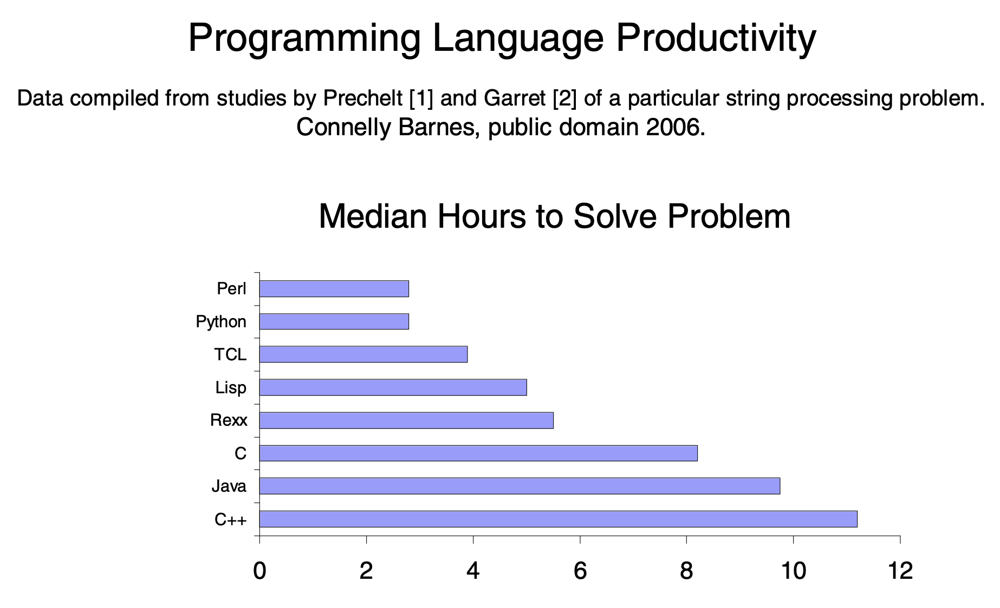
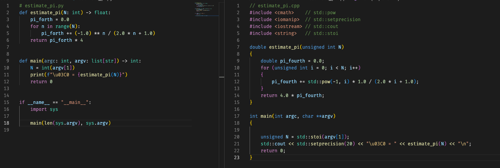
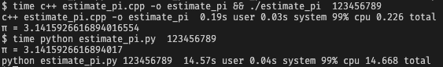
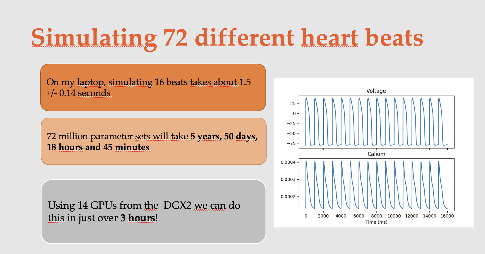

# Lecture 23 - Software Optimization
Henrik Finsberg - 16.11.22

---

## Mål for dagens forelesning
* Hva er et benchmark
* Hvordan ta tiden på et program
* Hva er profiling
* Hvordan optimalisere med tanke på minne
* Hva er en generator


---

Er python raskt?

---


---

## I 2005 - 2006 var det et voldsomt kappløp når det gjaldt video streaming

- Google video vs YouTube
* I dag kan vi vel trygt si at YouTube vant.
* Men Google endte opp med å kjøpe opp YouTube :)

---

* Youtube
    - Et lite start up på 20 utviklere
    - Programmerte i python

* Google video
    - Et massive selskap med flere hundre utviklere som jobbet med dette
    - De programmerte i C++

---

## Forklaring

* Hver gang YouTube lanserte en ny tjeneste brukte Google 1-2 månender på lansere noe lignende
* Hver gang Google lanserte en ny tjeneste brukte YouTube i underkant av en uke på å lansere noe lignende.

---

## Python er raskt å utvikle i  og det er letter for personer å bruke som ikke i utgangspunktet er utviklere

(Prechelt and Garret)

---


---

# Hva er raskest av python og C++?
For eksempel hvis jeg skulle estimere pi

$$
    1 - \frac{1}{3} + \frac{1}{5} - \cdots = \sum_{i=0}^{\infty} (-1)^{i} \frac{1}{2 i + 1} = \frac{\pi}{4}
$$
$$
    \pi \approx 4 \sum_{i=0}^{N} (-1)^{i} \frac{1}{2 i + 1}
$$

---




---

Det går over 76 ganger raskere i C++



---


## Men hva med numpy?

```python
# estimate_pi_numpy.py
import numpy as np


def estimate_pi(N):
    sign = np.ones((N,))
    sign[1::2] = -1
    i = np.arange(N)
    return 4 * np.sum(sign * (1 / (2 * i + 1)))


if __name__ == "__main__":
    import sys

    N = int(sys.argv[1])
    print(f"\u03C0 = {estimate_pi(N)}")
```

---

```
$ time python estimate_pi_numpy.py 10000000
1.06s user 0.16s system 623% cpu 0.196 total
π = 3.1415925535897977
```

---

## Python har flere kompilerte optimaliserte pakker som vi bruker i stedet

* Tallknusing bør sjelden gjøres i ren python


https://jakevdp.github.io/blog/2013/06/15/numba-vs-cython-take-2/


---

## Hva er software optimalisering?

* Vi ønsker å lage programmer som løser ett spesifik problem mest effektivt

* Vi ønsker ikke nødvendigivis å finne den mest effektive metoden, men å gjøre det bedre enn gjeldende situasjon


---

## Hva mener vi med mer effektiv

Ta for eksempel denne `estimate_pi` funksjonen

* Vi kan si at den som løser problemet raskest er mest effektiv
* Vi kan si at det programmet som bruker minst minne er mest effektiv
    - I `numpy` versjonen måtte vi lage 2 store numpy arrays først


---

* Hvis programmet er avhengig av å laste ned data via internett
    - Mest effektivt å laste ned minst mulig


* Hvis programmet kjører på en mobiltelefon kan batteriforbruk være viktig
    - Mest effektivt å bruke minst mulig strøm

* I mange tilfeller må vi velge hva som er mest viktig. Ofte går de på beskostning av hverandre.

---

## Når bør man starte med å optimalisere koden?

Det første man bør gjøre er å sørge for at

1. programmet fungerer og gir riktig svar
    - Du har skrevet tester og programmet består alle testene

---

2. programmet er lett å lese og forstå
    - Du har refakturert koden (engelsk: refactoring)
    - Brukt kjente design patterns der det er naturlig
    - Endret variabel navn slik at koden er lettere å forstå
    - Skrevet tester som dekker corner cases
    - Skrevet dokumentasjon
    - Delt opp koden i mindre gjenbrukbare deler

---

Hvis det er behov få å optimaliere koden så kan man gjøre det når disse tingene er på plass

---

"First make it work. Then make it right. Then make it fast." ~ Kent Beck (skaperen av SmallTalk)


---

## Er det verdt å optimalisere koden?
​
Hvis du kan gjøre enkle grep for å optimalisere koden, for eksempel å bytte ut en `for` løkke med `numpy` vektorisering, så JA!

* Hvis optimalisering av koden er mye jobb, bør du tenkte deg om det er verdt det.

---


XKCD #974

---

### Hvor mye tid du sparer avhenger av hvor ofte koden kjører

XKCD #1205

---

## Fordeler med optimalisering i vitenskapelige anvendelser

Vi kan gjøre flere simuleringer på kortere tid




---

Vi kan øke oppløsningen (presisjonen) og få mer realistiske simuleringer


Quarteroni 2021, Polygonal surface processing and mesh generation tools for the numerical simulation of the cardiac function

---

## Ulemper med optimaliseringer

* Det tar tid å optimalisere koden
* Koden kan bli vanskeligere å forstå
* Du kan innføre nye bugs
    - Viktg å ha gode tester før du starter med optimalisering
* Den krever ekstra pakker (`numpy`)


---

## Hvordan optimalisere koden?

* Algoritme analyse
    - Hvilke algoritmer finnes og hva er kjøretiden på disse
    - Har vi kunnskap om input som gjør at noen algoritmer er mer fordelaktige enn andre
    - https://cerfacs.fr/coop/fortran-vs-python

* Timing og benchmarking
    - Hvor rask er koden nå og hvor mye har det forbedret seg
    - Lag benchmarks (enkle programmer) som du kan kjøre for å sjekke

---

* Profilering
    - Finnes det enkelte flaskehalser i koden som tar spesielt mye tid
    - Bør vi konsentrere oss om kun å optimalisere en liten del av koden


---

## Timing

```python
import numpy as np
import time

def slow_sum(x):
    s = 0
    for xi in x:
        s += xi
    return s

def fast_sum(x):
    return np.sum(x)

if __name__ == "__main__":
    x = np.arange(10000000)
    t0 = time.perf_counter()
    sum1 = slow_sum(x)
    t1 = time.perf_counter()
    sum2 = fast_sum(x)
    t2 = time.perf_counter()
    print(f"Slow: {t1 - t0:.3f} seconds")
    print(f"Fast: {t2 - t1:.3f} seconds")
    assert sum1 == sum2
```

---

## Vi kan også lage skrive om dette til et benchmark

* Gjør om koden over til et benchmark
* Sørg også for å kjøre benchmarket mer enn en gang
    - Beregn gjennomsnitt og standardavvik

---

```python
import typing
import numpy as np
import time


class BenchmarkResults(typing.NamedTuple):
    value: float
    number: int
    times: list[int]
    name: str

    @property
    def mean(self) -> float:
        return np.mean(self.times)

    @property
    def std(self) -> float:
        return np.std(self.times)

    @property
    def repeats(self) -> int:
        return len(self.times)

    @property
    def best(self) -> float:
        return np.min(self.times)

    def print(self):
        print(
            f"{self.name}: mean: {self.mean}, std: {self.std}, best: {self.best}"
            f"with {self.number} runs and {self.repeats} repeats"
        )


def slow_sum(x: typing.Iterable[float]) -> float:
    s = 0
    for xi in x:
        s += xi
    return s


def fast_sum(x: typing.Iterable[float]) -> float:
    return np.sum(x)


def benchmark(
    f: typing.Callable[[typing.Iterable[float]], float],
    number: int = 1,
    repeats: int = 1,
) -> BenchmarkResults:
    x = np.arange(10000000)
    times = []
    for _ in range(repeats):
        t0 = time.perf_counter()
        for _ in range(number):
            y = f(x)

        times.append((time.perf_counter() - t0))

    return BenchmarkResults(value=y, times=times, number=number, name=f.__name__)


if __name__ == "__main__":

    res1 = benchmark(slow_sum, number=2, repeats=2)
    res2 = benchmark(fast_sum, number=2, repeats=2)
    res1.print()
    res2.print()
    assert res1.value == res2.value
```

---

## Her er det også mulig å bruke `timeit`

```python
import typing
import numpy as np
import timeit


def slow_sum(x: typing.Iterable[float]) -> float:
    s = 0
    for xi in x:
        s += xi
    return s


def fast_sum(x: typing.Iterable[float]) -> float:
    return np.sum(x)


if __name__ == "__main__":
    x = np.arange(10000000)

    res1 = timeit.repeat("slow_sum(x)", number=2, repeat=3, globals=globals())
    res2 = timeit.repeat("fast_sum(x)", number=2, repeat=3, globals=globals())
```

---

## I IPython kan man også bruke magic syntax

```
In [1]: %timeit slow_sum(x)
485 ms ± 602 µs per loop (mean ± std. dev. of 7 runs, 1 loop each)

In [2]: %timeit fast_sum(x)
4 ms ± 6.29 µs per loop (mean ± std. dev. of 7 runs, 100 loops each)
```

---

## The Drunkard's Walk
Vi skal analysere en kode som simulerer en full person som vandrer tilfeldig til han kommer hjem. (drunk.py)

En dranker har en start posisjon og et hjem (langs tall-linjen). Denne drankeren vandrere tilfeldig fra start posisjonen ved å enten gå -1 steg eller +1 steg.

Implementer en klasse for dette med en metode `walk_home` som vandrer til drankeren har kommet hjem.

---

```python
import numpy as np


class DrukardsWalk:
    def __init__(self, home: int, start: int = 0) -> None:
        self._position = start
        self._home = home
        self._history = [start]

    def is_home(self) -> bool:
        return self._home == self._position

    @property
    def position(self) -> int:
        return self._position

    @property
    def history(self) -> tuple[int, ...]:
        return tuple(self._history)

    @property
    def num_steps(self) -> int:
        return len(self._history)

    def step(self) -> None:
        self._position += 2 * np.random.randint(2) - 1
        self._history.append(self.position)

    def walk_home(self) -> None:
        while not self.is_home():
            self.step()
```

---

## Kan dette gjøres bedre?

* Hva bør vi gjøre før vi starter å optimalisere koden?
* Lage et benchmark - et program som vi kan kjøre før og etter.
* Er det noe vi må tenke på siden vi jobber med tilfeldighet?

---

```python
def benchmark():
    np.random.seed(1)
    drukard = DrukardsWalk(100)
    drukard.walk_home()


def main():
    t0 = time.perf_counter()
    N = 20
    for _ in range(N):
        benchmark()
    print(f"Elapsed time: {time.perf_counter() - t0} seconds")


if __name__ == "__main__":
    main()
```

---

## Vi må finne ut hva som er flaskehalsen!

* Hva med å time hver enkelt metode?
* Dette kalles profiling!
* Vi kan kjøre programmet gjennom en profiler når vi vi kjører det ved å skrive
    ```
    python -m cProfile drunk.py
    ```
* **ncalls**: Antall ganger funksjonen blir kalt
* **tottime**: Tiden vi bruker inne i funksjon (uten å kalle andre funksjoner)
* **cumtime**: Tiden vi bruker inne i funksjon (med å kalle andre funksjoner)
* **per call**: cumtime / ncalls

---

## Det er ofte bedre å lagre output i en fil

```
python -m cProfile -o drunk.cprof drunk.py
```

og bruke `pstats` modulen til å analysere resultatet

---

```python
import pstats


def main():
    stats = pstats.Stats("drunk.cprof")
    # Sorter på total tid og viser topp 10
    stats.sort_stats(pstats.SortKey.TIME).print_stats(10)
    # Sorter på total tid og viser kun metoder i filen drunk.py
    stats.sort_stats(pstats.SortKey.TIME).print_stats("drunk.py")


if __name__ == "__main__":
    main()
```

---

```
 Ordered by: internal time
   List reduced from 983 to 10 due to restriction <10>

   ncalls  tottime  percall  cumtime  percall filename:lineno(function)
   761160    1.044    0.000    1.044    0.000 {method 'randint' of 'numpy.random.mtrand.RandomState' objects}
   761160    0.331    0.000    1.433    0.000 drunk.py:26(step)
       20    0.155    0.008    1.637    0.082 drunk.py:30(walk_home)
   761180    0.049    0.000    0.049    0.000 drunk.py:11(is_home)
   761160    0.038    0.000    0.038    0.000 drunk.py:14(position)
   764237    0.021    0.000    0.021    0.000 {method 'append' of 'list' objects}
    28/26    0.021    0.001    0.022    0.001 {built-in method _imp.create_dynamic}
      296    0.007    0.000    0.007    0.000 {built-in method _thread.allocate_lock}
      638    0.007    0.000    0.007    0.000 {built-in method posix.stat}
      109    0.007    0.000    0.007    0.000 {built-in method marshal.loads}
```

---

## Vi kan også visualisere profileringsresultatene

ved å bruke `snakeviz`
```
python -m pip install snakeviz
```
og deretter
```
snakeviz drunk.cprof
```

---

## Vi kan også bruke `line_profiler`

```
python -m pip install line_profiler
```
Dette installerer komanndoen `kernprof`. Sett på en `@profile` på den funksjonen du ønsker å profile og kjør

```
kernprof -l drunk.py
```

Deretter kjør `line_profiler`
```
python -m line_profiler drunk.py.lprof
```

---

```
Total time: 1.6257 s
File: drunk.py
Function: step at line 26

Line #      Hits         Time  Per Hit   % Time  Line Contents
==============================================================
    26                                               @profile
    27                                               def step(self) -> None:
    28    761160    1269150.0      1.7     78.1          self._position += 2 * np.random.randint(2) - 1
    29    761160     356555.0      0.5     21.9          self._history.append(self.position)
```


---

Vi ser at meste parten av tiden brukes i `numpy.random`. Noen som har noe forslag?

* Hva med å generere en haug med tilfeldige tall på forhånd?


---

```python
class DrukardsWalk:
    def __init__(self, home: int, start: int = 0, N=1000) -> None:
        self._position = start
        self._home = home
        self._history = [start]
        self._N = N
        self._make_steps()

    def _make_steps(self):
        self._steps = 2 * np.random.randint(2, size=self._N) - 1
        self._n = 0

    def step(self) -> None:
        if self._n >= self._N:
            self._make_steps()

        self._position += self._steps[self._n]
        self._n += 1
        self._history.append(self.position)
```

---

```
Tue Nov  8 09:14:52 2022    drunk.cprof

         3132230 function calls (3130240 primitive calls) in 0.681 seconds

   Ordered by: internal time
   List reduced from 987 to 10 due to restriction <10>

   ncalls  tottime  percall  cumtime  percall filename:lineno(function)
   761160    0.300    0.000    0.362    0.000 drunk.py:32(step)
       20    0.154    0.008    0.623    0.031 drunk.py:40(walk_home)
   761180    0.107    0.000    0.107    0.000 drunk.py:17(is_home)
   761160    0.035    0.000    0.035    0.000 drunk.py:20(position)
   764237    0.018    0.000    0.018    0.000 {method 'append' of 'list' objects}
    28/26    0.012    0.000    0.013    0.000 {built-in method _imp.create_dynamic}
      109    0.005    0.000    0.005    0.000 {built-in method marshal.loads}
      780    0.004    0.000    0.007    0.000 {method 'randint' of 'numpy.random.mtrand.RandomState' objects}
      638    0.003    0.000    0.003    0.000 {built-in method posix.stat}
        1    0.003    0.003    0.626    0.626 drunk.py:51(main)
```

---

## Minne optimalisering

* Hvordan kan vi lese en stor fil? Si på 1TB?

* Hvor mye minne har jeg på maskinen?

* Hva om jeg ønsker å lage en liste of "alle" fibonacci tall?

---

Hva er forskjellen på
```python
for i in [2 * i for i in range(1, 100_000_000)]:
    pass
```
og
```python
for i in (2 * i for i in range(1, 100_000_000)):
    pass
```

---

## Vi kan bruke `memray` til å se på minneforbruket
Installer
```
python3 -m pip install memray
```
Kjør memory profiler
```
$ python3 -m memray run file.py
Writing profile results into memray-memory.py.4402.bin
⚠  Memray support in MacOS is still experimental ⚠
Please report any issues at https://github.com/bloomberg/memray/issues

[memray] Successfully generated profile results.

You can now generate reports from the stored allocation records.
Some example commands to generate reports:

/Users/finsberg/local/src/IN1910/IN1910_dev/venv/bin/python -m memray flamegraph memray-memory.py.4402.bin
```

---


Generer flamegraph
```
$ python -m memray  flamegraph memray-memory.py.4402.bin
Wrote memray-flamegraph-memory.py.4402.html
```

* Vi ser at hvis vi bruker `[]` bruker programmet ca 4GB minnet
* Mens det bruker 27kB om vi bruker `()`

---

```python
[2 * i for i in range(1, 100_000_000)]
```
er en liste, mens
```python
(2 * i for i in range(1, 100_000_000))
```
kalles en generator.

* Skal du bare loope over noe, så trenger du ikke å lage en liste
* Hva med mer kompliserte uttrykk?

---

## Vi kan bruke `yield` for å lage en generator

```python
(2 * i for i in range(1, 10))
```
er ekvivalent med følgende funksjon
```python
def gen():
    for i in range(1, 10):
        yield 2 * i

for i in gen():
    print(i)
```

---

## Kan også ha flere `yield` uttrykk


```python
def gen():
    yield 1
    yield 4
    yield 9
    yield 42

for i in gen():
    print(i)
```


---


## Uendelig fibonacci

* Lag en uendelig fibonacci følge ved å bruke `yield` og print ut de 10 første tallene.


---

```python
def fibonacci():
    a = 0
    b = 1
    while True:
        yield a
        a, b = b, a + b


for _, i in zip(range(10), fibonacci()):
    print(i)
```

---

## Vurder nøye før du begynner å optimalisere koden

* Sørg for at koden fungerer og gir rikitg svar
    - Skriv tester!
* Refakturer koden
* Vurder nøye om du virkelig trenger å optimalisere koden (i mange tilfeller trenger man det ikke)
* Bruk en profiler til å finne flaskehalsene
* Start med enkle optimaliseringer (eks vektorisering)
    - Vi skal se på ulike metoder for optimalisering neste gang
* Sjekk om det finnes eksisterende metoder som gjør det du ønsker

---

Donald Knuth:

> We should forget about small efficiencies, say about 97% of the time: premature optimization is the root of all evil. Yet we should not pass up our opportunities in that critical 3%.

---

## La oss prøve å løse et problem!

Gitt to lister med tall - finn de unike elementene som er felles

---

```python
@pytest.mark.parametrize(
    ["x", "y", "z"],
    (
        ([1, 2, 3, 4], [5, 6, 7, 8], []),
        ([1, 2, 3, 4], [4, 5, 6, 7], [4]),
        ([4, 5, 6, 7], [1, 2, 3, 4], [4]),
        ([1, 2, 3, 4], [1, 2, 3, 4], [1, 2, 3, 4]),
    ),
)
def test_find_unique_elements(x, y, z):
    assert set(z) == set(find_uniqe_elements(x, y)
```

---

## Lag et benchmark

```python
import typing
import time
import numpy as np


def benchmark(
    f: typing.Callable[
        [typing.Iterable[int], typing.Iterable[int]], typing.Iterable[int]
    ]
):
    N = 5000
    np.random.seed(1234)
    x = np.random.randint(0, N, size=N)
    y = np.random.randint(0, N, size=N)
    t0 = time.perf_counter()
    f(x, y)
    t1 = time.perf_counter()
    print(f"Elsapsed time: {t1 - t0:.3f} seconds")
```

---

## Naiv implementasjon

```python
def find_unique_elements1(x, y):
    unique_elements = []
    for xi in x:
        for yi in y:
            if xi == yi:
                if xi not in unique_elements:
                    unique_elements.append(xi)

    return unique_elements
```

* Hva er kjøretiden? O(N), O(N^2) O(Nlog(N))
* Hva er N?

---

## Plot kjøretid for ulik input

```python
import time
import matplotlib.pyplot as plt
import numpy as np

def plot_run_time(f, Ns=None):

    np.random.seed(1)
    Ns = [10, 100, 1000, 10000, 10000]
    times = []
    o_n = []
    o_n2 = []
    o_n3 = []
    o_logn = []
    o_nlogn = []
    for N in Ns:
        x = np.random.randint(0, N, size=N)
        y = np.random.randint(0, N, size=N)
        t0 = time.perf_counter()
        z = f(x, y)
        t1 = time.perf_counter()
        times.append(t1 - t0)
        o_n.append(N)
        o_n2.append(N ** 2)
        o_n3.append(N ** 3)
        o_logn.append(np.log(N))
        o_nlogn.append(N * np.log(N))

    fig, ax = plt.subplots(figsize=(10, 10))
    ax.loglog(Ns, (times[-1] / o_n[-1]) * np.array(o_n), label="O(N)")
    ax.loglog(Ns, (times[-1] / o_n2[-1]) * np.array(o_n2), label="O(N^2)")
    ax.loglog(Ns, (times[-1] / o_n3[-1]) * np.array(o_n3), label="O(N^3)")
    ax.loglog(Ns, (times[-1] / o_logn[-1]) * np.array(o_logn), label="O(log(N))")
    ax.loglog(Ns, (times[-1] / o_nlogn[-1]) * np.array(o_nlogn), label="O(Nlog(N))")

    ax.loglog(Ns, times, "k--", label="Run time")
    ax.set_xlabel("$N$")
    ax.set_ylabel("Run time [seconds]")
    ax.legend()
    plt.show()
```

---

Hvor er flaskehalsen?

* Hva med å kjøre det gjennom en profiler?
    ```
    kernprof -l file.py
     python -m line_profiler file.py.lprof
    ```

---

```
Timer unit: 1e-06 s

Total time: 9.71771 s
File: memory.py
Function: find_unique_elements1 at line 59

Line #      Hits         Time  Per Hit   % Time  Line Contents
==============================================================
    59                                           @profile
    60                                           def find_unique_elements1(x, y):
    61         1          1.0      1.0      0.0      unique_elements = []
    62      5001       1111.0      0.2      0.0      for xi in x:
    63  25005000    4867047.0      0.2     50.1          for yi in y:
    64  25000000    4802717.0      0.2     49.4              if xi == yi:
    65      4943      45973.0      9.3      0.5                  if xi not in unique_elements:
    66      1977        859.0      0.4      0.0                      unique_elements.append(xi)
    67
    68         1          0.0      0.0      0.0      return unique_elements
```

---

## Hva med å fjerne den indre for-løkken?


```python
def find_unique_elements2(x, y):
    unique_elements = []
    for xi in x:
        if xi in y:
            if xi not in unique_elements:
                unique_elements.append(xi)

    return unique_elements
```

---

## Hva med å droppe å sjekke om elementer allerede er i lista?

```python
def find_unique_elements3(x, y):
    unique_elements = []
    for xi in x:
        if xi in y:
            unique_elements.append(xi)

    return list(set(unique_elements))
```

---

## Hva med å gjøre det om list en list comprehension?

```python
def find_unique_elements4(x, y):
    return list(set([xi for xi in x if xi in y]))
```

---

## Finnes det en algoritme som har bedre kompleksitet enn O(N^2)?

* Ide:
    1. Fjern duplikater fra x - Gjør om x til et set  O(N)
    2. Fjern duplikater fra y - Gjør om y til et set O(N)
    3. Finn snittet (intersection) av x og y  O(N)

---

```python
def find_uniqe_elements5(x, y):
    return list(set(x).intersection(set(y)))
```

* Hvordan funker det egentlig?

---

Her er python ekivlalent av set intersection.
Hele grunnen til at dette er O(N) er for det å sjekke om et element er i et set er
vanligvis en O(1) operasjon fordi set er en datastruktur som bruker noe som heter hash maps

```python
def find_uniqe_elements_set(x, y):
    x = set(x)  # O(len(x))
    y = set(y)  # O(len(y))
    # Anta at x og y er set
    if len(x) > len(y):
        # La y være settet med flest elementer
        x, y = y, x

    z = set()
    for xi in x:     # Dette er O(len(x))
        if xi in y:  # Dette er O(1) (average case)
            z.add(xi) #O(1)
    return z
```

---

- [Implementasjon av set intersection](https://github.com/python/cpython/blob/42d873c63aa9d160c132be4a34599531574db12c/Objects/setobject.c#L1166-L1238)
- [Liste over tidskompleksiteter for ulike datastrukturer i python](https://wiki.python.org/moin/TimeComplexity)
- [Hash tables](https://en.wikipedia.org/wiki/Hash_table)


---

## Eventuelt bruke en `intersect1d` fra `numpy`

```python
def find_unique_elements6(x, y):
    return np.intersect1d(x, y)
```

---

## Moral

* Uansett hvor mye du optimaliserer så vil en bedre algoritme alltid være å foretrekke
* Derfor er det viktig å forstå algoritmene vi bruker!


---

## Mål for dagens forelesning
* Hva er et benchmark
* Hvordan ta tiden på et program
* Hva er profiling
* Hvordan optimalisere med tanke på minne
* Hva er en generator
