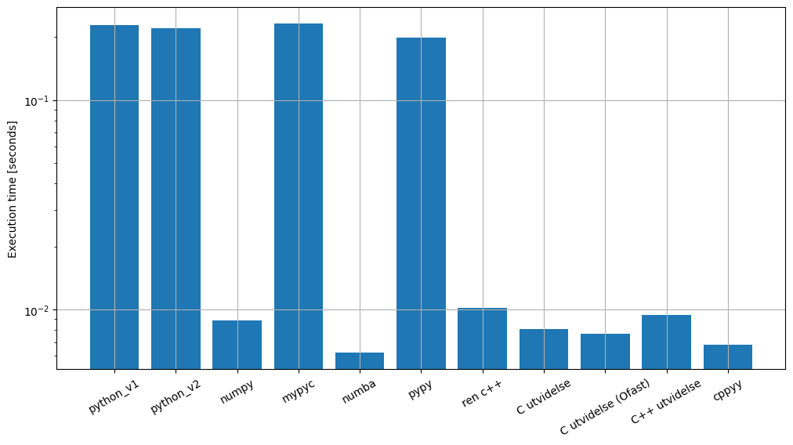

# Lecture 24 - Mixed programming
Henrik Finsberg - 18.11.22

---

## Spørsmål fra forrige time

* Hva er en profiler og hva betyr det å profilere koden?
* Hvilke verktøy finnes for å profilere koden?
* Hva er et benchmark?
* Hva er en generator og hva er fordelen og ulempen med å bruke dette?

---

## Svar

* En profiler er program man kjører koden igjennom som måler hvor lang ting og hvor mange ganger ulike deler av koden blir kjørt.
* cProfile er innebygd i python. Vi har også line-profiler som kan profilere kun enkelte funksjoner. Vi kan bruke `memray` for å profilere minne (det finnes også flere vektøy som vi ikke har dekkes f.eks `pyinstrument`, `fil`)
* Et benchmark er et test program som kan brukes til å sammenligne ulike implementasjoner
* En generator er et objekt som kun vet hvordan den kan gi deg neste element. Det gjør at de er veldig minne-effektive men det betyr også at når du har gått igjennom en generator så er den brukt opp.


---

## Mål for dagens forelesning
* Lære ulike måter vi kan få koden til å gå raskere

---

##  Optimalisering og blandet programmering

1. Få koden til å fungere
2. Refakturer og gjør den mer lesbar (og elegant)
    - Skriv tester
    - Skriv dokumentasjon
3. Gjør koden raskere
   - Bruk en profiler til å finne flaskehalsene

---


## I denne forelesningen skal vi så på ulike metoder får å gjøre koden raskere

* Python har en grense for hvor rask vi kan gjøre koden
* For å gå raskere må vi ta i bruk teknikker som utnytter at Python er implementert i C

---

## Det er for tiden veldig mye fokus på å gjøre python (CPython) raskere

* Faster Python Plan: [github.com/faster-cpython](https://github.com/faster-cpython/ideas/blob/main/FasterCPythonDark.pdf)
* The “Shannon Plan”: [github.com/markshannon](https://github.com/markshannon/faster-cpython/blob/master/plan.md)
* Python3.11 som ble lansert forrige måned er faktisk signifikant raskere enn python3.10

---

## Python3.10 vs Python3.11

La oss prøve python3.10 og python3.11 på funksjonen som estimerer pi

```python
def estimate_pi(N: int) -> float:
    pi_forth = 0.0
    for n in range(N):
        pi_forth += (-1.0) ** n / (2.0 * n + 1.0)
    return pi_forth * 4


if __name__ == "__main__":
    import sys

    N = int(sys.argv[1])
    print(f"\u03C0 = {estimate_pi(N)}")
```

---

```
$ time python3.10 estimate_pi.py 10000000
π = 3.1415925535897915
python3.10 estimate_pi.py 10000000  1.19s user 0.01s system 99% cpu 1.204 total

$ time python3.11 estimate_pi.py 10000000
π = 3.1415925535897915
python3.11 estimate_pi.py 10000000  0.94s user 0.02s system 96% cpu 1.001 total
```

---

## Før man starter å optimalisere koden bør man sjekke alternative algoritmer

Forrige gang så vi på to ulike algoritmer for å finne felles unike elementer i to lister

```python
def find_uniqe_elements4(x, y):   # O(N^2)
    return list(set([xi for xi in x if xi in y]))


def find_uniqe_elements5(x, y):   # O(N)
    return list(set(x).intersection(set(y)))
```

Valg av algoritme er viktig!

---

## Metoder for å optimalisere kode

Anta at vi allerede har den beste algortimen. Kan vi gjøre koden mer effektiv?

---


### Mixed programming

* Vi skriver overordnet kode i ett høynivå-språk (python), som er lett å forstå
* Vi skriver kode som må være effektiv i et lavnivå-språk (C), slik som løkker artimetiske operasjoner
* Eventuelt bruker vi et bibliotek som igjen bruker et lavnivå språk (f.eks `numpy`)
* Neste time skal vi se på paralelle og samtidige (concurrent) beregninger


---

## Test problem

Beregne pi med Leibniz formula

$$
    \pi \approx 4 \sum_{i=0}^{N} (-1)^{i} \frac{1}{2 i + 1}
$$

---

## Benchmark

```python
def benchmark(f: typing.Callable[[int], float]):
    times = []
    values = []
    N = 1_000_000
    num_repeats = 5
    num_runs = 2
    for _ in range(num_repeats):
        t0 = time.perf_counter()
        for _ in range(num_runs):
            pi = f(N)
        times.append(time.perf_counter() - t0)
        values.append(pi)

    return BenchmarkResults(values=values, times=times, name=f.__name__, number=num_runs)
```

---

```python
class BenchmarkResults(typing.NamedTuple):
    values: list[float]
    times: list[int]
    name: str
    number: int = 1

    @property
    def mean(self) -> float:
        return np.mean(self.times)

    @property
    def std(self) -> float:
        return np.std(self.times)

    @property
    def repeats(self) -> int:
        return len(self.times)

    @property
    def best(self) -> float:
        return np.min(self.times)

    def print(self):
        print(
            f"{self.name}: mean: {self.mean}, std: {self.std}, best: {self.best}"
            f"with {self.number} runs and {self.repeats} repeats"
        )
```

---

## Naiv implementasjon

```python
def estimate_pi_v1(N: int) -> float:
    pi_forth = 0.0
    for n in range(N):
        pi_forth += (-1.0) ** n / (2.0 * n + 1.0)
    return pi_forth * 4

```

* Output
    ```
    estimate_pi_v1: mean: 0.23141535859999748, std: 0.004699309746757616, best: 0.2276096250000137with 2 runs and 5 repeats
    ```

---

## Hvor er flaskehalsen?

* Hva med å kjøre det gjennom en profiler

    ```
    python -m cProfile -o estimate_pi.cprof estimate_pi.py
    ```

* Og deretter analysere resultatene
    ```python
    def analyze_profile():
        import pstats

        stats = pstats.Stats("estimate_pi.cprof")
        stats.sort_stats(pstats.SortKey.TIME).print_stats(5)
        stats.sort_stats(pstats.SortKey.CALLS).print_stats(5)
    ```

---

```
Wed Nov  9 11:51:22 2022    estimate_pi.cprof

         79073 function calls (77083 primitive calls) in 1.339 seconds

   Ordered by: internal time
   List reduced from 995 to 5 due to restriction <5>

   ncalls  tottime  percall  cumtime  percall filename:lineno(function)
       10    1.261    0.126    1.261    0.126 estimate_pi.py:74(estimate_pi_v1)
    28/26    0.028    0.001    0.030    0.001 {built-in method _imp.create_dynamic}
      109    0.006    0.000    0.006    0.000 {built-in method marshal.loads}
      638    0.003    0.000    0.003    0.000 {built-in method posix.stat}
  220/219    0.002    0.000    0.003    0.000 {built-in method builtins.__build_class__}


Wed Nov  9 11:51:22 2022    estimate_pi.cprof

         79073 function calls (77083 primitive calls) in 1.339 seconds

   Ordered by: call count
   List reduced from 995 to 5 due to restriction <5>

   ncalls  tottime  percall  cumtime  percall filename:lineno(function)
     6763    0.000    0.000    0.000    0.000 {built-in method builtins.isinstance}
4670/4498    0.000    0.000    0.000    0.000 {built-in method builtins.len}
     4018    0.001    0.000    0.001    0.000 {built-in method builtins.getattr}
     3510    0.000    0.000    0.000    0.000 {method 'rstrip' of 'str' objects}
     3088    0.000    0.000    0.000    0.000 {method 'append' of 'list' objects}
```

---

## Vi kan også prøve med `line_profiler`

Først
```
kernprof -l estimate_pi.py
```
og deretter
```
python -m line_profiler estimate_pi.py.lprof
```

---

```
Timer unit: 1e-06 s

Total time: 5.5561 s
File: estimate_pi.py
Function: estimate_pi_v1 at line 74

Line #      Hits         Time  Per Hit   % Time  Line Contents
==============================================================
    74                                           @profile
    75                                           def estimate_pi_v1(N):
    76        10          5.0      0.5      0.0      pi_forth = 0.0
    77  10000010    2130687.0      0.2     38.3      for n in range(N):
    78  10000000    3425396.0      0.3     61.7          pi_forth += (-1.0) ** n / (2.0 * n + 1.0)
    79        10         10.0      1.0      0.0      return pi_forth * 4
    80                                               # return sum((-1.0) ** n / (2.0 * n + 1.0) for n in range(N)) * 4
```


---

## Dette sier meg at 99% av tiden brukes i denne for-løkka

* Kanskje vi kan prøve å skrive den på en linje

    ```python
    def estimate_pi_v2(N):
        return sum((-1.0) ** n / (2.0 * n + 1.0) for n in range(N)) * 4
    ```

* Dette gir
    ```
    estimate_pi_v2: mean: 0.2294259913993301, std: 0.018535171312886428, best: 0.21978837499955262with 2 runs and 5 repeats
    ```
    Som er mer eller mindre det samme som før


---


## Hva med å skrive den om til å bruke `numpy`?

```python
def estimate_pi_numpy(N):
    sign = np.ones((N,))
    sign[1::2] = -1
    i = np.arange(N)

    return 4 * np.sum(sign * (1 / (2 * i + 1)))
```

* Dette gir
    ```
    estimate_pi_numpy: mean: 0.01072316680001677, std: 0.0026735434673264523, best: 0.008878167000148096with 2 runs and 5 repeats
    ```
    Noe som er 22x speedup! Ikke dårlig

---

## Burde vi ikke kunne bruke disse type annoteringene til noe?

* Vi kan bruke `mypyc` til å kompilere koden til C
    ```python
    # estimate_pi_mypy.py
    def estimate_pi(N: int) -> float:
    return sum((-1.0) ** n / (2.0 * n + 1.0) for n in range(N)) * 4
    ```
    Kompilere
    ```
    mypyc estimate_pi_mypy.py
* Dette vil genere en `.so` fil. I mitt tilfelle heter denne ` estimate_pi_mypy.cpython-310-darwin.so`
* Denne filen kan du importere i python ved å skrive
    ```python
    import estimate_pi_mypy
    ```

---

Dette var ikke veldig imponerende
```
estimate_pi: mean: 0.23879604999965523, std: 0.011568126126969882, best: 0.23136049999993702with 2 runs and 5 repeats
```

* Men dere kan prøve dette eksempelet istedenfor
    ```python
    import time

    def fib(n: int) -> int:
        if n <= 1:
            return n
        else:
            return fib(n - 2) + fib(n - 1)


    t0 = time.time()
    fib(32)
    print(time.time() - t0)
    ```

---

## Just in time kompilering med `numba`

`numba` oversetter python (spesielt numpy) til opimalisert maskinkode

* Installer med `pip` eller `conda`
    ```
    python -m pip install numba
    ```
* Sleng på en dekorator
    ```python
    import numba

    @numba.jit
    def estimate_pi_numba(N):
        sign = np.ones((N,))
        sign[1::2] = -1
        i = np.arange(N)

        return 4 * np.sum(sign * (1 / (2 * i + 1)))
    ```

---

```
estimate_pi_numba: mean: 0.0765878331996646, std: 0.14066827175829646, best: 0.006228624999494059with 2 runs and 5 repeats
```

* Dette er over 30x sammenlignet med ren python og litt bedre enn ren `numpy`.

* Vi ser at det er stor forskjell mellom gjennomsnitt og beste. Dette er fordi første gangen funksjonen kjøres så vil `numba` bruke litt ekstra tid på å kompilere koden. Da vil den gå raskere neste gang.

---

## Det et også mulig å bruke å kjøre `numba` i `nopython` mode

Da bruker du `numba.njit` istedenfor

```python
@numba.njit
def estimate_pi_numba(N):
    sign = np.ones((N,))
    sign[1::2] = -1
    i = np.arange(N)

    return 4 * np.sum(sign * (1 / (2 * i + 1)))
```

* Jeg fikk ikke noe spesiell speedup av dette, men hvis du jobber med rene python objekter kan dette hjelpe.


---

## Det finnes og en annen python oversetter (interpreter) som heter `pypy` som gjør dette automatisk

* Vanlig python, kalles også CPython er implementert i C. `pypy` er implementert i python

* På https://www.pypy.org skriver de at `pypy` i snitt er 4.5 ganger raskere enn CPython

* Ren python implementasjonen bruker ca 0.198 sekunder med pypy på min maskin

---

## Vi kan også bare implementere funksjonen i C++?

```c++
#include <chrono>
#include <cmath>
#include <iostream>

using namespace std::chrono;

double estimate_pi(unsigned int N)
{
    double pi_fourth = 0.0;
    for (unsigned int i = 0; i < N; i++)
    {
        pi_fourth += std::pow(-1, i) * 1.0 / (2.0 * i + 1.0);
    }
    return 4.0 * pi_fourth;
}

int main()
{
    int N = 1000000;
    int num_repeats = 5;
    int num_runs = 2;
    for (int i = 0; i < num_repeats; i++)
    {
        auto start = high_resolution_clock::now();
        for (int i = 0; i < num_runs; i++)
        {
            estimate_pi(N);
        }
        auto stop = high_resolution_clock::now();
        auto duration = duration_cast<microseconds>(stop - start);
        std::cout << duration.count() / 1e6 << " ";
    }
    std::cout << "\n";
}
```

---

```
$ c++ estimate_pi.cpp -o estimate_pi_cpp -std=c++14
$ ./estimate_pi_cpp
0.019509 0.014388 0.012554 0.011115 0.010273
```

Så dett er er omtent 20x av hva vi fikk i ren python

---

## Det hadde jo vært fint om vi bare kunne importert og brukt denne funksjonen i python?

* Og det kan vi "nesten". La oss først vise hvordan vi kan gjøre dette i `C`. Se på følgende code
    ```C
    // estimate_pi.c
    #include <stdio.h>

    void print_hello()
    {
        printf("Hello world\n");
    }

    int main()
    {
        print_hello();
        return 0;
    }
    ```

---

Vi kan kompilere dette med enten `gcc` eller `clang`
```
clang estimate_pi.c -o estimate_pi_c
```
Og kjøre programmet
```
$ ./estimate_pi_c
Hello world
```

* La oss se hvordan vi kan kalle denne `print_hello` funksjonen fra python.

---

## Vi kan bruke `ctypes` til å kalle på C funksjoner

* Først må vi kompilere koden som et delt bibliotek (disse har typisk filending `.so` eller `.dylib` (mac) og `.dll` på Windows)
    ```
    clang estimate_pi.c -o estimate_pi_c.so -shared -fpic
    ```

* Nå kan vi brukte `ctypes` til å laste inn denne koden
    ```python
    import ctypes

    library = ctypes.CDLL("estimate_pi_c.so")
    ```
* Og nå kan vi kalle metoden
    ```python
    library.print_hello()
    ```

---

## Hva med å estimere pi

* Følgende kode kan brukes i `C`
    ```C
    #include <math.h>

    double estimate_pi(unsigned int N)
    {
        double pi_fourth = 0.0;
        for (unsigned int i = 1; i < N; i++)
        {
            pi_fourth += pow(-1, i) * 1.0 / (2.0 * i + 1.0);
        }
        return 4.0 * pi_fourth;
    }
    ```

---

* Men nå må vi først fortelle python hva skal typer denne funksjonen tar som argumenter og retur
    ```python
    library.estimate_pi.argtypes = [ctypes.c_uint]
    library.estimate_pi.restype = ctypes.c_double
    ```

* Nå kan vi kalle på funksjonen

    ```python
    pi = library.estimate_pi(1_000_000)
    print(pi)
    ```


* La oss wrappe denne inn i en funksjon og teste den med benchmarket vår. Da får jeg
    ```
    estimate_pi_c: mean: 0.00807349160022568, std: 6.6502073150099304e-06, best: 0.00806525000007241with 2 runs and 5 repeats
    ```

---

## Det går også an å kompilere med noen extra flag for å gjøre det raskere

```
$ clang estimate_pi.c -o estimate_pi_c.so -shared -fpic -Ofast
```

* Dette gjøre det litt raskere
    ```
    estimate_pi_c: mean: 0.00786695020069601, std: 0.0001471369314638027, best: 0.007690166999964276with 2 runs and 5 repeats
    ```

---

## Hva med C++?

Vi kan prøve å gjøre det samme i C++.
```
$ c++ estimate_pi.cpp -o estimate_pi_cpp.so -std=c++14 -fpic -shared
```

```python
cpp_library = ctypes.CDLL("estimate_pi_cpp.so")

cpp_library.estimate_pi.argtypes = [ctypes.c_uint]
cpp_library.estimate_pi.restype = ctypes.c_double

def estimate_pi_cpp(N):
    return cpp_library.estimate_pi(N)

```

* Men dette vil ikke fungere. Og grunnen til dette er pga ovloading. I C++ kan vi ha flere funksjoner med samme navn men ulik type, og når vi skriver bindinger til python kan vi ikke ha mer enn en funksjon med et navn.

---

## Vi kan fikse dette ved å deklarere funksjonen som en `C` funksjon

```C++
extern "C"
{
    double estimate_pi(unsigned int N)
    {
        double pi_fourth = 0.0;
        for (unsigned int i = 0; i < N; i++)
        {
            pi_fourth += std::pow(-1, i) * 1.0 / (2.0 * i + 1.0);
        }
        return 4.0 * pi_fourth;
    }
}
```

* Da vil det fungere, og nå får jeg
    ```
    estimate_pi_cpp: mean: 0.010690566601260798, std: 0.0011193234578346244, best: 0.009439458000997547 with 2 runs and 5 repeats
    ```

---

## Dette går også an å gjøre dette direkte med `cppyy`

Installer med `pip`
```
pip install cppyy
```

```python
cppyy.include("cmath")
cppyy.cppdef(
    """
double estimate_pi(unsigned int N)
{
    double pi_fourth = 0.0;
    for (unsigned int i = 0; i < N; i++)
    {
        pi_fourth += std::pow(-1, i) * 1.0 / (2.0 * i + 1.0);
    }
    return 4.0 * pi_fourth;
}
"""
)
```

---

Resultatet fra benchmarket er nå
```
estimate_pi: mean: 0.0075695666004321534, std: 0.0015024673920345326, best: 0.006816166001954116 with 2 runs and 5 repeats
```
som er på nivå med `numba`

---

## Oppsumering




---

## Andre alternativer

* Cython
* pybind11
* [Pyjion](https://www.trypyjion.com/#install)
* Annet språk
    - Rust ([pyO3](https://github.com/PyO3/pyo3))
    - Fortran (f2py)

---


## Mål for dagens forelesning
* Lære ulike måter vi kan få koden til å gå raskere
