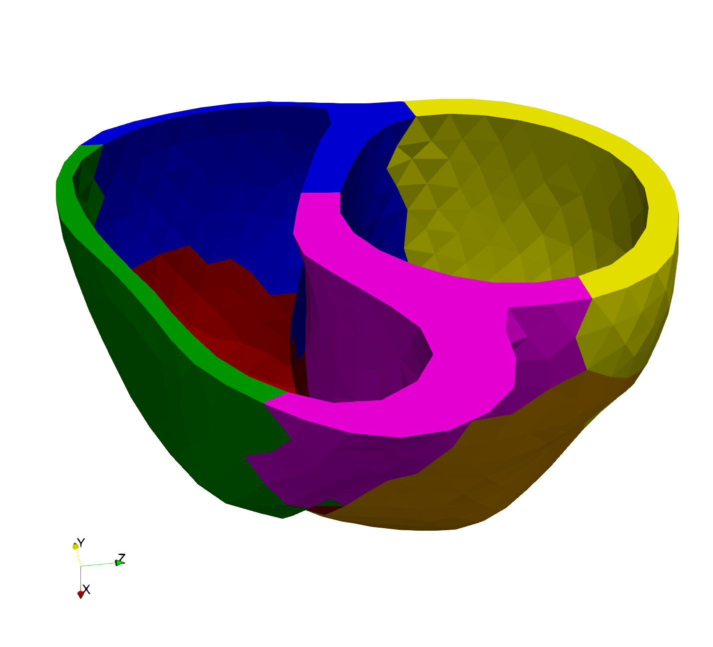

# Lecture 25 - Parallell og samtidig programmiering
Henrik Finsberg - 23.11.22

---

## Spørsmål fra forrige time
* Hva betyr JIT kompilering
* Hvordan kan vi JIT kompilere koden i python
* Forklar ulike måter man kan få koden til å gå raskere i python


---

## Svar

* Just-in-time kompilering tar koden og kompilerer denne til maskinkode mens den kjører. Dette er ulikt C++ som er kompilert *ahead of time*.
* Vi kan bruke *numba.jit* (eventuel *numba.njit*). Vi kan også bruke *pypy* som er en python oversetter som er implementert i python. Det finnes også `pyjion`
* JIT, numpy, skrive kode i C/C++/Rust/Fortran og importere i python, `cppyy`, Cython,


---

## Mål for dagens forelesning
* Lære hvordan man kan kjøre koden på flere tråder og prosessorer

---


## Vi har sett hvordan vi kan optimalisere kode slik at den blir raskere

- Vektorisiering med numpy
- `numba`
- `C` / `C++` utvidelser
- `cppyy`

Dersom dette ikke er gått nok, kan vi gjøre det bedre?
* Vi kan bruke en kraftigere maskin!

---

## I Norge har vi flere superdatamaskiner

- NTNU - [Saga (ny i 2019)](https://documentation.sigma2.no/hpc_machines/saga.html)
- NTNU - [Betzy (ny i 2020)](https://documentation.sigma2.no/hpc_machines/betzy.html)
- UiT - [Fram](https://documentation.sigma2.no/hpc_machines/fram.html)

```
ssh saga
```

* På simula forsker vi også på bruk av nye typer superdatamaskiner
* [ex3](https://www.ex3.simula.no)

---

## En superdatamaskin

*En superdatamaskin er en en datamaskin med høy ytelse sammenlignet med en generell datamaskin. Ytelsen til en superdatamaskin er normal målt i flyttalsoperasjoner per sekung (FLOPS)*

* Saga: 645 Teraflop/s (CPUs) + 150 Teraflop/s (GPUs)
* Betzy: 6.2 Petaflops
* Fram: 1.1 Petaflop/s

* Exascale: Systemer som er i stand til å gjøre minst $10^{18}$ FLOPS (1 exaflops = 1000 Petaflops). Første exascale masking be [annonsert i år](https://en.wikipedia.org/wiki/Frontier_(supercomputer))

---

Video fra i sommer da jeg besøke Lawrence Berkeley National Lab
https://www.dropbox.com/s/c7pjlef0fddfgix/IMG_2397.mp4

---

## Det å bare kjøre koden på en supercomputer vil ikke nødevendigvis gå fortere

* Vi er nødt til å endre koden vår slik at den kan utyntte kraften
    - Vi ønsker å kjøre koden på flere kjerner (CPU)
    - Da må vi bruke paralell programmering!

* Du kan tenke på en CPU kjerne som det som faktisk utfører beregningen vår - hjernen til datamaskinen

---

## Serial vs Paralell - Hvorden skiller paralell programmering seg fra "vanlig" (sekvensiell) programmering?

* I "vanlig" programmering utføres koden linje for linje, en etter hverandre

* Når vi skriver parallelle programmer så skjer dette på en litt annen måte

* Hva vil det si at noe kjører i paralell?

---


---

Anta at Magnus Carlsen spiller sjakk mot 70 andre spillere

* Magnus bruker 10 sekunder per trekk
* Mostanderene bruker 50 sekunder per trekk
* I snitt bruker Magnus 30 trekk på å slå sin motstander


---

```python
def player(name="Player1"):
    for move in range(30):
        think()  # Tar 10 sekunder
        wait()   # Tar 50 sekunder
```

* Hvor lang tid bruker Mangus på å spille mot alle de 70 spillerene?

---

## Sekvensiell tankegang

* Magnus spiller mot en spiller av gangen
* Hvert trekk tar 10 (Magnus) + 50 (motstander) = 60 sekunder = 1 minutt
* Hvert spill er 30 trekk -> Hvert spill tar 30 minutter
* Det er 70 spill -> Total tar det
    $$70 \times 30 \text{ minuter} = 2100 \text{ minutter} = 35 \text{ timer}$$

---

```python
def serial():
    for i in range(70):
        player(name=f"Player {i+1}") # Tar 30 minutter
```

---

## "Parallell" tankegang versjon 1 - Ikke vent på motstanderen

* I mesteparten av tiden (5/6 deler) bruker Magnus på å vente på motstanderen
    - Denne tiden kan han istedet bruke på å spille mot de andre

* Når Magnus har utført sitt trekk går han direkte videre til neste motstander
    - Når Magnus kommer tilbake til motstanderen igjen har hen allerede flyttet


* Hvert spill tar 10 sekunder * 30 trekk = 300 sekunder
* Det er 70 spill -> Total tar det
    $$70 \times 300 \text{ sekunder} = 21000 \text{ sekunder} = 5 \text{ timer } 50 \text{ minutter}$$


---


## Parallell tankegang version 2 - Lag kloner av Magnus

* Anta at vi kan lage kopier av Magnus som kan spille samtitig
* Anta av vi kan lage 7 kopier og hver av disse spiller sekvensielle spill
* Anta at vi klarer å fordele arbeidsmengen på hver Magus helt likt
    - Dvs 10 motstandere per Magnus
* Total tid blir
    $$\frac{0.5 \times 70 \text{ timer }}{7} = \frac{35 \text{ timer }}{7} = 5 \text{ timer}$$

* Eventuelt, hvert trekk tar 10 (Magnus) + 50 (motstander) = 60 sekunder = 1 minutt
* Hvert spill er 30 trekk -> Hvert spill tar 30 minutter
* Det er 10 spill for hver Magnus -> Total tar det $10 \times 30$ minutter = $5$ timer

---

* Merk at dersom vi kan lage 70 kopier av Magnus så kan vi la hver kopi spille ett spill.
    - Siden hver av disse også må vente på motstanderen så ville dette tatt 30 minutter

---

## Kombinasjon

Hvis vi lager 14 kopier av Magnus og gir 5 motstander til hver (5 * 14 = 70), så kan vi spille alle spillene på 30 minutter dersom hver Magnus går videre til neste motstander isteden for å vente.

Dette er det optimale (ved å bruke minst mulig kloner av Magnus)

---

## Her har vi illustrert to måter vi kan tenke parallelt på

* Vi kan bruke tiden som Magnus ellers må bruke på å vente til å gjøre noe nyttig
    - Multithreading i python

* Vi kan lage kopier av Magnus som gjør den samme jobben
    - Multiprocessing

* Vi kan tenkte på Magnus som er prosess.

* Merk at det er kun når vi lager kopier av Magnus at vi faktisk kjører ting i parallel. Multithreading i python er ikke parallell, men det er samtidig (*concurrent*)

---

### Global Interpreter Lock i python

* I python er det noe som hetet Global Interpreter Lock (GIL) som betyr at
en process kun kan utføre en python operasjon av gangen.

* I andre programmeringsspråk (f.eks C++) er det mulig å utføre flere operasjoner på samme process.

* Grunnen til at python gjør det på denne måten er på grunn av måten python rydder opp i minnet. Husk i C++ er man nødt til å allokere minne og deallokere minne når man er ferdig. Dette slipper du i python og her er kostnaden for det.

* Da har vært en god del initiativ for å fjerne denne låsen
    https://pyfound.blogspot.com/2022/05/the-2022-python-language-summit-python_11.html

---

## I/O begrensede vs CPU begrensede problemer

* I/O begrensede problemer
    - Problemer der vi må vente
    - Laste ned data fra nettet
    - Lese / Skrive til disk
    - Multithreading

* CPU begrensede problemer
    - Problemer der vi har mye som må gjøres
    - Hvis jeg hadde en kopi kunne jeg gjort mer
    - Multiprocessing

---

## Multithreading

- Brukes for I/O begrensede problemer når vi bruker mest tid på å vente.
- Vi bruker kun en prosessor (kun en Magnus)
- Operativsystemet bestemmer når Magnus skal bytte motstander
    - Her finnes det også et alternativ som heter asynkron programmering hvor du kan bestemme når Magnus skal bytte
- Eksempel - laste ned data fra nettet eller skrive til en fil

---

### Multiprocessing

- Brukes for CPU begrensede problemer når vi må utføre intensive beregninger.
- Vi lager $N$ kopier som gjør samme jobben ($N$ kan maks være antall kjerner du har på maskinen din)
- Oppgavene må være uavhengige
    - Hvis du vil lage kopier av Magnus og du ønsker at disse kopiene skal kommunisere så blir det fort mer komplisert (MPI).

---

### Mulitprocessing med kommunikasjon

- Når vi skal løse ligninger med multiprocessing går det an å dele opp geometrien du skal bruke opp i mindre deler

- Hver prosessor regner ut løsningen på sin del

- Prosessorene må kommunisere når løsningen avhenger av løsningen på ulike deler

*  IN3200 – High-Performance Computing and Numerical Projects (Vår 2022)



---

## Et enkelt IO begrenset problem

Anta at vi har en funksjon som må vente i 1 sekund og at vi har to oppgaver som kaller på denne funksjonen

```python
def wait():
    return time.sleep(1.0)

def task(task_nr):
    print(f"Executing task {task_nr}")
    wait()
    print(f"Done executing task {task_nr}")
```


* Implementer en seriel versjon der du utfører to oppgaver og ta tiden.

---

```python
def serial():
    t0 = time.perf_counter()
    task(1)
    task(2)
    print(f"Elapsed time: {time.perf_counter() - t0}")
```

---

## Multithreaded versjon

* Vi kan lage en tråd for hver oppgave

    ```python
    from threading import Thread

    thread1 = Thread(target=task, args=(1,))
    thread2 = Thread(target=task, args=(2,))
    ```
* Vi stater en tråd ved å skrive
    ```python
    thread1.start()
    ```
* Vi venter på at tråden skal bli ferdig ved å skrive
    ```python
    thread1.join()
    ```
* Implementer en versjon som kjører på to tråder der du utfører disse to oppgavene og ta tiden.

---

```python
def threads():
    t0 = time.perf_counter()
    thread1 = Thread(target=task, args=(1,))
    thread2 = Thread(target=task, args=(2,))
    thread1.start()
    thread2.start()
    thread1.join()
    thread2.join()
    print(f"Elapsed time: {time.perf_counter() - t0}")
```

---

## Multiprocessing versjon

* Vi kan også kjøre dette på flere prosesser ved å utføre en oppgave på hver prosess
    ```python
    from multiprocessing import Process

    process1 = Process(target=task, args=(1,))
    process2 = Process(target=task, args=(2,))
    ```
* Og APIen for å startet og vente er tilsvarende som for tråder
    ```python
    process1.start() # start
    process1.join()  # vent
    ```
* Implementer en versjon som kjører på to prosesser der du utfører disse to oppgavene og ta tiden.

---

```python
def processes():
    t0 = time.perf_counter()
    process1 = Process(target=task, args=(1,))
    process2 = Process(target=task, args=(2,))
    process1.start()
    process2.start()
    process1.join()
    process2.join()
    print(f"Elapsed time: {time.perf_counter() - t0}")
```

---


## Et CPU begrenset problem

Anta nå at vi har et CPU begreset problem (her regner vi ut PI med Leibniz formel)

```python
def think():
    return sum((-1.0) ** n / (2.0 * n + 1.0) for n in range(30_000_000)) * 4
```

* Gjenta øvelsen hvor du utfører denne oppgaven inne i `task` funksjonen

---

```python
from threading import Thread
from multiprocessing import Process
import time


def think():
    return sum((-1.0) ** n / (2.0 * n + 1.0) for n in range(30_000_000)) * 4


def task(task_nr):
    print(f"Executing task {task_nr}")
    think()
    print(f"Done executing task {task_nr}")


def serial():
    t0 = time.perf_counter()
    task(1)
    task(2)
    print(f"Elapsed time: {time.perf_counter() - t0}")


def threads():
    t0 = time.perf_counter()
    thread1 = Thread(target=task, args=(1,))
    thread2 = Thread(target=task, args=(2,))
    thread1.start()
    thread2.start()
    thread1.join()
    thread2.join()
    print(f"Elapsed time: {time.perf_counter() - t0}")


def processes():
    t0 = time.perf_counter()
    process1 = Process(target=task, args=(1,))
    process2 = Process(target=task, args=(2,))
    process1.start()
    process2.start()
    process1.join()
    process2.join()
    print(f"Elapsed time: {time.perf_counter() - t0}")


if __name__ == "__main__":
    print("Serial")
    serial()
    print("Threads")
    threads()
    print("Processes")
    processes()
```

---

## Tilbake til Magnus Carlsen

Anta at en spiller kan beskrives på følgende måte
```python
def player(name="Player1"):
    print(f"Start playing against {name}")
    for move in range(30):
        think()  # Tar 10 sekunder
        wait()  # Tar 50 sekunder
    print(f"Done playing against {name}")
```

La Magnus spille mot 5 spillere og anta at

```python
def wait():
    time.sleep(0.05)

def think():
    sum((-1.0) ** n / (2.0 * n + 1.0) for n in range(500_000)) * 4
```

* Hvor lang tid bruker Magnus i serie / multithreaded / mulitprocessing

---

```python
import time
from threading import Thread
from multiprocessing import Process

def take_time(f):
    def wrap():
        t0 = time.perf_counter()
        ret = f()
        print(f"Elapsed time: {time.perf_counter() - t0} seconds")
        return ret

    return wrap

def wait():
    time.sleep(0.05)

def think():
    sum((-1.0) ** n / (2.0 * n + 1.0) for n in range(500_000)) * 4

def player(name="Player1"):
    print(f"Start playing against {name}")
    for move in range(30):
        think()  # Tar 10 sekunder
        wait()  # Tar 50 sekunder
    print(f"Done playing against {name}")

@take_time
def serial():
    print("Running serial")
    for i in range(5):
        player(f"Player {i+1}")

@take_time
def threads():
    print("\nRunning multithreading")
    all_threads = []
    for i in range(5):
        thread = Thread(target=player, args=(f"Player {i+1}",))
        thread.start()
        all_threads.append(thread)

    # Wait for all threads to finish
    for thread in all_threads:
        thread.join()

@take_time
def processes():
    print("\nRunning multiprocessing")
    all_processes = []
    for i in range(5):
        process = Process(target=player, args=(f"Player {i+1}",))
        process.start()
        all_processes.append(process)

    # Wait for all processs to finish
    for process in all_processes:
        process.join()

if __name__ == "__main__":
    serial()
    threads()
    processes()
```

---

* Prøv å øk / reduser adelen tid Magnus bruker på å tenke. Hvordan endrer dette kjøretiden på flere prosesser / tråder


---

## For å sette i gang flere oppgaver finnes en bedre API

- Først må vi lage en prosess, så starte den og til slutt vente på at den blir ferdig.
- Dette er en såpass vanlig mønster at det finnes en annen måte på dette


```python
import concurrent.futures

# Her kan man også sende inn `max_workers`
with concurrent.futures.ThreadPoolExecutor() as executor:
    for i in range(5):
        executor.submit(player, f"Player {i+1}") # Start hver tråd

    # Vent her til alle trådene er ferdig
```
* Implementer sjakkspillet ved å bruke `concurrent.futures`

---

```python
import concurrent.futures

@take_time
def threads():
    print("\nRunning multithreading")
    with concurrent.futures.ThreadPoolExecutor() as executor:
        for i in range(5):
            executor.submit(player, f"Player {i+1}")


@take_time
def processes():
    print("\nRunning multiprocessing")
    with concurrent.futures.ProcessPoolExecutor() as executor:
        for i in range(5):
            executor.submit(player, f"Player {i+1}")
```

---


## Primtalsjekker

Sjekk hvilke tall som er primtall. Hvor raskt klarer vi å gjøre det?

```python
numbers = [
    13466917, 20996011, 24036583, 25964951, 25964953, 30402457, 32582657, 37156667, 37156669, 10002847, 10001209
]

def is_prime(n):
    if n % 2 == 0:
        return False
    for i in range(3, n):
        if n % i == 0:
            return False
    return True
```

* Start med å implementere en seriel versjon

---

```python
def take_time(f):
    def wrap(*args, **kwargs):
        t0 = time.perf_counter()
        ret = f(*args, **kwargs)
        print(f"Elapsed time: {time.perf_counter() - t0} seconds")
        return ret

    return wrap


@take_time
def serial(number):
    print("Serial")
    results = []
    for number in number:
        result = is_prime(number)
        results.append((number, result))

    for number, result in results:
        print(f"{number} is prime: {result}")

```

---

## Implementer en versjon med tråder og prosesser

- Merk at `executer.submit` returnerer en `future`
    ```python
    results = []
    with concurrent.futures.ProcessPoolExecutor() as executor:
        for number in numbers:
            future = executor.submit(is_prime, number)
            results.append((number, future))
    ```
- En `future` er noe som kan inneholde et resultat, og vi kan hente ut dette via `result` metoden.
    ```python
    for number, future in results:
        print(f"{number} is prime: {future.result()}")
    ```

---

```python
@take_time
def threads(numbers):
    print("\nRunning multithreading")
    results = []
    with concurrent.futures.ThreadPoolExecutor() as executor:
        for number in numbers:
            future = executor.submit(is_prime, number)
            results.append((number, future))

    for number, future in results:
        print(f"{number} is prime: {future.result()}")


@take_time
def processes(numbers):
    print("\nRunning multiprocessing")
    results = []
    with concurrent.futures.ProcessPoolExecutor() as executor:
        for number in numbers:
            future = executor.submit(is_prime, number)
            results.append((number, future))

    for number, future in results:
        breakpoint()
        print(f"{number} is prime: {future.result()}")
```

---


## `numba` har også å måte å kjøre for-løkker i parallell


```python
@numba.njit()
def is_prime_numba(n):
    prime = True
    if n % 2 == 0:
        prime = False

    for i in range(3, n):
        if n % i == 0:
            prime = False
    return prime


@numba.jit(parallel=True)
def fun(numbers, results):
    n = len(numbers)
    for i in numba.prange(n):
        number = numbers[i]
        results[i] = is_prime_numba(number)


@take_time
def run_numba(numbers):
    results = np.empty(len(numbers), dtype=bool)
    fun(np.array(numbers), results)

    for number, result in zip(numbers, results):
        print(f"{number} is prime: {result}")
```

---

## Typiske problemer som er egnet for paralell programmering

* Problemer hvor du skal gjøre det samme veldig mange ganger
* Eksempel:
    - Sjekke om en list med tall er primtall
    - Brute force optimering
    - Monte Carlo Simulering


---


## Typiske problemer som IKKE er egnet for paralell programmering

* Problemer hvor ting avhenger av hverandre
* Eksempel:
    - Løse en ODE - løsningen i neste steg avhenger av løsningen i forrige steg
    - For eksempel pendelen som vi løste i prosjekt 1

---

## Hva med å regne ut gjennomsnittet av elementene i en liste?

Regn ut gjennomsnittet av et stort array

```python
import numpy as np
x1 = np.random.normal(10, 0.1, size=(20000, 20000))
x1.mean()
```

---

## Paralell programmering med  `dask`

https://dask.org

Dask er et bibliotek for å skalere python og har paralelle versjoner av `numpy` og `pandas`
- Dask er også spesielt nyttig hvis du har beregninger som krever mer minne enn du har tilgjengelig


```python
import dask.array as da
x2 = da.random.normal(10, 0.1, size=(20000, 20000))
x2.mean().compute()
print(x2)
```

Vi kan også visualisere hvordan beregningene gjøres
```python
x2.visualize()
```

---


---

## Utfordringer med paralell programmering

* Mer komplisert å implementere
* Mer komplisert å forstå

* Overhead
    - Hvis et program tar 2 minutter og du deler det opp på to kjerner så burde det i teorien ta 1 minutt
    - Dette gjør det normalt ikke fordi det blir også brukt noe ekstra ressurser
    - Vanlig å plotte kjøretiden for ulike antall kjerner og se hvordan de skalerer

---

## Race conditions

```python
x = 0
x = x + 1
```

1. Les `x`
2. Legg til 1 på `x`
3. Skriv denne nye verdien til `x`


---

```python
from threading import Thread
import time


class Database:
    def __init__(self, sleep_time=0.1):
        self.value = 0
        self.sleep_time = sleep_time

    def update_value(self, thread_index):
        print(f"Thread {thread_index}: updating value")
        value_copy = self.value
        value_copy += 1
        # Here we sleep so that we are "sure" that we switch thread
        time.sleep(self.sleep_time)
        self.value = value_copy
        print(f"Thread {thread_index}: finished updating value")


def main():
    database = Database(sleep_time=0.1)
    thread1 = Thread(target=database.update_value, args=(1,))
    thread2 = Thread(target=database.update_value, args=(2,))
    thread1.start()
    thread2.start()

    thread1.join()
    thread2.join()
    print(database.value)
```

---

## Moral

* Lesing av data i parallell er aldri noe problem
* Man bør være forsiktig dersom man skriver til samme data i paralell
* Dette er typisk bare et problem med tråder fordi de deler minnet mellom tråder
    - Når vi kjører flere prosesser får hver enkelt prosess en kopi av minnet
* Man kan inføre låser (lock). Tråden som holder låsen kan skrive, og ingen andre tråder kan skrive før man får låsen

---

```python
from threading import Thread, Lock
import time


class Database:
    def __init__(self, lock: Lock, sleep_time=0.1):
        self.value = 0
        self.sleep_time = sleep_time
        self.lock = lock

    def update_value(self, thread_index):
        self.lock.acquire()  # Get lock
        print(f"Thread {thread_index}: updating value")
        value_copy = self.value
        value_copy += 1
        # Here we sleep so that we are "sure" that we switch thread
        time.sleep(self.sleep_time)
        self.value = value_copy
        print(f"Thread {thread_index}: finished updating value")
        self.lock.release()  # Release lock


def main():
    lock = Lock()
    database = Database(sleep_time=0.1, lock=lock)
    thread1 = Thread(target=database.update_value, args=(1,))
    thread2 = Thread(target=database.update_value, args=(2,))
    thread1.start()
    thread2.start()

    thread1.join()
    thread2.join()
    print(database.value)
```

---

## Mandelbrot mengden

$$f_c(z) = z^2 + c$$

$$ \mathcal{M} = \{c : c \in \mathbb{C}, z_{n+1} = f_c(z_{n}) \text{ ikke divergerer og vi starter med } z_0 = 0 \} $$

$$ c \in \mathbb{C} \implies c = x + i y,  \;\; (x, y) \in \mathbb{R}^2 $$

---

Er $1 \in \mathcal{M}$ ?

$$z = 0,$$
$$f(0) = 0^2 + 1 = 1,$$
$$f(f(0)) = 1^2 + 1 = 2,$$
$$f(f(f(0))) = 2^2 + 1 = 5,$$

Denne følgen divergerer, så 1 er ikke i mengeden

---

## Hvordan vet vi at et følge divergerer?

* Det går an å vise at en følge konveregerer hvis og bare hvis det finnes en $n$ slike at  $|z_n| > 2$
* Vi må også sette et maksimum antall iterasjoner før vi konkluderer med at følgen konvergerer.

---

## Naiv Python

```python
import numpy as np
import matplotlib.pyplot as plt

def mandelbrot_pixel(c: complex, maxiter: int) -> int:
    """Check wether a single pixel diverges"""
    z = 0

    for n in range(maxiter):
        z = z*z + c
        if abs(z) > 2:
            return n

    return 0


def mandelbrot_image(
    xmin: float,
    xmax: float,
    ymin: float,
    ymax: float,
    width: int,
    height: int,
    maxiter: int,
) -> np.ndarray:
    """Render an image of the Mandelbrot set"""
    x = np.linspace(xmin, xmax, width)
    y = np.linspace(ymin, ymax, height)
    img = np.empty((width, height))

    for i, xi in enumerate(x):
        for j, yj in enumerate(y):
            c = xi + 1j * yj
            img[i, j] = mandelbrot_pixel(c, maxiter)

    return img
```

---

## Benchmark

```python
from typing import Callable


def benchmark(
    mandelbrot: Callable[[float, float, float, float, int, int, int], np.ndarray]
) -> np.ndarray:
    xmin = -0.74877
    xmax = -0.74872
    ymin = 0.065053
    ymax = 0.065103
    pixels = 1000
    maxiter = 2048
    return mandelbrot(xmin, xmax, ymin, ymax, pixels, pixels, maxiter)
```

---

## Naiv python

```
$ python mandel.py
mandelbrot_image_python: Elapsed time: 107.19205716700162 seconds
```

---

## Hva med multiprocessing?

Hva er teoretisk mulig?

```python
import psutil
num_cores = psutil.cpu_count(logical=False)
print("Number of physical cores: ", num_cores)
print(f"Theoretical best time = {107.19205716700162 / num_cores:.2f} seconds")
```
Jeg har 10 kjerner, så teoretisk mulig er rett under 11 sekunder


---

```python
def task(xi, y, maxiter):
    result = np.zeros_like(y)
    for j, yj in enumerate(y):
        c = xi + 1j * yj
        result[j] = mandelbrot_pixel_python(c, maxiter)
    return result


@take_time
def mandelbrot_image_mp(
    xmin: float,
    xmax: float,
    ymin: float,
    ymax: float,
    width: int,
    height: int,
    maxiter: int,
) -> np.ndarray:
    x = np.linspace(xmin, xmax, width)
    y = np.linspace(ymin, ymax, height)
    img = np.empty((width, height))

    results = []
    with concurrent.futures.ProcessPoolExecutor() as executor:
        for i, xi in enumerate(x):
            result = executor.submit(task, xi, y, maxiter)
            results.append((i, result))

    for i, value in results:
        img[i, :] = value.result()

    return img
```

---

## Multiprocessing

```
$ python mandel.py
mandelbrot_image_mp: Elapsed time: 14.826232415998675 seconds
```

---

## Numpy

```python
def mandelbrot_image_numpy(
    xmin: float,
    xmax: float,
    ymin: float,
    ymax: float,
    width: int,
    height: int,
    maxiter: int,
) -> np.ndarray:
    x = np.linspace(xmin, xmax, num=width).reshape((1, width))
    y = np.linspace(ymin, ymax, num=height).reshape((height, 1))
    C = np.tile(x, (height, 1)) + 1j * np.tile(y, (1, width))

    Z = np.zeros((height, width), dtype=complex)
    M = np.ones((height, width), dtype=bool)
    M_tmp = np.ones((height, width), dtype=bool)
    img = np.zeros((height, width), dtype=float)
    for i in range(maxiter):
        Z[M] = Z[M] * Z[M] + C[M]
        M[np.abs(Z) > 2] = False
        M_tmp = ~M & ~M_tmp
        img[~M_tmp] = i
        M_tmp[:] = M[:]

    img[np.where(img == maxiter - 1)] = 0
    return img.T

```

---

## Numpy

```
$ python mandel.py
mandelbrot_image_numpy: Elapsed time: 21.186761958000716 seconds
```

---

## Numba

```python
import numpy as np
import numba

@numba.njit
def mandelbrot_pixel_numba(c, maxiter):
    z = 0
    for n in range(maxiter):
        z = z*z + c
        if abs(z) > 2:
            return n
    return 0

@numba.njit
def mandelbrot_numba(xmin, xmax, ymin, ymax, width, height, maxiter):
    x = np.linspace(xmin, xmax, width)
    y = np.linspace(ymin, ymax, height)
    img = np.empty((width, height))

    for i in range(width):
        for j in range(height):
            c = x[i] + 1j*y[j]
            img[i, j] = mandelbrot_pixel_numba(c, maxiter)
    return img
```
---


## Numba

Nå er det også viktig å kjøre den flere ganger på jit kompileringen

```python
def take_time(f):
    def wrap(*args, **kwargs):
        for _ in range(4):
            t0 = time.perf_counter()
            ret = f(*args, **kwargs)
            print(f"{f.__name__}: Elapsed time: {time.perf_counter() - t0} seconds")
        return ret

    return wrap
```


```
$ python mandel.py
mandelbrot_image_numba: Elapsed time: 2.4381369590009854 seconds
mandelbrot_image_numba: Elapsed time: 2.113938499998767 seconds
mandelbrot_image_numba: Elapsed time: 2.114544499996555 seconds
mandelbrot_image_numba: Elapsed time: 2.129646458000934 seconds
```

---


## Vi kan også optimalisere pixel funksjonen vår
Går an å vise at

```python
c = cx + 1j * cy
z = 0
for n in range(maxiter):
    z = z*z + c
    if abs(z) > 2:
        return n
```
er ekvivalent med
```python
x = cx
y = cy
for n in range(maxiter):
    x2 = x*x
    y2 = y*y
    if x2 + y2 > 4.0:
        return n
    y = 2*x*y + cy
    x = x2 - y2 + cx
```

---

med

```python
@numba.jit
def mandelbrot_pixel_numba_opt(cx, cy, maxiter):
    x = cx
    y = cy
    for n in range(maxiter):
        x2 = x*x
        y2 = y*y
        if x2 + y2 > 4.0:
            return n
        y = 2*x*y + cy
        x = x2 - y2 + cx
    return 0
```


---

## Numba (opt)

```
$ python mandel.py
mandelbrot_image_numba: Elapsed time: 2.26780937500007 seconds
mandelbrot_image_numba: Elapsed time: 1.9655964160010626 seconds
mandelbrot_image_numba: Elapsed time: 1.9640810830023838 seconds
mandelbrot_image_numba: Elapsed time: 1.9632414590014378 seconds
```

---

## Hva med å skrive det i C++

```C++
#include <memory>

int mandelbrot_pixel(double cx, double cy, int maxiter)
{
    double x = cx;
    double y = cy;

    for (int n = 0; n < maxiter; n++)
    {
        double x2 = x * x;
        double y2 = y * y;

        if (x2 + y2 > 4.0)
        {
            return n;
        }

        y = 2 * x * y + cy;
        x = x2 - y2 + cx;
    }
    return 0;
}

void mandelbrot(std::unique_ptr<int[]> &output, double xmin, double xmax, double ymin, double ymax, int width,
                int height, int maxiter)
{
    int i, j;

    double xlin[width];
    double ylin[height];
    double dx = (xmax - xmin) / width;
    double dy = (ymax - ymin) / width;

    for (i = 0; i < width; i++)
    {
        xlin[i] = xmin + i * dx;
    }

    for (j = 0; j < height; j++)
    {
        ylin[j] = ymin + j * dy;
    }

    for (i = 0; i < width; i++)
    {
        for (j = 0; j < height; j++)
        {
            output[i * height + j] = mandelbrot_pixel(xlin[i], ylin[j], maxiter);
        }
    }
}

int main()
{
    double xmin = -0.74877;
    double xmax = -0.74872;
    double ymin = 0.065053;
    double ymax = 0.065103;
    int width = 1000;
    int height = 1000;
    int maxiter = 2048;

    auto output = std::make_unique<int[]>(width * height);
    mandelbrot(output, xmin, xmax, ymin, ymax, width, height, maxiter);

    return 0;
}
```

---

## Ren C++
```python
import subprocess as sp

def mandelbrot_cpp():
    sp.run(["c++", "mandel.cpp", "-o", "mandel", "-std=c++14"])
    sp.run(["./mandel"])
```

```
$  python mandel.py
mandelbrot_cpp: Elapsed time: 4.905803958001343 seconds
mandelbrot_cpp: Elapsed time: 4.893993125002453 seconds
mandelbrot_cpp: Elapsed time: 4.882310791999771 seconds
mandelbrot_cpp: Elapsed time: 4.8994538750012 seconds
```


---

## Hva med `cppyy`?

```python
import cppyy

cppyy.cppdef(
    """
int mandelbrot_pixel(double cx, double cy, int maxiter) {
    double x = cx;
    double y = cy;

    for (int n = 0; n < maxiter; n++) {
        double x2 = x * x;
        double y2 = y * y;

        if (x2 + y2 > 4.0) {
            return n;
        }

        y = 2 * x * y + cy;
        x = x2 - y2 + cx;
    }
    return 0;
}

void mandelbrot(int *output, double xmin, double xmax, double ymin, double ymax, int width,
                int height, int maxiter)
{
    int i, j;

    double xlin[width];
    double ylin[height];
    double dx = (xmax - xmin) / width;
    double dy = (ymax - ymin) / width;

    for (i = 0; i < width; i++) {
        xlin[i] = xmin + i * dx;
    }

    for (j = 0; j < height; j++) {
        ylin[j] = ymin + j * dy;
    }

    for (i = 0; i < width; i++) {
        for (j = 0; j < height; j++) {
            output[i * height + j] = mandelbrot_pixel(xlin[i], ylin[j], maxiter);
        }
    }
}

"""
)
```

---


```python

from cppyy.gbl import mandelbrot as _mandelbrot_cppy

def mandelbrot_image_cppyy(
    xmin: float,
    xmax: float,
    ymin: float,
    ymax: float,
    width: int,
    height: int,
    maxiter: int,
):
    img = np.zeros((width, height), dtype=np.int32)
    # img = np.zeros(width * height, dtype=np.int32)
    _mandelbrot_cppy(img, xmin, xmax, ymin, ymax, width, height, maxiter)
    return img
```

```
$ python mandel.py
mandelbrot_image_cppyy: Elapsed time: 1.974395707999065 seconds
mandelbrot_image_cppyy: Elapsed time: 1.9679610839993984 seconds
mandelbrot_image_cppyy: Elapsed time: 1.9712992910026514 seconds
mandelbrot_image_cppyy: Elapsed time: 1.9832210410022526 seconds
```

---


## Vi kan også slå på optimaliseringer i C++

Vi kan be kompilatoren om å ikke sjekke ting som kan gå galt. Dette vil gjøre at koden kan bli mer effektiv. Kan velge mellom `O1`, `O2` og `O3` (hvor `O3` er mest effektiv kode)

```python
def mandelbrot_cpp_O3():
    sp.run(["c++", "mandel.cpp", "-o", "mandel", "-std=c++14", "-O3"])
    sp.run(["./mandel"])
```

```
$ python mandel.py
mandelbrot_cpp_O3: Elapsed time: 0.30302579199997126 seconds
mandelbrot_cpp_O3: Elapsed time: 0.1992916659983166 seconds
mandelbrot_cpp_O3: Elapsed time: 0.204420250000112 seconds
mandelbrot_cpp_O3: Elapsed time: 0.2121354999981122 seconds
```

---

En annen optimalisering av kompileringen er å bruke såkalt `fast-math`, men dette kan gi varierende avrundingsfeil, så vær forsiktig


```python
def mandelbrot_cpp_Ofast():
    sp.run(["c++", "mandel.cpp", "-o", "mandel", "-std=c++14", "-Ofast"])
    sp.run(["./mandel"])
```

```
$ python mandel.py
mandelbrot_cpp_Ofast: Elapsed time: 0.35638749999998254 seconds
mandelbrot_cpp_Ofast: Elapsed time: 0.2089014999983192 seconds
mandelbrot_cpp_Ofast: Elapsed time: 0.1904252499989525 seconds
mandelbrot_cpp_Ofast: Elapsed time: 0.19873341700076708 seconds
```

---

## Parallisering av C++ med OpenMP

Vi kan bruke noe som kalles en macro for å si noe om hvilken løkke som skal kjøres i parallell

```C++
#pragma omp parallel for
for (i = 0; i < width; i++)
{
    for (j = 0; j < height; j++)
    {
        output[i * height + j] = mandelbrot_pixel(xlin[i], ylin[j], maxiter);
    }
}
```

Dette forteller kompilatorent at vi skal parallelisere. Vi må også legge til flagget `-fopenmp` når vi kompilerer

---

## Parallisering av C++ med OpenMP

```python
def mandelbrot_cpp_O3_omp():
    sp.run(
        [
            "/opt/homebrew/opt/llvm/bin/clang++",
            "mandel.cpp",
            "-o",
            "mandel",
            "-std=c++14",
            "-O3",
            "-fopenmp",
        ]
    )
    sp.run(["./mandel"])
```

```
$ python mandel.py
mandelbrot_cpp_O3_omp: Elapsed time: 0.66619795799852 seconds
mandelbrot_cpp_O3_omp: Elapsed time: 0.7958954999994603 seconds
mandelbrot_cpp_O3_omp: Elapsed time: 0.5983904999993683 seconds
mandelbrot_cpp_O3_omp: Elapsed time: 0.7138583340019977 seconds
```

---

## Paralellisering med numba

```python
@numba.njit(parallel=True)
def mandelbrot_image_parallel_numba(xmin, xmax, ymin, ymax, width, height, maxiter):
    x = np.linspace(xmin, xmax, width)
    y = np.linspace(ymin, ymax, height)
    img = np.empty((width, height))

    for i in numba.prange(width):
        for j in range(height):
            img[i, j] = mandelbrot_pixel_numba_opt(x[i], y[j], maxiter)
    return img
```

```
$ python mandel.py
mandelbrot_image_parallel_numba: Elapsed time: 0.9907117500006279 seconds
mandelbrot_image_parallel_numba: Elapsed time: 0.3793739580032707 seconds
mandelbrot_image_parallel_numba: Elapsed time: 0.4062750840021181 seconds
mandelbrot_image_parallel_numba: Elapsed time: 0.39508145899890224 seconds
```

---


