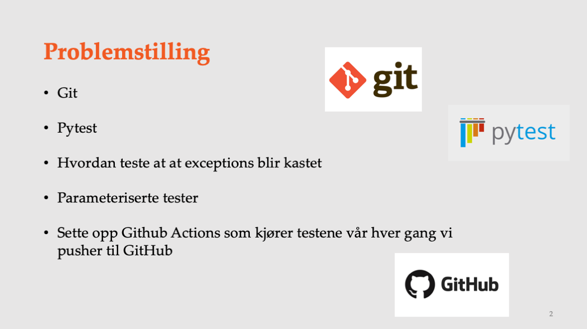
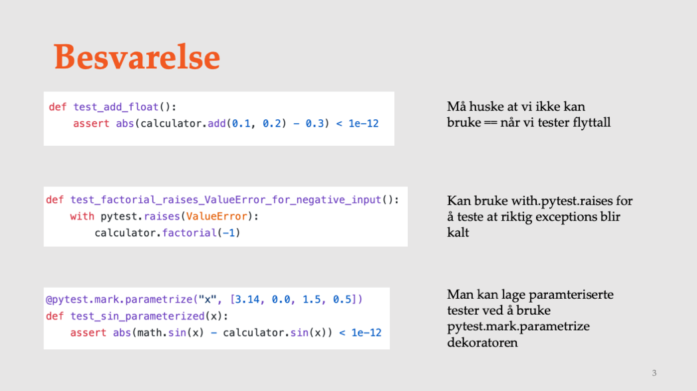
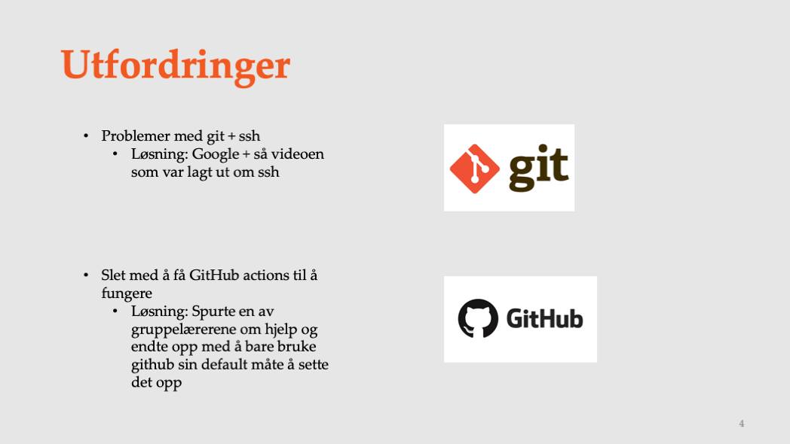
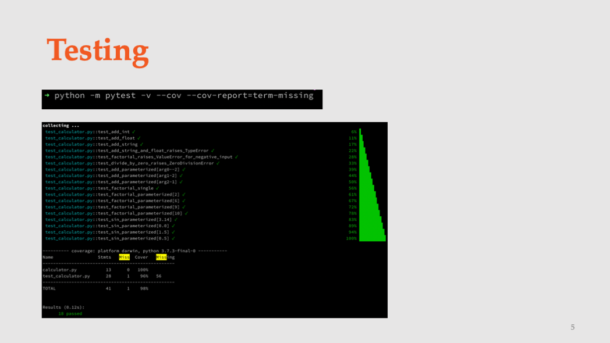

# Eksamen slides: prosjekt 0

+++ {"slide": true}

+++

+++ {"slide": true}

+++
I dette prosjektet skulle vi lære bruke git, som betyr å lære bruke de mest vanlige kommandoene som “git add”, “git commit” og “git push”.
Hovedformålet var å lage en kalkulator som vi også skullle teste at fungerte slik den skulle. Vi skulle bruke pytest som rammeverk for å teste koden vår.
Vi skulle blant annet teste at exceptions ble kastet og at riktig exception ble kasestet. Senere oppgaven skulle vi også implementere parameteriserte tester som er nyttig når vi skal teste same funksjon med ulik input.
Helt til slutt var det en ekstraoppgave som gikk ut på å sette på GitHub actions som kjørte testene våre hver gang vi pushet.

+++ {"slide": true}

+++

Jeg sørget for å gjøre oppgave for oppgave og commite mellom hver oppgave. I en av oppegavene skulle vi teste at add(0.1, 0.2) ble 0.3. Her kunne vi ikke teste med likehet med mått sjekke av differansen var lavere enn en toleranse.
I en annen oppgave skulle vi teste av fakultet metoden vår kastet ValueError når vi ga negativ input. Dette kunne vi gjøre ved å bruke pytest.raises.
Nå vi skulle teste sinus funksjonen, så testet vi dette mot den innebygde sinus funksjonen i math biblioteket. Her viser vi også hvordan vi kan gjøre dette i en parameterisert test ved å bruke pytest.mark.parametrize dekoratoren.

+++ {"slide": true}

+++

Jeg hadde en del problemer med git, og spesielt det å sette opp ssh. Fikk hele tiden beskjed om at jeg ikke hadde tilgang til repoet. Jeg løste dette ved å google litt og fant et bra svar på stackoverflow. Så også videoen som var lagt ut om hvordan sette opp ssh og det hjalp også. Ett annet problem jeg hadde var å sette påå GitHub actions. Dette villle ikke kjøre og jeg tror kanskje det hadde noe med hvordan jeg formatterte den yaml filen. Jeg spurte en av gruppelærerne om dette og endte opp med å bruke oppskriften som du får når du går inn på repoet og trykker på github actions

+++ {"slide": true}

+++
Jeg har skrevet tester for alle metodene og har sørget for at vi har en 100% test coverage. Her ser dere også komandoen jeg kjørte for å kjøre alle testene med pytest.
